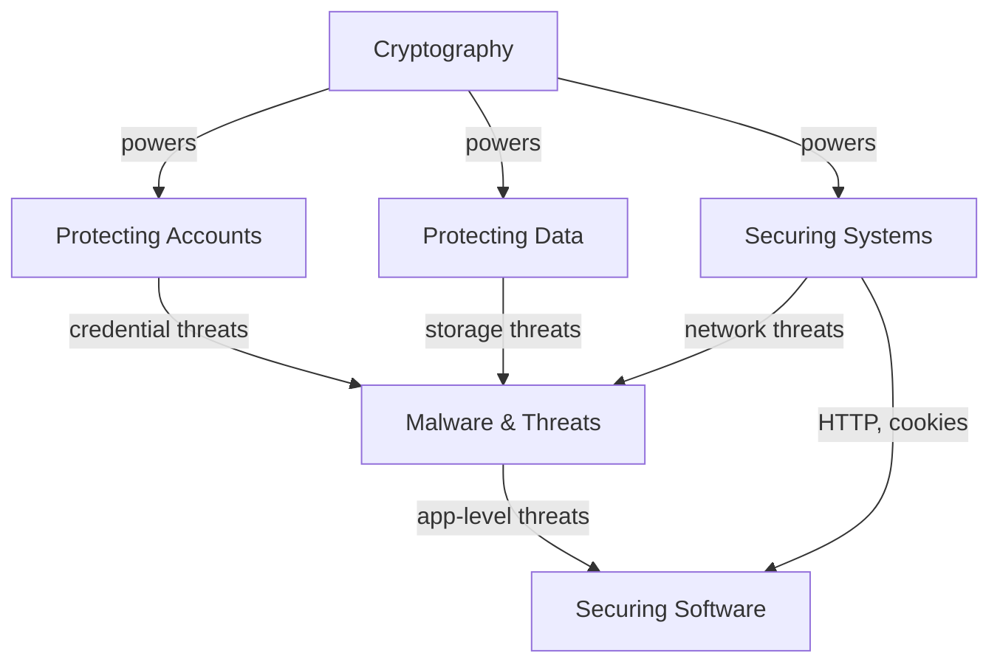

# CS50 Security — Index

> Notes from CS50's cybersecurity module. Each file covers a distinct topic area with cross-links between related concepts.

---

## Files

| # | Topic | Key Concepts |
|---|-------|-------------|
| [[01 - Protecting Accounts]] | Identity & Access | Auth, passwords, MFA, phishing, SSO, passkeys |
| [[02 - Protecting Data]] | Data Security | Hashing, salting, E2EE, encryption at rest, ransomware |
| [[03 - Cryptography]] | Crypto Fundamentals | Symmetric, RSA, Diffie-Hellman, digital signatures |
| [[04 - Securing Systems]] | Network Security | HTTP/S, TLS, cookies, firewall, VPN, proxy, SSH |
| [[05 - Malware & Threats]] | Malware | Viruses, worms, botnets, DoS/DDoS, zero day, antivirus |
| [[06 - Securing Software]] | App Security | XSS, SQL injection, command injection, CSP, escaping |

---

## Concept Map

