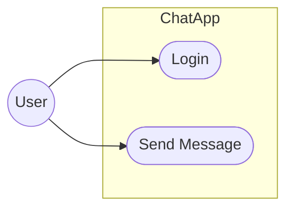
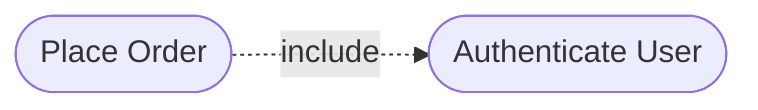
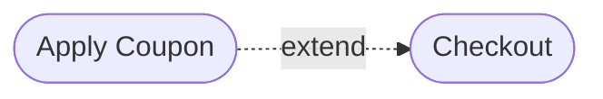
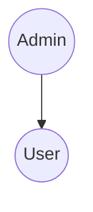

# 5.2 — Use Case Diagram

Use Case Diagram:
> high-level view of what users can do with the system.

Focuses on:
- actors
- system functionality
- system boundary

Does NOT show:
- internal logic
- algorithms
- database structure
- implementation details

---

# Main Components

| Component | Meaning |
|---|---|
| Actor | External user/system |
| Use Case | Function provided by system |
| System Boundary | Scope of the system |
| Association | Interaction between actor and use case |

---

# Basic Example

---

# Explanation

User can:
- login
- send messages

Diagram only shows:
> what the system provides externally.

It does NOT explain:
- how login works
- database queries
- APIs
- backend logic

---

# Include Relationship

Used when:
> one use case always requires another.

Example:
Place Order always requires authentication.

---

# Extend Relationship

Used when:
> behaviour is optional/conditional.

Example:
Coupon application during checkout.

---

# Include vs Extend

| Include | Extend |
|---|---|
| Mandatory | Optional |
| Always executed | Conditional |

---

# Generalization Example

Admin is a specialized type of User.

---

# When To Use

Best for:
- requirements gathering
- stakeholder discussion
- defining system scope

---

# Important Insight

Use Case Diagram answers:
> "What can users do with the system?"