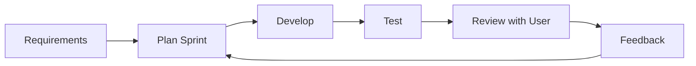

# 🧠 Agile Process (Complete Notes)

## 🧩 Core Idea
Agile = **Iterative + Incremental development with continuous feedback**

> Build small → Test → Get feedback → Improve → Repeat

---

## ⚙️ Key Characteristics
- Iterative development (short cycles called **Sprints**)
- Incremental delivery (working software each cycle)
- Continuous feedback (users involved)
- Adaptability to change
- Close team collaboration

---

## 🔁 Agile Workflow

---

## 📌 Importance of Agile

### 1. Handles Changing Requirements
- Requirements evolve
- Agile allows **flexibility**

### 2. Early Feedback
- Users see working product early
- Mistakes caught early

### 3. Faster Delivery
- Deliver usable features frequently

### 4. Reduced Risk
- Small iterations → small failures

### 5. Better Collaboration
- Daily communication (standups, reviews)

### 6. Higher Quality
- Continuous testing + improvement

---

## 🏗️ Agile Concepts

### 🔹 Sprint
- Short cycle (1–2 weeks)
- Delivers a small feature

### 🔹 Increment
- Working product piece after each sprint

### 🔹 Backlog
- List of features/tasks to be done

### 🔹 Standup Meeting
- Daily short team sync

---

## ⚖️ Agile vs Traditional (Waterfall)

| Aspect            | Agile ✅                      | Waterfall ❌              |
|------------------|-----------------------------|--------------------------|
| Development      | Iterative                   | Sequential               |
| Flexibility      | High                        | Low                      |
| Feedback         | Continuous                  | At end                   |
| Risk             | Low                         | High                     |
| Delivery         | Frequent                    | One-time                 |
| Requirement Change | Easy                     | Difficult                |

---

## 🧠 Why Agile Works Better

- Software is **uncertain & dynamic**
- Agile avoids “big assumptions”
- Focuses on **real user feedback**
- Encourages **continuous improvement**

---

## 🧩 Real-World Analogy
Ordering food step-by-step:
- Try one dish → adjust → order more  
Instead of ordering everything blindly.

---

## 🧠 Final Understanding

Agile =  
> **Flexible + Feedback-driven + Incremental development approach**  
> that produces **better, faster, and more user-aligned software**
