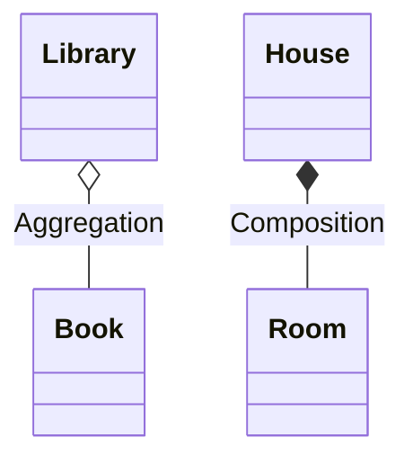

# 🧠 Aggregation vs Composition

## 🧩 Core Idea
- **Aggregation** → Weak “has-a” relationship  
- **Composition** → Strong “part-of” relationship  

---

## ⚙️ Aggregation

### 🎯 Characteristics
- Weak association  
- Independent lifecycle  
- Object can exist without container  

### 📌 Example
- Library → Books  

---

## ⚙️ Composition

### 🎯 Characteristics
- Strong association  
- Dependent lifecycle  
- Object cannot exist without container  

### 📌 Example
- House → Rooms  

---

## 📊 UML Representation



---

## 💻 Code Perspective

### Aggregation
```java
class Library {
    List<Book> books;
}
```

---

### Composition
```java
class House {
    Room room = new Room();
}
```

---

## ⚖️ Difference

| Aspect        | Aggregation          | Composition          |
|---------------|----------------------|----------------------|
| Relationship  | Weak                 | Strong               |
| Lifecycle     | Independent          | Dependent            |
| Ownership     | Partial              | Full                 |
| UML Symbol    | Hollow diamond       | Filled diamond       |

---

## 🧠 Final Understanding

- Aggregation → **loose connection**  
- Composition → **tight dependency**
