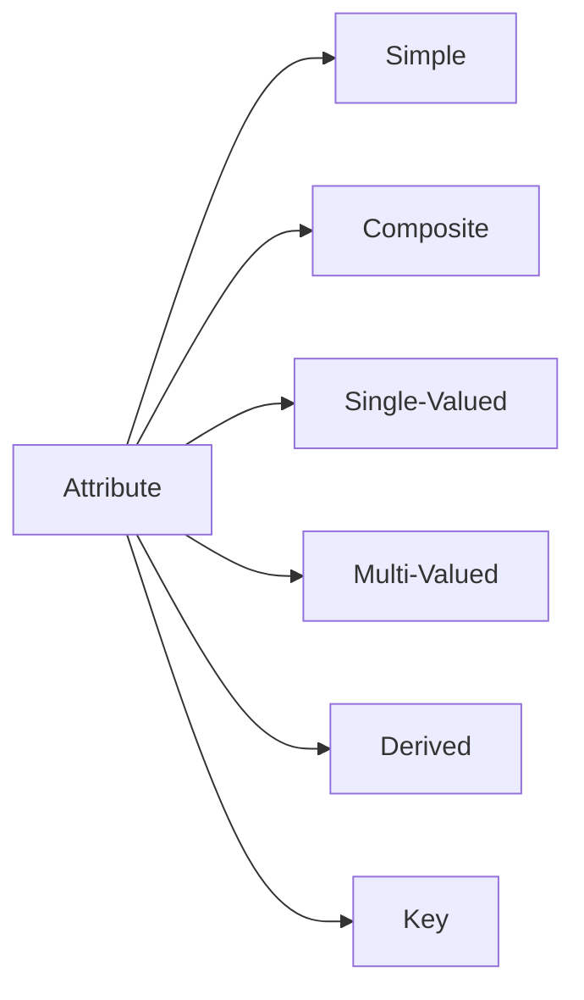

# 🧠 Attributes in OOP

## 🧩 Core Idea
Attribute =  
> **Property/characteristic of an object**

---

## 💻 Example

```java
class Student {
    String name;
    int age;
}
```

- `name`, `age` → attributes  

---

## ⚙️ Types of Attributes

### 🔹 Simple Attribute
- Cannot be divided  
- Example: age, salary  

---

### 🔹 Composite Attribute
- Can be split into parts  
- Example: address → street, city  

---

### 🔹 Single-Valued Attribute
- One value only  
- Example: roll number  

---

### 🔹 Multi-Valued Attribute
- Multiple values  
- Example: phone numbers  

---

### 🔹 Derived Attribute
- Calculated from others  
- Example: age from DOB  

---

### 🔹 Key Attribute
- Uniquely identifies object  
- Example: student ID  

---

## 🔁 Big Picture



---

## 🧠 Final Understanding

Attribute =  
> **Data that describes an object in a system**
