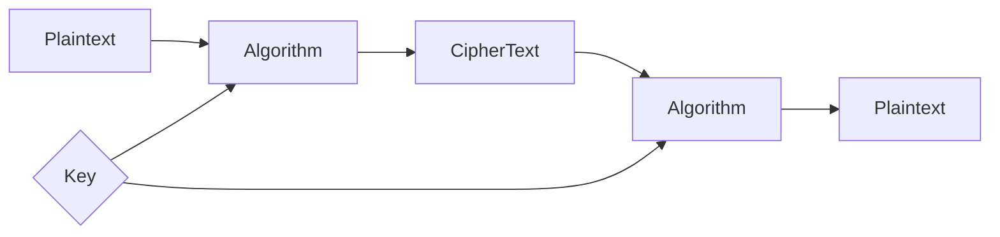

### Plaintext
 Un-encrypted, Readable form of data. Original data. 

### Ciphertext
Encrypted form of data which is meaningless in this form. Only useful if user can convert it back to the plaintext

### Encryption
Process of converting the plaintext to ciphertext using a key.

### Decryption 
Ciphertext -> plaintext using same key or a different key that is connected to the key used for encryption

### Cryptanalysis
Understand hidden aspects of the system.
Breach systems, find and read the encrypted data without access to the key. Using some mathematical ways.
Exploit weakness to read the protected data.

### Cryptography
Cryptography is a technique used to secure communication by converting readable information into an unreadable format. It protects data from unauthorized access and ensures that only the intended receiver can understand the message

- Used to secure communication by converting readable data into an unreadable form.
- Plaintext is the original message; ciphertext is the encrypted form (via encryption/decryption).
- Ensures data is kept private, unchanged, verified, and the sender cannot deny sending it.
- Uses symmetric (single key), asymmetric (public/private key), and hash functions (SHA, MD5).

### Passive attack
Read the encrypted data, unauthorized.

### Active attack
Delete or Modify unauthorized data.

---
### What is cryptography
Mathematical techniques to protect information by transforming it into a secure form

- **Confidentiality** → only intended person can read
- **Integrity** → data not changed
- **Authentication** → sender is real
- **Non-repudiation** → sender cannot deny sending
> Build Secure Systems

### Cryptanalysis
Break Secure systems without key

### Key

- Algorithm = lock design (public)
- Key = actual key (secret)

### 🔐 Kerckhoffs’s Principle

> System should be secure even if everything is known except the key

### Passive & Active
Passive -> Read, Steal data unauthorized
Active -> Modify, inject, Delete data unauthorized
Danger -> Active >> Passive

## 1️⃣ Symmetric Cryptography

- Same key for encryption + decryption
- Fast
- Problem: how to share key?

Example: AES

---

## 2️⃣ Asymmetric Cryptography

- Two keys:
    - Public key
    - Private key
- Solves key sharing problem

Example: RSA

---

## 3️⃣ Hash Functions

- No decryption
- One-way
- Used for integrity

Example: SHA-256

---
### 🔐 Kerckhoffs’s Principle — what it _really_ means

Security must depend on the secrecy of the key. not the algorithm
Creating a new algorithm and hiding and counting on the secrecy of it is bad. If they understand entire system is vulnerable
Use well known tested algorithm such as AES, DES and have the key as secret. Even the hacker knows the working of algorithm but cant break without key and cant guess key mathematically

