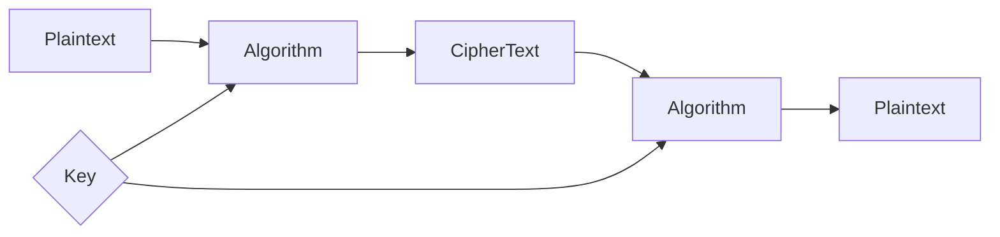

### Plaintext
 Un-encrypted, Readable form of data. Original data. 

### Ciphertext
Encrypted form of data which is meaningless in this form. Only useful if user can convert it back to the plaintext

### Encryption
Process of converting the plaintext to ciphertext using a key.

### Decryption 
Ciphertext -> plaintext using same key or a different key that is connected to the key used for encryption

### Cryptanalysis
Understand hidden aspects of the system.
Breach systems, find and read the encrypted data without access to the key. Using some mathematical ways.
Exploit weakness to read the protected data.

### Cryptography
Cryptography is a technique used to secure communication by converting readable information into an unreadable format. It protects data from unauthorized access and ensures that only the intended receiver can understand the message

- Used to secure communication by converting readable data into an unreadable form.
- Plaintext is the original message; ciphertext is the encrypted form (via encryption/decryption).
- Ensures data is kept private, unchanged, verified, and the sender cannot deny sending it.
- Uses symmetric (single key), asymmetric (public/private key), and hash functions (SHA, MD5).

### Passive attack
Read the encrypted data, unauthorized.

### Active attack
Delete or Modify unauthorized data.

---
### What is cryptography
Mathematical techniques to protect information by transforming it into a secure form

- **Confidentiality** → only intended person can read
- **Integrity** → data not changed
- **Authentication** → sender is real
- **Non-repudiation** → sender cannot deny sending
> Build Secure Systems

### Cryptanalysis
Break Secure systems without key

### Key
