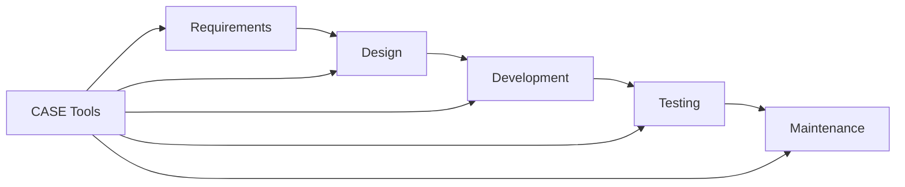

# 🧠 CASE Tools (Computer-Aided Software Engineering)

## 🧩 Core Idea
CASE Tools =  
> Software that **automates/supports software development activities**

Used across the **entire software lifecycle**

---

## 🎯 Purpose
- Reduce manual effort
- Improve productivity
- Ensure consistency & standardization
- Support documentation and maintenance

---

## ⚙️ Types of CASE Tools

### 🔹 Upper CASE (Early Stages)
Used in:
- Requirement analysis
- System design

📌 Functions:
- UML diagram creation
- Requirement modeling

📌 Examples:
- IBM Rational Rose
- StarUML
- Visual Paradigm

---

### 🔹 Lower CASE (Later Stages)
Used in:
- Coding
- Testing
- Maintenance

📌 Functions:
- Code generation
- Debugging
- Test case generation

📌 Examples:
- Eclipse (IDE)
- Visual Studio
- Selenium (testing)

---

### 🔹 Integrated CASE (I-CASE)
Used in:
- Entire software lifecycle

📌 Functions:
- Combines upper + lower CASE
- End-to-end development support

📌 Examples:
- IBM Rational Suite
- Oracle JDeveloper
- Microsoft Visual Studio (full ecosystem)

---

## 📌 Where CASE Tools are Used

| Phase            | Usage                          |
|------------------|--------------------------------|
| Requirement      | Documentation, modeling        |
| Design           | UML diagrams                   |
| Development      | Code writing/generation        |
| Testing          | Automated testing              |
| Maintenance      | Updates, tracking changes      |

---

## ✅ Advantages
- Faster development
- Reduced human errors
- Better documentation
- Improved software quality
- Standardized processes

---

## ❌ Disadvantages
- High cost
- Learning curve
- Tool dependency

---

## 🔁 Big Picture

---

## 🧠 Final Understanding

CASE Tools =  
> **Automation + Assistance tools used throughout software development
> lifecycle**  
> to improve **efficiency, quality, and consistency**
