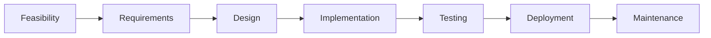

# 🧠 Classic Project Life Cycle

## 🧩 Core Idea
> Software is developed in **structured phases from start to end**

---

## ⚙️ Stages

### 🔹 1. Feasibility Study
- Check if project is possible  
- Analyze cost, time, resources  

---

### 🔹 2. Requirements Analysis
- Gather and define system requirements  

---

### 🔹 3. System Design
- Plan architecture and structure  
- Use UML diagrams  

---

### 🔹 4. Implementation
- Coding and development  

---

### 🔹 5. Testing
- Identify and fix bugs  
- Validate system  

---

### 🔹 6. Deployment
- Release system to users  

---

### 🔹 7. Maintenance
- Bug fixes  
- Updates and improvements  

---

## 🔁 Workflow

---

## 📌 Importance
- Organized development  
- Better planning  
- Reduced risks  

---

## 🧠 Final Understanding

Project Life Cycle =  
> **Step-by-step process to build, test, and maintain software**
