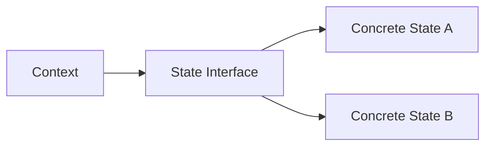
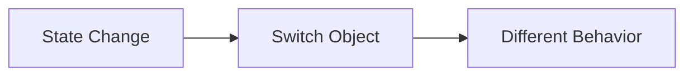

# 🧠 State Design Pattern

## 🧩 Core Idea
> Allow an object to **change its behavior when its internal state changes**

✔ Replace `if-else` / `switch` with **polymorphism**

---

## ⚙️ Structure

### 🔹 Components
- **Context**
  - Holds current state
  - Delegates behavior to state

- **State (interface/abstract)**
  - Defines common methods

- **Concrete States**
  - Implement different behaviors

---

## 🔁 Flow



---

## ⚙️ Working

- Each state = separate class  
- Same method names across states  
- Context holds a **state reference**  
- Changing state = **switching object**

```java
state.handle(context);
```

---

## 💻 Example

```java
interface State {
    void play(Player p);
}

class PlayState implements State {
    public void play(Player p) {
        System.out.println("Playing");
    }
}

class StopState implements State {
    public void play(Player p) {
        System.out.println("Stopped");
    }
}

class Player {
    private State state;

    void setState(State s) {
        state = s;
    }

    void play() {
        state.play(this);
    }
}
```

---

## 🧠 Object Management Approaches

### 1️⃣ Create on demand
```java
player.setState(new PlayState());
```

---

### 2️⃣ Reuse inside Context (recommended)
```java
class Player {
    private final State playState = new PlayState();
    private final State stopState = new StopState();

    void setPlay() { state = playState; }
}
```

---

### 3️⃣ Factory (scalable)
```java
class StateFactory {
    static Map<String, State> states = Map.of(
        "PLAY", new PlayState(),
        "STOP", new StopState()
    );
}
```

---

## ❌ Avoid
- Storing objects in interfaces
- Mixing state logic with context

---

## 📌 When to Use
- Behavior depends on state  
- Too many conditional statements  
- Frequent state transitions  

---

## ✅ Advantages
- Cleaner code (no if-else chains)
- Easy to add new states
- Better maintainability

---

## ⚠️ Disadvantages
- More classes
- Slightly complex structure

---

## 🔁 Big Picture



---

## 🧠 Final Understanding

State Pattern =  
> **Encapsulate states as objects and change behavior by switching them**
