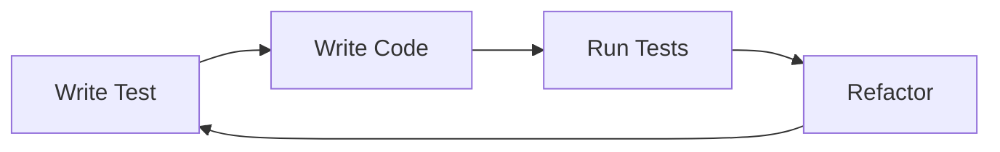

# ⚡ Extreme Programming (XP)

## 🧩 Core Idea
XP = **Agile with strict, high-discipline engineering practices**

> Improve quality by doing good practices **continuously and intensively**

---

## ⚙️ Key Characteristics
- Strong focus on **code quality**
- Continuous feedback
- Frequent releases
- High team collaboration
- Simplicity in design

---

## 🔁 XP Development Cycle

---

## 📌 Core Practices

### 🔹 Pair Programming
- 2 developers, 1 system
- Real-time code review

### 🔹 Test-Driven Development (TDD)
- Tests written before code
- Ensures correctness early

### 🔹 Continuous Integration
- Frequent code merging
- Avoids integration issues

### 🔹 Small Releases
- Deliver features frequently

### 🔹 Simple Design
- Build only what is needed

### 🔹 Refactoring
- Continuous code improvement

### 🔹 Customer Involvement
- Constant feedback from users

---

## ⚖️ XP vs General Agile

| Aspect            | Agile                     | XP (Extreme)                |
|------------------|--------------------------|-----------------------------|
| Approach         | Flexible principles       | Strict practices            |
| Focus            | Process + delivery        | Code quality + discipline   |
| Testing          | Regular                   | Before coding (TDD)         |
| Code Review      | Occasional                | Continuous (pair programming) |

---

## 🧠 Why XP is Powerful
- Catches bugs early
- Produces clean, maintainable code
- Reduces long-term technical debt
- Improves team collaboration

---

## 🧩 Real Insight
XP pushes Agile ideas to the limit:

> Test early, review constantly, integrate continuously → **high-quality software**

---

## 🧠 Final Understanding

XP =  
> **A disciplined Agile methodology focused on continuous testing, collaboration, and clean code**
