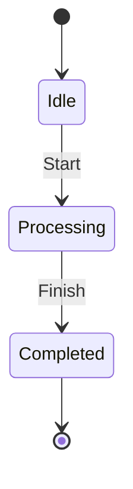
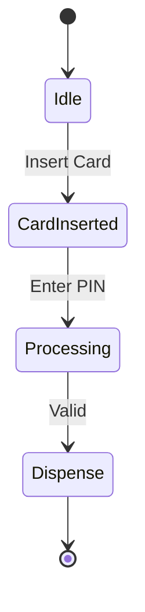
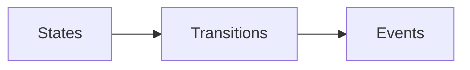

# 🧠 Finite State Machines (FSM)

## 🧩 Core Idea
FSM =  
> **System exists in one state at a time and changes state based on events**

---

## ⚙️ Components

### 🔹 State
- Current condition of system  
- Example: Idle, Processing  

---

### 🔹 Transition
- Movement between states  

---

### 🔹 Event
- Trigger causing transition  
- Example: click, timer  

---

### 🔹 Initial State
- Starting point  

---

### 🔹 Final State
- Ending point  

---

## 📊 UML State Diagram

---

## 📌 Example: ATM System

---

## 📌 Uses
- UI systems  
- Embedded systems  
- Workflow modeling  

---

## ✅ Advantages
- Clear behavior representation  
- Easy to track transitions  
- Good for event-driven systems  

---

## ❌ Disadvantages
- Complex for large systems  
- Difficult to scale  

---

## 🔁 Big Picture

---

## 🧠 Final Understanding

FSM =  
> **States + Events + Transitions define system behavior**
