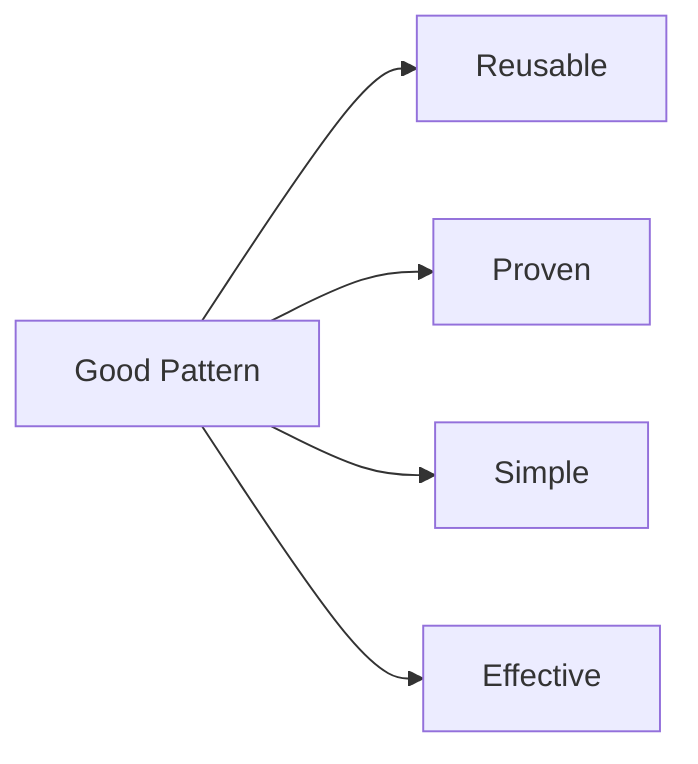

# 🧠 Good Design Pattern

## 🧩 Core Idea
> A good pattern is a **proven, reusable solution** that improves software design

---

## ⚙️ Characteristics of a Good Pattern

### 🔹 Solves Real Problems
- Applicable to real-world scenarios  

---

### 🔹 Reusable
- Can be applied in multiple situations  

---

### 🔹 Proven
- Tested and widely used  

---

### 🔹 Improves Design
- Enhances maintainability  
- Increases flexibility  
- Produces cleaner code  

---

### 🔹 Easy to Understand
- Clear structure  
- Not overly complex  

---

### 🔹 Reduces Complexity
- Simplifies system design  

---

## ❌ Not a Good Pattern
- Too complex  
- Not reusable  
- Rare/specific use only  
- Makes code harder  

---

## 🔁 Big Picture

---

## 🧠 Final Understanding

Good Pattern =  
> **Reusable + proven + simple + improves design**
