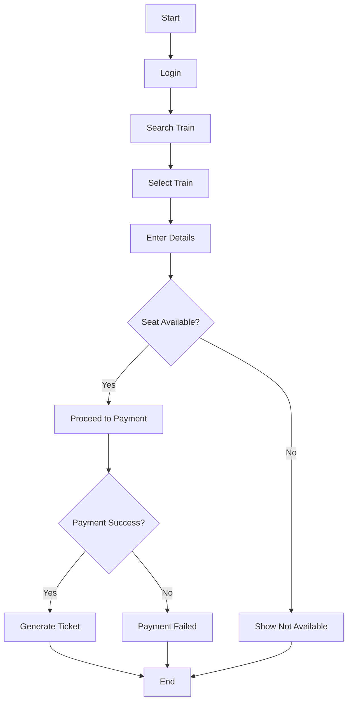

# 🧠 Activity Diagram – IRCTC Ticket Booking

## 🧩 Core Idea
Activity Diagram =  
> **Represents step-by-step workflow with actions and decisions**

---

## ⚙️ Steps in Booking Process

1. Login  
2. Search Train  
3. Select Train  
4. Enter Passenger Details  
5. Check Seat Availability  
6. Payment  
7. Ticket Generation  

---

## 🔀 Decision Points
- Seat Available?  
- Payment Successful?  

---

## 📊 Activity Diagram

---

## 📌 Key Elements
- Start / End  
- Actions  
- Decision nodes  
- Control flow arrows  

---

## 🧠 Final Understanding

Activity Diagram =  
> **Flow of actions and decisions representing system behavior**
