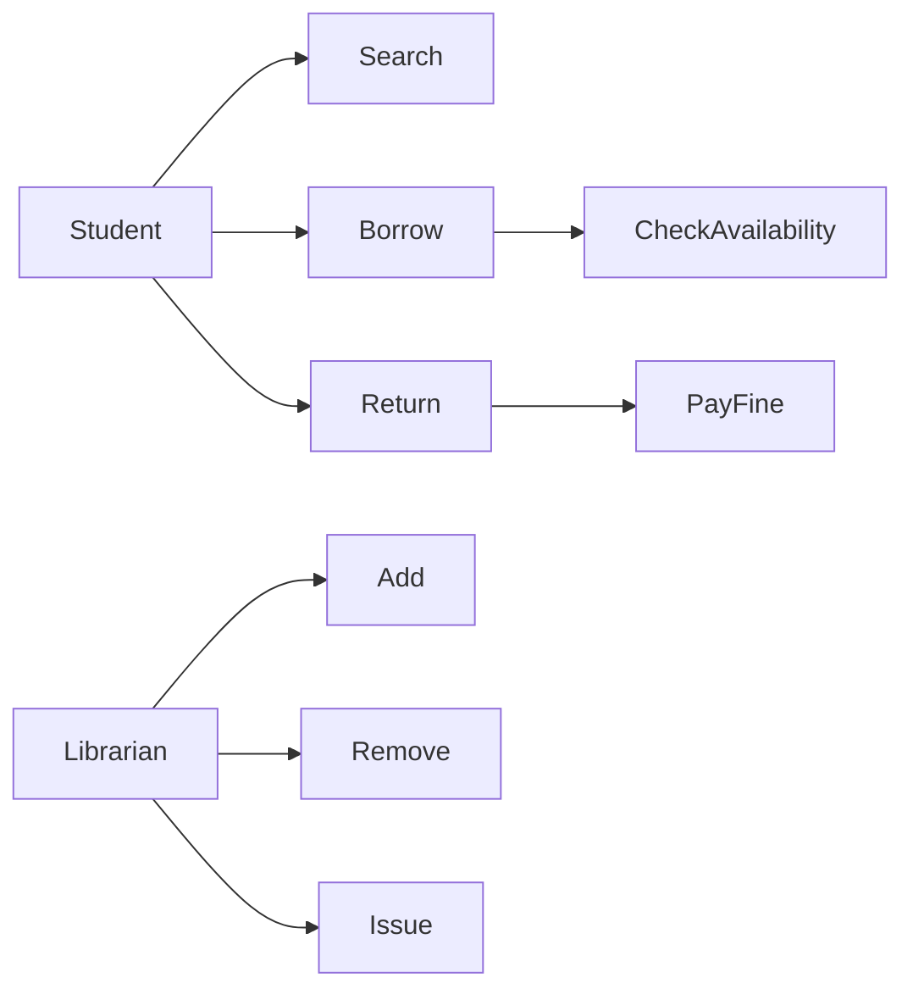
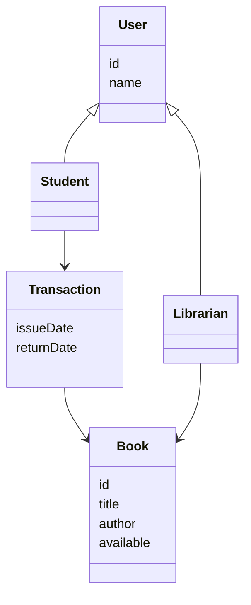

# 🧠 Library Management System (OOAD)

## 🧩 Problem Statement
System to manage:
- Books
- Users
- Issue/Return process
- Fine handling  

---

## 👤 Actors
- Student / Member  
- Librarian  

---

## ⚙️ Use Cases

### Student
- Search Book  
- Borrow Book  
- Return Book  
- View Account  

### Librarian
- Add Book  
- Remove Book  
- Issue Book  
- Collect Fine  

---

## 🔗 Use Case Relationships

- **«include»** → mandatory  
  - Borrow Book → Check Availability  

- **«extend»** → optional  
  - Return Book → Pay Fine  

- **Generalization**
  - User → Student, Librarian  

---

## 📊 Use Case Diagram

---

## 🧱 Classes (OOD)

- **User (id, name)**
- **Student extends User**
- **Librarian extends User**

- **Book (id, title, author, availability)**

- **Transaction (issueDate, returnDate)**

---

## 🔗 Relationships
- Student → borrows Book  
- Librarian → manages Book  
- Transaction → connects User & Book  

---

## 📊 Class Diagram

---

## 🧠 Final Understanding

> Convert real-world system → Actors → Use Cases → Relationships → Classes → UML diagrams
