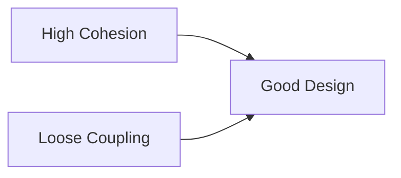

# 🧠 Loose Coupling & High Cohesion

## 🧩 Core Idea
Good system design =  
> **High Cohesion (focused modules)** + **Loose Coupling (low dependency)**

---

## ⚙️ Coupling

### 🎯 Definition
Degree of **dependency between modules**

### 📊 Types
- **Tight Coupling ❌**
  - Strong dependency
  - Changes affect multiple modules

- **Loose Coupling ✅**
  - Minimal dependency
  - Modules interact via well-defined interfaces

---

## ⚙️ Cohesion

### 🎯 Definition
Degree to which elements within a module are **related and focused**

### 📊 Types
- **Low Cohesion ❌**
  - Mixed responsibilities
  - Hard to maintain

- **High Cohesion ✅**
  - Single, clear purpose
  - Easier to understand and modify

---

## ⚖️ Comparison

| Aspect        | Coupling                     | Cohesion                     |
|---------------|----------------------------|------------------------------|
| Scope         | Between modules             | Within a module              |
| Goal          | Reduce dependency           | Increase focus               |
| Good Practice | Loose Coupling              | High Cohesion                |

---

## 📌 Importance

- Easier **maintenance**
- Better **scalability**
- Improved **debugging**
- Higher **reusability**
- Cleaner **architecture**

---

## 💻 Example

### ❌ Bad Design
```java
class OrderService {
    void processOrder() {
        // payment logic
        // database logic
        // email logic
    }
}
```

---

### ✅ Good Design
```java
class PaymentService { }
class EmailService { }

class OrderService {
    PaymentService payment;
    EmailService email;
}
```

---

## 🔁 Big Picture



---

## 🧠 Final Understanding

> Systems should be **loosely coupled and highly cohesive**  
to achieve **flexibility, maintainability, and scalability**
