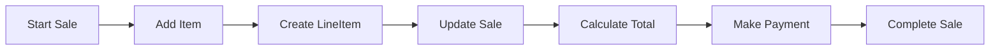

# 🧠 Implementation Model (NextGen POS)

## 🧩 Core Idea
Implementation Model =  
> **Mapping UML design (classes, relationships) into actual code**

---

## 🏪 NextGen POS (Context)
System for billing:
- Start sale  
- Add items  
- Calculate total  
- Make payment  
- Complete transaction  

---

## ⚙️ Key Classes

- **Sale** → handles transaction  
- **Product** → item details  
- **LineItem** → product + quantity  
- **Payment** → payment info  
- **Register** → system controller  

---

## 🔁 UML → Code Mapping

| UML Concept   | Code Representation        |
|---------------|----------------------------|
| Class         | Java class                 |
| Attribute     | Variables                  |
| Method        | Functions                  |
| Association   | Object references          |
| Inheritance   | `extends`                  |

---

## 💻 Code Structure

### Product
```java
class Product {
    String name;
    double price;
}
```

---

### LineItem
```java
class LineItem {
    Product product;
    int quantity;

    double getSubtotal() {
        return product.price * quantity;
    }
}
```

---

### Sale
```java
class Sale {
    List<LineItem> items = new ArrayList<>();

    void addItem(Product p, int qty) {
        items.add(new LineItem(p, qty));
    }

    double getTotal() {
        return items.stream()
            .mapToDouble(i -> i.getSubtotal())
            .sum();
    }
}
```

---

### Payment
```java
class Payment {
    double amount;

    Payment(double amount) {
        this.amount = amount;
    }
}
```

---

## 🔁 System Flow



---

## 📌 Steps in Implementation

1. Identify classes from UML  
2. Convert attributes → variables  
3. Convert methods → functions  
4. Map relationships → object references  
5. Implement business logic  

---

## 🧠 Final Understanding

Implementation Model =  
> **Convert design (UML) into structured code with classes and interactions**
