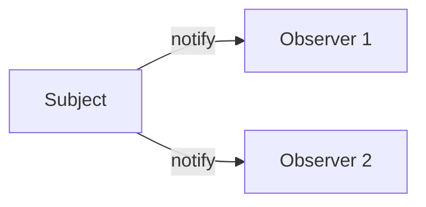

# 🧠 Observer Design Pattern

## 🧩 Core Idea
> One object (**Subject**) changes → multiple objects (**Observers**) are automatically notified

---

## ⚙️ Structure

### 🔹 Subject
- Maintains list of observers
- Sends notifications on state change

### 🔹 Observer
- Receives updates from subject

### 🔹 Concrete Classes
- **ConcreteSubject** → actual data holder  
- **ConcreteObserver** → reacts to updates  

---

## 🔁 Flow



---

## 📌 Example: Weather System
- Weather data changes → displays update automatically  

---

## 💻 Code

```java
interface Observer {
    void update(float temp);
}

class PhoneDisplay implements Observer {
    public void update(float temp) {
        System.out.println("Temp: " + temp);
    }
}

class WeatherStation {
    List<Observer> observers = new ArrayList<>();

    void addObserver(Observer o) {
        observers.add(o);
    }

    void notifyObservers(float temp) {
        for (Observer o : observers) {
            o.update(temp);
        }
    }
}
```

---

## 📌 When to Use
- One-to-many relationship  
- Event-driven systems  
- Multiple objects need updates  

---

## ✅ Advantages
- Loose coupling  
- Easy to extend  
- Scalable  

---

## ❌ Disadvantages
- Many updates may affect performance  
- Hard to trace flow  

---

## 🧠 Final Understanding

Observer Pattern =  
> **Subject notifies all observers automatically when its state changes**
