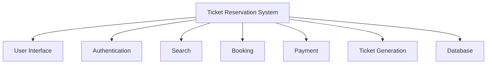
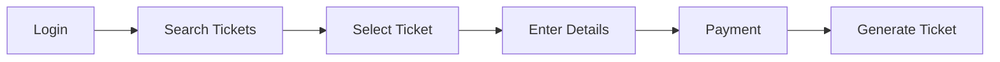
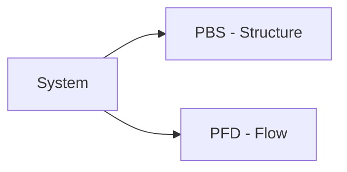

# 🧠 PBS & PFD (Online Ticket Reservation System)

## 🧩 Core Idea
- **PBS (Product Breakdown Structure)** → Break system into components  
- **PFD (Product Flow Diagram)** → Show process/workflow  

---

## ⚙️ Product Breakdown Structure (PBS)

### 🎯 Purpose
- Identify system components  
- Structural view (static)

### 📌 Components
- User Interface  
- Authentication Module  
- Search Module  
- Booking Module  
- Payment Module  
- Ticket Generation  
- Database  

---

## 📊 PBS Diagram

---

## ⚙️ Product Flow Diagram (PFD)

### 🎯 Purpose
- Show system workflow  
- Dynamic view  

### 📌 Steps
1. Login  
2. Search Tickets  
3. Select Ticket  
4. Enter Details  
5. Payment  
6. Generate Ticket  

---

## 📊 PFD Diagram

---

## ⚖️ Difference

| Aspect   | PBS                     | PFD                    |
|----------|-------------------------|------------------------|
| Focus    | Structure (components)  | Flow (process)         |
| Type     | Static                  | Dynamic                |
| Purpose  | What system has         | How system works       |

---

## 🔁 Big Picture

---

## 🧠 Final Understanding

- PBS → **What exists**  
- PFD → **How it works**

Together → complete system understanding
