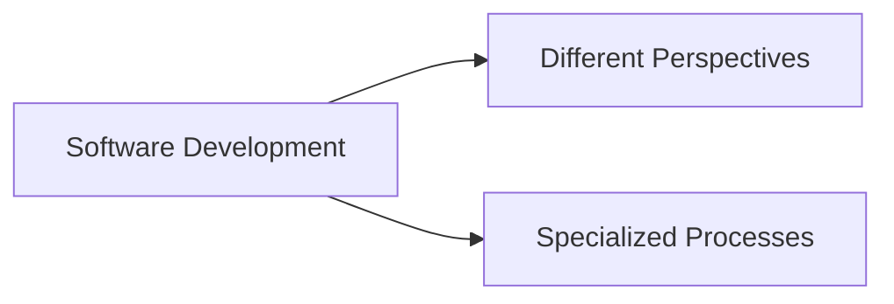

# 🧠 Perspective & Specialized Process in Software Engineering

## 🧩 Core Idea
- **Perspective** = Different ways to view software development  
- **Specialized Process** = Customized development approach for specific systems  

---

## ⚙️ Perspectives

### 🔹 Process Perspective
- Focus: How software is developed  
- Examples: Agile, Waterfall  

---

### 🔹 Product Perspective
- Focus: What is being built  
- Features, quality, functionality  

---

### 🔹 Project Perspective
- Focus: Management aspects  
- Time, cost, resources  

---

## ⚙️ Specialized Processes

### 🔹 Real-Time Systems
- Immediate response required  
- Example: Traffic control systems  

---

### 🔹 Safety-Critical Systems
- Failure can cause serious damage  
- Example: Medical, aircraft systems  

---

### 🔹 Web Applications
- Focus on UI, scalability  
- Example: Websites, web apps  

---

### 🔹 Component-Based Development
- Build using reusable components  

---

## 📌 Importance
- Different systems have different requirements  
- One process cannot fit all scenarios  
- Improves efficiency and reliability  

---

## 🔁 Big Picture

---

## 🧠 Final Understanding

Perspective =  
> **Different viewpoints to understand development**

Specialized Process =  
> **Adapted process for specific system needs**
