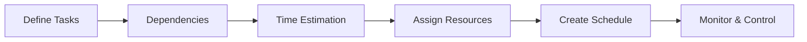

# 🧠 Project Scheduling

## 🧩 Core Idea
Project Scheduling =  
> **Planning tasks, time, order, and resources to complete a project**

---

## ⚙️ Steps in Project Scheduling

### 🔹 1. Define Tasks
- Break project into smaller tasks/modules

---

### 🔹 2. Identify Dependencies
- Determine task order
- Which task depends on another

---

### 🔹 3. Estimate Time
- Assign duration for each task

---

### 🔹 4. Assign Resources
- Allocate people/tools to tasks

---

### 🔹 5. Create Schedule
- Arrange tasks on timeline
- Set start and end dates

---

### 🔹 6. Monitor & Control
- Track progress
- Handle delays and adjustments

---

## 🔁 Workflow

---

## 📌 Importance
- Ensures timely delivery
- Improves resource utilization
- Tracks project progress
- Reduces delays and risks

---

## 🧠 Final Understanding

Project Scheduling =  
> **Organizing tasks in the right order with proper time and resources**
