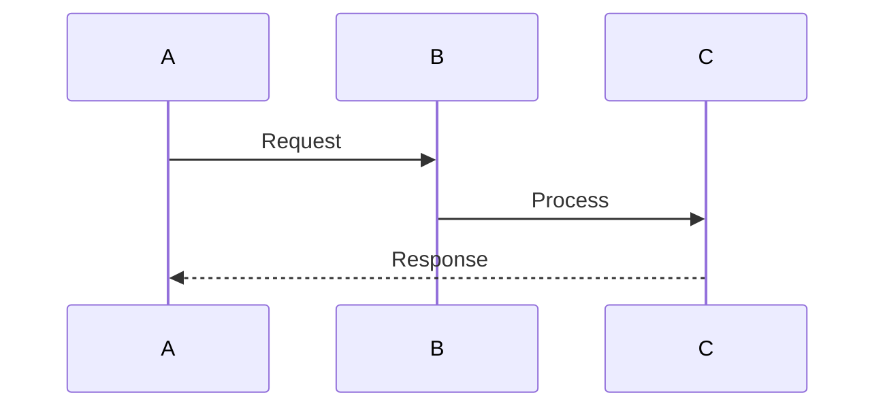
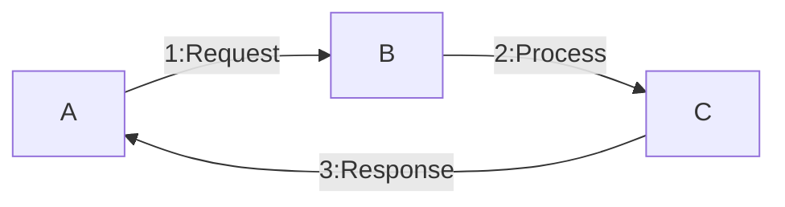
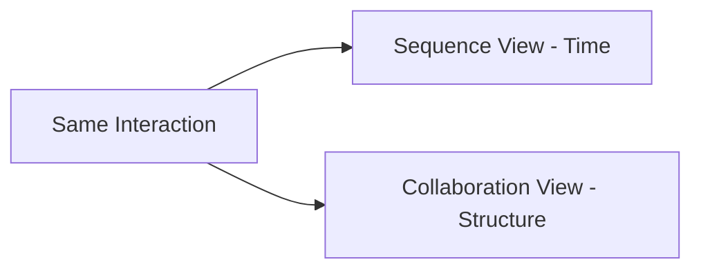

# 🧠 Sequence Diagram vs Collaboration (Communication) Diagram

## 🧩 Core Idea
Both diagrams model:
> **How objects interact by sending messages**

Difference:
- **Sequence Diagram** → Focus on **time/order**
- **Collaboration Diagram** → Focus on **relationships/structure**

---

## ⚙️ Sequence Diagram

### 🎯 Purpose
Show **step-by-step flow of interactions over time**

### 📌 Characteristics
- Time flows **top → bottom**
- Objects placed horizontally
- Messages shown as arrows in order

### 📊 Representation

### ✅ Best Used When
- Understanding **execution flow**
- Tracking **order of operations**

---

## ⚙️ Collaboration (Communication) Diagram

### 🎯 Purpose
Show **how objects are connected and interact**

### 📌 Characteristics
- Network-like structure
- Focus on object relationships
- Messages shown with **numbering (1, 2, 3...)**

### 📊 Representation (Conceptual)

### ✅ Best Used When
- Understanding **object connections**
- Visualizing **interaction structure**

---

## ⚖️ Key Differences

| Aspect              | Sequence Diagram 📊           | Collaboration Diagram 🕸️     |
|---------------------|------------------------------|------------------------------|
| Focus               | Time / Order                 | Relationships / Structure    |
| Layout              | Vertical (timeline)          | Network-like                 |
| Message Order       | Position-based               | Numbered                    |
| Clarity             | Flow understanding           | Structural understanding     |

---

## 🔁 Big Picture

---

## 🧠 Final Understanding

- Both describe **same system behavior**
- Just different perspectives:
  - Sequence = **“When things happen”**
  - Collaboration = **“Who interacts with whom”**
