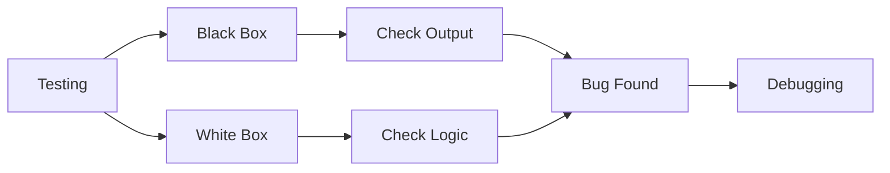

# 🧠 White Box, Black Box Testing & Debugging

## 🧩 Core Idea
- **Black Box** → Test functionality (no code knowledge)  
- **White Box** → Test internal logic (with code knowledge)  
- **Debugging** → Find and fix errors  

---

## ⚙️ Black Box Testing

### 🎯 Focus
- Input → Output behavior  

### 📌 Characteristics
- No knowledge of internal code  
- Based on requirements  

### 💻 Example
```java
add(2, 3) → 5
```

### ✅ Advantages
- Easy to perform  
- User perspective  

### ❌ Disadvantages
- Misses internal logic errors  

---

## ⚙️ White Box Testing

### 🎯 Focus
- Internal code logic  
- Conditions, loops, paths  

### 💻 Example
```java
if (x > 0) {
    // test this branch
}
```

### ✅ Advantages
- Thorough testing  
- Detects hidden bugs  

### ❌ Disadvantages
- Requires programming knowledge  

---

## ⚙️ Debugging

### 🎯 Focus
- Identify and fix errors  

### 🔁 Steps
1. Identify bug  
2. Locate source  
3. Fix  
4. Retest  

---

## ⚖️ Comparison

| Aspect          | Black Box        | White Box        | Debugging        |
|-----------------|------------------|------------------|------------------|
| Focus           | Output           | Internal logic   | Fix errors       |
| Code Knowledge  | Not required     | Required         | Required         |
| Purpose         | Validate         | Verify           | Correct          |

---

## 🔁 Big Picture



---

## 🧠 Final Understanding

Testing =  
> **Check correctness (Black + White Box)**  

Debugging =  
> **Fix identified errors**

```