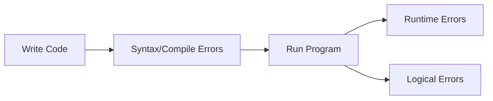

# 🧠 Types of Errors in Programs

## 🧩 Core Idea
Errors occur at different stages:
> **Before execution, during execution, or after execution**

---

## ⚙️ Types of Errors

### 🔹 Syntax Error
- Mistake in code structure  
- Detected before execution  

```java
int x = 10
```

---

### 🔹 Compilation Error
- Detected during compilation  
- Type mismatch, undeclared variables  

---

### 🔹 Runtime Error
- Occurs during execution  
- Causes program crash  

```java
int x = 10 / 0;
```

---

### 🔹 Logical Error
- Program runs but gives wrong output  

```java
int sum = a - b; // incorrect logic
```

---

### 🔹 Semantic Error
- Meaning of code is incorrect  
- Wrong use of logic/formula  

---

## ⚖️ Summary

| Error Type     | Stage              | Effect              |
|----------------|--------------------|----------------------|
| Syntax         | Before execution   | Code won’t run       |
| Compilation    | Compile time       | Build fails          |
| Runtime        | During execution   | Crash                |
| Logical        | After execution    | Wrong output         |
| Semantic       | Meaning error      | Incorrect behavior   |

---

## 🔁 Flow



---

## 🧠 Final Understanding

Errors =  
> **Issues in code that prevent correct execution or output**
