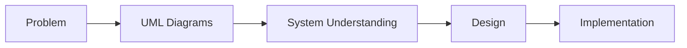

# 🧠 UML (Unified Modeling Language)

## 🧩 Core Idea
UML = **Standard visual language to model, design, and understand software systems**

> Makes software **visible, structured, and communicable**

---

## 🎯 Primary Goals
- **Visualize** → Represent system using diagrams
- **Specify** → Clearly define structure & behavior
- **Construct** → Guide implementation (blueprint for code)
- **Document** → Record design for future reference

---

## ⚙️ Importance of UML
- Handles **complex systems** by breaking them into parts
- Improves **team communication**
- Reduces **ambiguity in design**
- Helps in **planning before coding**
- Useful for **maintenance and scaling**

---

## 🧠 Why UML is Needed
Software is **invisible + complex**

UML:
- Converts ideas → diagrams  
- Helps understand system **before building**
- Avoids wrong design decisions early

---

## 🧩 Key Uses
- System design & architecture planning
- Requirement understanding
- Communication between stakeholders
- Documentation for future developers
- Basis for code generation (in some tools)

---

## 📊 Types of UML Diagrams (Just List)

### 🔹 Structural Diagrams (Static view)
- Class Diagram
- Object Diagram
- Component Diagram
- Deployment Diagram
- Package Diagram
- Composite Structure Diagram

---

### 🔹 Behavioral Diagrams (Dynamic view)
- Use Case Diagram
- Activity Diagram
- State Machine Diagram

---

### 🔹 Interaction Diagrams (subset of behavioral)
- Sequence Diagram
- Communication (Collaboration) Diagram
- Interaction Overview Diagram
- Timing Diagram

---

## 🔁 Big Picture

---

## 🧠 Final Understanding

UML =  
> **A standardized way to visualize, design, and document software systems**, 
> making complex systems easier to understand, build, and maintain.
