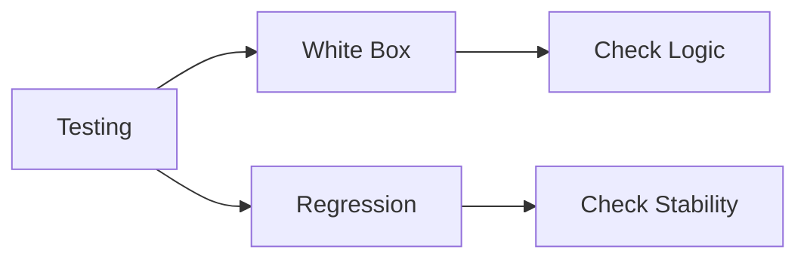

# 🧠 White Box vs Regression Testing

## 🧩 Core Idea
- **White Box Testing** → Tests internal code logic  
- **Regression Testing** → Ensures existing features still work after changes  

---

## ⚙️ White Box Testing

### 🎯 Focus
- Internal structure of code  
- Logic, conditions, execution paths  

### 📌 Characteristics
- Requires knowledge of code  
- Performed during development  

---

## ⚙️ Regression Testing

### 🎯 Focus
- Previously working features  
- Stability after modifications  

### 📌 Characteristics
- Ensures no new bugs introduced  
- Done after updates or fixes  

---

## ⚖️ Difference

| Aspect          | White Box Testing         | Regression Testing        |
|-----------------|--------------------------|---------------------------|
| Focus           | Internal logic           | Existing functionality    |
| Purpose         | Verify correctness       | Ensure stability          |
| Code Knowledge  | Required                 | Not required              |
| When Used       | During development       | After changes             |

---

## 🔁 Big Picture

---

## 🧠 Final Understanding

- White Box → **How code works**  
- Regression → **Did anything break after changes**
