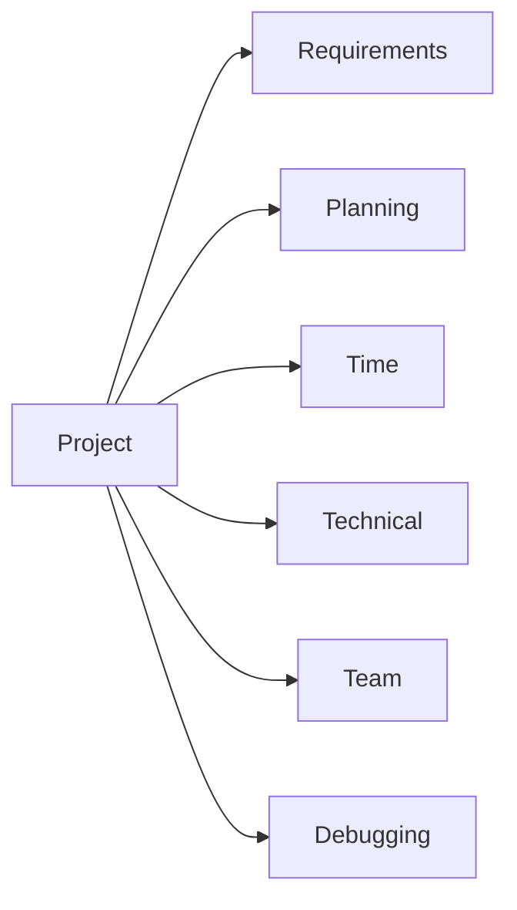

# 🧠 Problems in Software Projects (Student Perspective)

## 🧩 Core Idea
> Common challenges faced while developing academic software projects

---

## ⚙️ Key Problems

### 🔹 Requirement Issues
- Unclear or changing requirements  

---

### 🔹 Planning Issues
- Lack of structured approach  
- No proper task breakdown  

---

### 🔹 Time Constraints
- Limited time due to academic schedule  
- Work concentrated near deadlines  

---

### 🔹 Technical Challenges
- Learning new technologies while building  
- Limited prior experience  

---

### 🔹 Design Difficulties
- Trouble in system design and architecture  

---

### 🔹 Team Coordination
- Uneven contribution  
- Communication gaps  

---

### 🔹 Debugging Issues
- Difficulty identifying and fixing errors  

---

### 🔹 Scope Management
- Expanding features beyond initial plan  

---

## 🔁 Big Picture

---

## 🧠 Final Understanding

> Student project challenges mainly arise from  
**limited experience, time constraints, and coordination issues**
