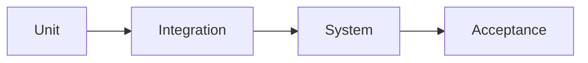

# 🧠 Types of Software Testing

## 🧩 Core Idea
Testing =  
> **Verifying correctness, performance, and reliability of software**

---

## ⚙️ Based on Level

### 🔹 Unit Testing
- Test individual functions/classes  

```java
add(2, 3) → 5
```

---

### 🔹 Integration Testing
- Test interaction between modules  

---

### 🔹 System Testing
- Test complete system  

---

### 🔹 Acceptance Testing
- Validate with user requirements  

---

## ⚙️ Based on Approach

### 🔹 Black Box Testing
- No knowledge of code  
- Input → Output  

---

### 🔹 White Box Testing
- Internal logic testing  

---

## ⚙️ Based on Purpose

### 🔹 Regression Testing
- Ensure old features still work  

---

### 🔹 Performance Testing
- Check speed, scalability  

---

### 🔹 Security Testing
- Ensure system safety  

---

### 🔹 Usability Testing
- Check user experience  

---

## 🔁 Testing Flow



---

## 🧠 Final Understanding

Testing =  
> **Multi-level process to ensure software works correctly and efficiently**
