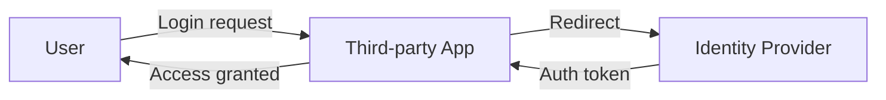
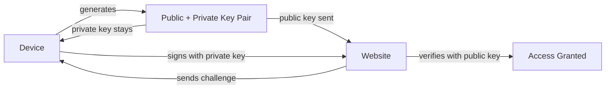

# Protecting Accounts

> **Series:** [[01 - Protecting Accounts]] · [[02 - Protecting Data]] · [[03 - Cryptography]] · [[04 - Securing Systems]] · [[05 - Malware & Threats]]

---

## Navigation
- [Core Definitions](#Core%20Definitions)
- [Identity Proof Components](#Identity%20Proof%20Components)
- [Password Attacks](#Password%20Attacks)
- [NIST Password Guidelines](#NIST%20Password%20Guidelines)
- [Authentication Factors](#Authentication%20Factors)
- [MFA / TFA](#MFA%20/%20TFA)
- [Common Security Threats](#Common%20Security%20Threats)
- [Single Sign-On (SSO)](#Single%20Sign-On%20(SSO))
- [Password Managers](#Password%20Managers)
- [Passkeys](#Passkeys)

---

## Core Definitions

### Authentication

> **Proving who you are.**

The system verifies your identity before granting access.

Examples:
- Entering username + password
- Logging in with Google (SSO)
- Using a fingerprint

---

### Authorization

> **Determining what you are allowed to access.**

After identity is confirmed, the system checks permissions.

Examples:
- Admin can delete users
- Normal user cannot access admin panel

---

## Identity Proof Components

### Username
- Public identifier — not secret
- Used to locate the account

### Password
- Private secret — only known to the user
- Used to verify identity

---

## Password Attacks

### Dictionary Attack
- Tries common words from language dictionaries
- Exploits weak, predictable passwords

### Brute Force Attack
- Tries every possible combination systematically

Example:
- 4-digit numeric PIN → $10^4 = 10,000$ combinations → cracked in milliseconds
- 8-character password using 94 characters (52 letters + 10 digits + 32 symbols):

$$
94^8 \approx 6 \text{ quadrillion combinations}
$$

---

## NIST Password Guidelines

| Rule | Detail |
|------|--------|
| Minimum length | 8 characters |
| Maximum length | 64 characters |
| Character set | Allow full Unicode |
| Complexity rules | Don't enforce blindly |
| Blocklist | Common passwords, sequences, repeated patterns |
| Feedback | Tell user why password is weak |

### Security Practices
- Do **not** use security hint questions ("What was your first pet?") — answers are often guessable or leaked
- Implement **rate limiting** on failed login attempts
- Slow down or lock out after repeated failures

---

## Authentication Factors

### 1️⃣ Knowledge — Something you know
- Password, PIN

### 2️⃣ Possession — Something you have
- Phone, hardware token, keycard

### 3️⃣ Inherence — Something you are
- Fingerprint, face recognition, iris scan

---

## MFA / TFA

**Multi-Factor Authentication** — combines at least two different factor categories.

Example:
- Password (knowledge) + OTP to phone (possession)

Adds an additional barrier even if one factor is compromised.

### OTP Risk — SIM Swap Attack
- Attacker contacts carrier, convinces them to transfer your number to their SIM
- They now receive your OTP
- Mitigated by using **authenticator apps** or **hardware tokens** instead of SMS

---

## Common Security Threats

### Keylogging
- Malware records every keystroke
- Sends captured credentials to attacker

### Credential Stuffing
- Attacker takes leaked credentials from one site
- Tries them on other sites
- Works because people reuse passwords

### Social Engineering
- Builds trust with the target
- Manipulates them into revealing credentials — no technical exploit needed

### Phishing
- Fake email or link mimicking a legitimate service
- Redirects user to a malicious lookalike site
- Captures submitted credentials

### Man-in-the-Middle (MITM)
- Attacker intercepts communication between user and server
- Poses as the server to the user, and as the user to the server

### Machine-in-the-Middle
- Same concept but at network infrastructure level
- Compromised routers or ISP-level interception

---

## Single Sign-On (SSO)

> Login to one site using your identity from another trusted provider.

Commonly implemented via **OAuth 2.0**.

Example: "Login with Google"

**Trade-off:** Reduces password reuse risk, but creates a single point of failure — if Google account is compromised, all linked services are too.

---

## Password Managers

- Store all passwords encrypted (e.g. AES-256)
- Protected by a single **master password**
- Enable long, unique passwords per site with no memorization needed

> One strong master password is much better than reusing weak ones everywhere.

---

## Passkeys

- Generated by the device — no password involved
- Based on **public-key cryptography**
- Often unlocked with biometrics (fingerprint, face)

Eliminates:
- Password reuse
- Phishing-based credential theft (private key never leaves device)
