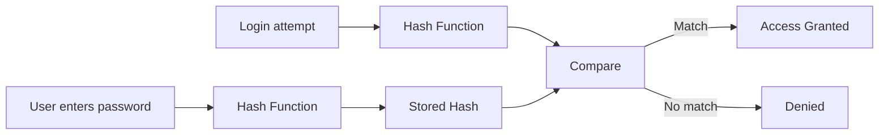
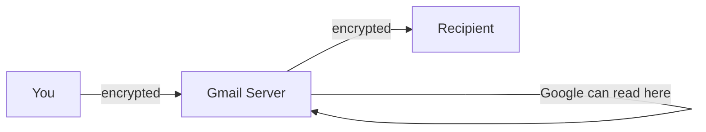
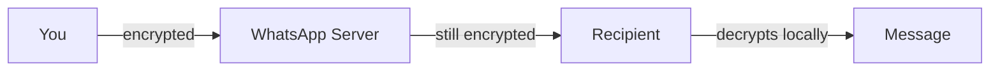

# Protecting Data

> **Series:** [[01 - Protecting Accounts]] · [[02 - Protecting Data]] · [[03 - Cryptography]] · [[04 - Securing Systems]] · [[05 - Malware & Threats]]

---

## Navigation
- [[#Data Leaks]]
- [[#Hashing]]
- [[#Attacks on Hashed Passwords]]
- [[#Rainbow Tables]]
- [[#Salting]]
- [[#Password Hashing Algorithms]]
- [[#Hash Metadata]]
- [[#Hash Collisions]]
- [[#Red Flags]]
- [[#Encryption in Transit vs E2EE]]
- [[#Deletion & Secure Deletion]]
- [[#Encryption at Rest]]
- [[#Full Disk Encryption]]
- [[#Ransomware]]
- [[#Quantum Computing Threat]]

---

## Data Leaks

> A data leak means database contents have been exposed to unauthorized parties.

May include: username, email, password, personal info.

| Password Storage | Attacker Gets |
|-----------------|---------------|
| Plain text | Immediate access |
| Hashed | Must crack the hash first |

---

## Hashing

> Input → Hash Function → Fixed-length output (hash)

Properties:
- **Fixed-length output** regardless of input size
- **Deterministic** — same input always produces same hash
- **One-way** — cannot reverse the hash to get input
- **No visible pattern** — hash reveals nothing about input

### Login Flow



> Even admins cannot see original passwords — only hashes are stored.

---

## Attacks on Hashed Passwords

### Dictionary Attack
- Hash every word in a wordlist
- Compare results against stolen hashes
- Fast if password is a common word

### Brute Force
- Hash every possible combination
- Computationally expensive for long/complex passwords

---

## Rainbow Tables

> A precomputed lookup table of `password → hash` pairs.

Instead of hashing each guess at attack time:
- Attacker precomputes millions of hashes offline
- At attack time, just looks up the stolen hash instantly

This is a **precomputation attack** — trades storage for speed.

Defeated by → [[#Salting]]

---

## Salting

> Adding a unique random value to each password before hashing.

```
password + salt1 → hash1
password + salt2 → hash2
```

Even identical passwords produce different hashes.

Properties:
- Salt is **unique per user**
- Salt is **stored alongside the hash** (not secret, just random)
- Defeats rainbow tables — attacker would need a separate table per salt

---

## Password Hashing Algorithms

> Do **not** create your own. Use well-tested libraries.

### For Passwords
| Algorithm | Notes |
|-----------|-------|
| `bcrypt` | Widely used, slow by design |
| `Argon2` | Modern, memory-hard, recommended |
| `PBKDF2` | Standard, used in many systems |

### General Cryptographic Hashing (not for passwords)
- `SHA-2`, `SHA-3`

> Password hashing ≠ general hashing. Password hashing is intentionally slow to resist brute force.

---

## Hash Metadata

Modern systems store all of this together in one encoded string:

```
$argon2id$v=19$m=65536,t=3,p=4$<salt>$<hash>
```

Contains:
- Algorithm used
- Cost/work factor
- Salt
- Hash

Allows safe algorithm upgrades without breaking existing accounts.

---

## Hash Collisions

A hash is **not mathematically unique**.

- Infinite possible inputs → fixed-length output
- By the **pigeonhole principle**, collisions must exist

However:
- Strong cryptographic hashes make finding collisions **computationally infeasible**
- Longer hash → lower collision probability

This is why hashing is still considered a reliable one-way function.

---

## Red Flags

> If a site emails you your actual password during a reset:

**They stored it in plain text. Do not trust that site.**

Proper systems:
- Store only hashes
- Send password **reset links**, never the original password

---

## Encryption in Transit vs E2EE

### Encryption in Transit

Data is encrypted **while moving** between points — but not while sitting at an intermediate server.



Example: Gmail uses HTTPS — your connection is encrypted, but Google can read your email on their servers.

---

### End-to-End Encryption (E2EE)

Data is encrypted **the entire journey** — no intermediate server can read it.



- Only sender and recipient hold the keys
- Even the service provider sees only ciphertext

Example: WhatsApp messages

---

## Deletion & Secure Deletion

### How Deletion Actually Works

When you delete a file, the OS does **not** wipe the data.

- It marks that space as "available"
- Original bits stay until overwritten by a new file
- Recoverable with forensic tools — sometimes long after deletion

> Sensitive files should never be "just deleted."

### Secure Deletion

Actively overwrites the space so the original content is unrecoverable.

| Method | Detail |
|--------|--------|
| Basic | Overwrite with `0`s |
| Stronger | Multiple passes with random data |

---

## Encryption at Rest

Data is encrypted while stored on a physical device.

- Hard drive, SSD, flash drive
- Requires authentication (password/key) to access
- Device can be stolen, sold, or destroyed — data remains unreadable without the key

---

## Full Disk Encryption

The **entire disk** appears as random meaningless bytes until authenticated.

- Without the key, even pulling the drive and connecting it elsewhere yields nothing
- As disks wear out, encryption ensures residual data on degraded sectors stays unreadable

Examples:
- **BitLocker** (Windows)
- **LUKS** (Linux)

---

## Ransomware

Attacker encrypts the victim's files with their own key, then demands payment.

- Victim loses access to all their data
- No guarantee the key provided (if any) actually works
- Even paying does not ensure recovery

> Backups stored offline or off-device are the real defense.

---

## Quantum Computing Threat

Classical bits are strictly `0` or `1`. Qubits exist in **superposition** — both simultaneously.

| Qubits | States Represented |
|--------|--------------------|
| 1 | 2 |
| 2 | 4 |
| 3 | 8 |
| n | $2^n$ |

- Explores vast solution spaces in parallel
- **Shor's algorithm** can factor large numbers efficiently → breaks RSA
- Threatens most current asymmetric encryption

> Post-quantum cryptography is an active area of research to address this.
