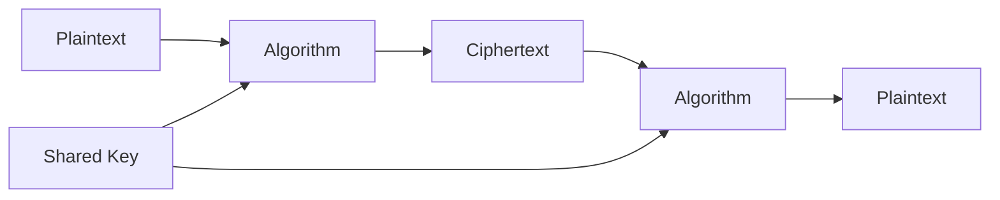
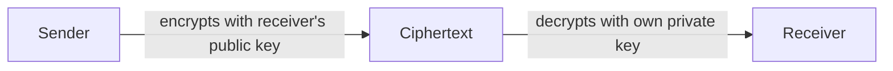
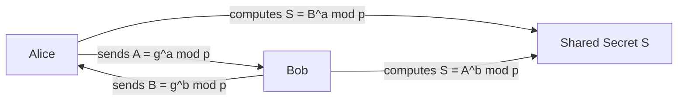
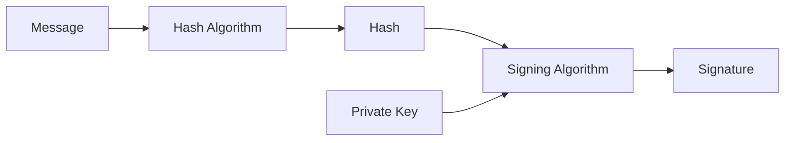
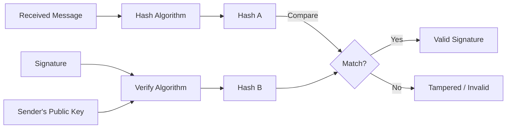
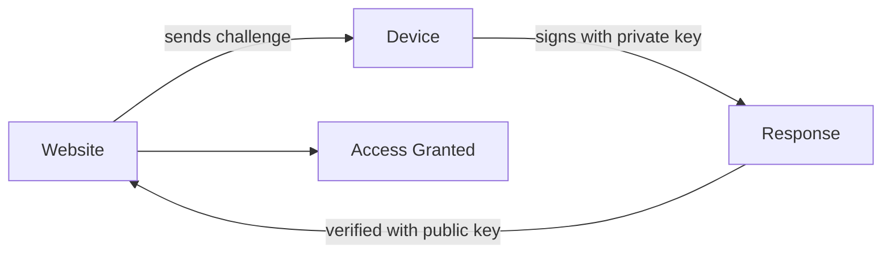

# Cryptography

> **Series:** [[01 - Protecting Accounts]] · [[02 - Protecting Data]] · [[03 - Cryptography]] · [[04 - Securing Systems]] · [[05 - Malware & Threats]]

---

## Navigation
- [[#Core Concepts]]
- [[#Symmetric Cryptography]]
- [[#Key Distribution Problem]]
- [[#Asymmetric Cryptography]]
- [[#RSA]]
- [[#Diffie-Hellman Key Exchange]]
- [[#Digital Signatures]]
- [[#Cryptanalysis]]
- [[#Caesar Cipher]]
- [[#Passkeys]]
- [[#Integrity Hashes]]

---

## Core Concepts

> **Cryptography** — reversible secret transformations of data using encryption and decryption.

To decrypt, you need:
- The **algorithm** (the procedure)
- The **key** (the secret value)

### Terminology

| Term | Meaning |
|------|---------|
| Plaintext | Original readable data |
| Ciphertext | Encrypted, unreadable data |
| Encipher | Plaintext → Ciphertext |
| Decipher | Ciphertext → Plaintext |
| Cipher | The mathematical procedure used to transform data |
| Key | Secret value used by the algorithm |

> Ciphers operate on **characters or bits**, not entire words.

---

## Symmetric Cryptography

> Both sender and receiver use the **same shared key**.



Common algorithms:
- **AES** (Advanced Encryption Standard) — current standard
- **Triple DES** — older, still used in some legacy systems

**Advantage:** Fast and efficient.
**Problem:** How do you securely share the key in the first place? → [[#Key Distribution Problem]]

---

## Key Distribution Problem

- Symmetric encryption requires both parties to have the same key
- Sharing the key securely is the core challenge
- You can't encrypt the key without needing another key to protect that one
- Circular problem — solved by [[#Asymmetric Cryptography]]

---

## Asymmetric Cryptography

> Uses a **key pair**: one public, one private.

- **Public key** — freely shareable
- **Private key** — never shared, stays with the owner

### Encryption Flow



Only the private key holder can decrypt — even the sender cannot decrypt after encrypting.

---

## RSA

> Based on the mathematical difficulty of **factoring large numbers**.

### Key Generation

Choose two large primes $p$, $q$

$$n = p \times q$$

$$\phi(n) = (p-1)(q-1)$$

Choose public exponent $e$ such that:

$$\gcd(e,\ \phi(n)) = 1$$

Compute private exponent $d$:

$$d \equiv e^{-1} \pmod{\phi(n)}$$

### Keys

$$\text{Public Key} = (e,\ n)$$

$$\text{Private Key} = (d,\ n)$$

### Encryption & Decryption

$$C = M^e \bmod n$$

$$M = C^d \bmod n$$

**Security relies on:** Factoring $n$ back into $p$ and $q$ is computationally infeasible at large sizes — but threatened by [[02 - Protecting Data#Quantum Computing Threat|quantum computing]].

---

## Diffie-Hellman Key Exchange

> Establishes a **shared secret** over an insecure channel — without transmitting the secret itself.

Public values agreed upon: $p$ (prime), $g$ (generator)

Each party picks a private value:

$$a \text{ (Alice)}, \quad b \text{ (Bob)}$$

Exchange public values:

$$A = g^a \bmod p \quad \text{(Alice sends this)}$$

$$B = g^b \bmod p \quad \text{(Bob sends this)}$$

Each computes the shared secret:

$$S = B^a \bmod p \quad \text{(Alice computes)}$$

$$S = A^b \bmod p \quad \text{(Bob computes)}$$

Both arrive at the same $S$ — without ever transmitting it.



---

## Digital Signatures

Used to prove:
- **Authenticity** — message came from the claimed sender
- **Integrity** — message was not modified
- **Non-repudiation** — sender cannot deny sending it

Algorithms: DSA, ECDSA, RSA (signing mode)

### Signing



1. Hash the message
2. Sign the hash with the sender's **private key**
3. Send: message + signature

### Verification



1. Receiver hashes the received message
2. Uses sender's **public key** to extract the original hash from the signature
3. Compares both hashes — if equal, signature is valid

---

## Cryptanalysis

> Attempting to break encrypted data without the key.

Goals:
- Recover plaintext
- Discover the key
- Find a weakness in the algorithm

---

## Caesar Cipher

A simple **rotational cipher** — each letter is shifted by a fixed number of positions.

Example (shift 3):
```
A → D
B → E
C → F
Z → C
```

**Simple but completely insecure** — only 25 possible keys, trivially brute-forced.

> Historical interest only. Basis for understanding more complex substitution ciphers.

---

## Passkeys

> Passwordless login based on public-key cryptography. See also: [[01 - Protecting Accounts#Passkeys]]

### Process

1. Device generates a **key pair** (public + private)
2. Public key is registered with the website
3. Private key never leaves the device

### Login Challenge



Properties:
- No password stored anywhere
- Phishing-resistant — private key tied to exact domain
- Unique key pair per website

---

## Integrity Hashes

> Different from password hashing — used to verify **data integrity and authenticity**.

| Algorithm | Full Name | Use |
|-----------|-----------|-----|
| HMAC | Hash-based Message Authentication Code | Message integrity + authenticity |
| CMAC | Cipher-based MAC | Same purpose, cipher-based |

These are not one-way storage hashes — they verify that a message has not been tampered with in transit.
