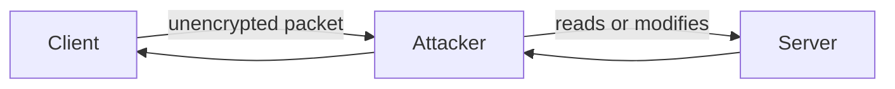
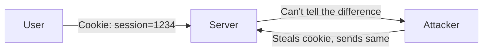
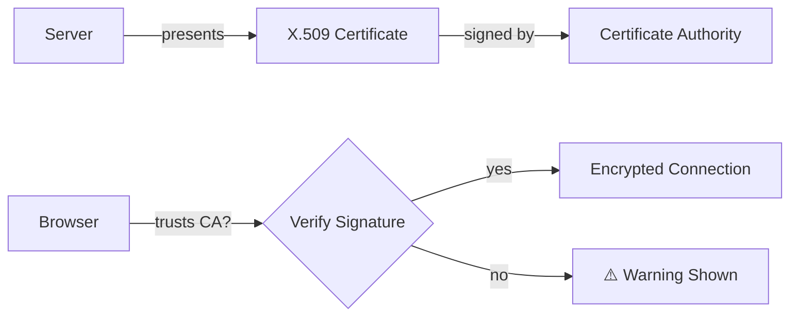
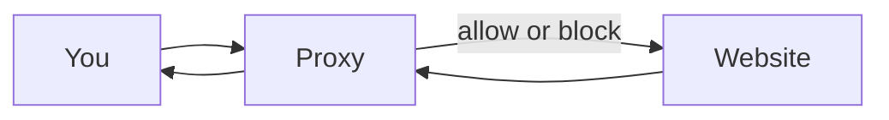
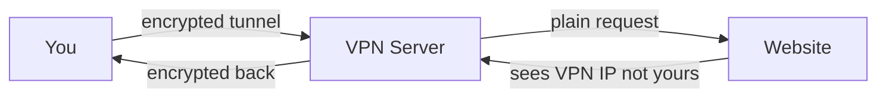

# Securing Systems

> **Series:** [[01 - Protecting Accounts]] · [[02 - Protecting Data]] · [[03 - Cryptography]] · [[04 - Securing Systems]] · [[05 - Malware & Threats]]

> Everything builds on encryption.

---

## Navigation
- [[#WiFi — WPA]]
- [[#HTTP vs HTTPS]]
- [[#Packet Sniffing & Machine-in-the-Middle]]
- [[#Cookies & Session Hijacking]]
- [[#TLS & Certificates]]
- [[#SSL Stripping & HSTS]]
- [[#Ports]]
- [[#Port Scanning & Penetration Testing]]
- [[#Firewall]]
- [[#Proxy]]
- [[#VPN]]
- [[#SSH]]

---

## WiFi — WPA

**WPA (WiFi Protected Access)** encrypts data between your device and the router.

- Without it, anyone on the same network can read your traffic in plain text
- The router must support and have WPA enabled

---

## HTTP vs HTTPS

### HTTP — HyperText Transfer Protocol

- How the web communicates
- Data is **not encrypted** in transit
- Vulnerable to interception and modification

```http
GET /search?q=cats HTTP/3
Host: example.com
```

```http
POST /checkout HTTP/3
Host: example.com

card_number=3298347229871234
```

> Credit card number in plain text — anyone intercepting the packet sees it directly.

---

### HTTPS

- HTTP + **TLS encryption**
- Data, headers, cookies are all encrypted
- Packet **metadata** (sender/receiver IP, port) is still visible — routers need it to route the packet
- The **payload** is protected

---

## Packet Sniffing & Machine-in-the-Middle



On unencrypted HTTP:
- Attacker can **read** all packet data
- Attacker can **modify** packets — e.g. inject `<script src="malicious.js">` into HTML responses before they reach you

> IP addresses of sender and receiver are visible in every packet regardless — needed for routing. But the attacker doesn't need your IP to sniff — they just intercept whatever passes through.

---

## Cookies & Session Hijacking

### Cookie

After login, the server issues a session token so you don't re-authenticate on every request.

```http
HTTP/3 200
Set-Cookie: session=1234abcd
```

Every subsequent request sends it back:

```http
GET /dashboard HTTP/3
Cookie: session=1234abcd
```

Works like a **temporary pass** — present it to confirm identity.

### Session Hijacking

- Attacker steals your session ID (via sniffing, XSS, etc.)
- Uses it to impersonate you — no password needed



> HTTPS encrypts cookies in transit, preventing sniffing. But XSS can still steal cookies from the browser.

---

## TLS & Certificates

**TLS (Transport Layer Security)** — the protocol that makes HTTPS secure.
SSL is the older, deprecated predecessor. Always TLS now.

### Certificate (X.509)

Server presents a certificate containing:
- Domain name
- Public key
- Expiry date
- Issuer (Certificate Authority)



**Certificate Authorities (CAs)** — trusted companies (DigiCert, Let's Encrypt, etc.) that browsers ship with as trusted signers. If a CA signs a cert, the browser trusts it.

---

## SSL Stripping & HSTS

### SSL Stripping

When you type `example.com`, browser tries HTTP first, then gets redirected to HTTPS:

```http
HTTP/3 307 Redirect
Location: https://example.com
```

> This redirect is **unencrypted** — attacker can intercept it and redirect to `https://examp1e.com` instead.

### HSTS — HTTP Strict Transport Security

Server tells the browser: *only ever use HTTPS for this domain.*

```
Strict-Transport-Security: max-age=31536000; includeSubDomains; preload
```

| Directive | Meaning |
|-----------|---------|
| `max-age` | Enforce HTTPS for this many seconds (~1 year) |
| `includeSubDomains` | Applies to all subdomains |
| `preload` | Browser ships with HTTPS-only list baked in — eliminates even the first HTTP request |

> Without preload, the very first visit is still vulnerable. With preload, the browser never sends an HTTP request at all.

---

## Ports

A port number tells the OS **which service** should handle an incoming packet.

| Port | Service |
|------|---------|
| 80 | HTTP |
| 443 | HTTPS |
| 22 | SSH |
| 23 | Telnet (unencrypted, should be blocked) |

- A service must be **actively listening** on a port to accept connections
- Closed port = no access, connection refused

---

## Port Scanning & Penetration Testing

### Port Scanning
- Systematically tries every port to discover what services are running
- Tools: `nmap`
- Used offensively to find attack surface, and defensively to audit your own exposure

### Penetration Testing
- Authorized attempt to exploit open or misconfigured ports/services
- Goal: find flaws before real attackers do

| Role | Function |
|------|----------|
| Red Team | Attackers — find and exploit weaknesses |
| Blue Team | Defenders — detect and respond |
| Ethical Hacking | All of the above, done legally within defined scope |

---

## Firewall

Software or hardware that filters traffic entering or leaving a network based on rules.

- Block by **IP address**, **port**, or **protocol**
- Example: block port 23 (Telnet) network-wide
- **Only effective on its own network** — mobile data bypasses a home/office firewall entirely

### Deep Packet Inspection (DPI)

- Opens and inspects packet **contents** (not just metadata)
- Can block by domain name, detect malware signatures, or filter specific content
- Used by ISPs, governments, and corporate networks

---

## Proxy

A server sitting between client and destination — inspects, filters, or modifies traffic.



- Companies use proxies to monitor all outbound employee traffic
- Can **add a custom CA** to your device → proxy intercepts HTTPS, decrypts, inspects, re-encrypts
- This is a **sanctioned machine-in-the-middle** — your org controls it

### URL Rewriting (Proxy Technique)
```
https://proxy.company.com/?url=https://example.com
```
All links are routed through the proxy first — so the proxy knows and controls every site you visit.

> Even with a VPN, if a CA has been installed on your device, all traffic still goes through the proxy first. VPN doesn't help here.

---

## VPN

Encrypts all traffic between you and the VPN server.



- Website sees the **VPN's IP**, not yours
- Useful for: privacy, bypassing geo-restrictions, securing public WiFi traffic
- **Not fully private** — VPN provider can log and legally disclose your traffic if required

---

## SSH — Secure Shell

Encrypted protocol for securely executing commands on a remote machine.

```bash
ssh user@stanford.edu
```

- All commands and responses are encrypted
- Can tunnel other protocols through SSH (ad-hoc VPN)
- Port 22
