# 🔐 CS50 Cybersecurity

> [!abstract] Overview
> Security is not a single tool — it's **layers**. This note covers account protection, data protection, cryptography, system security, software vulnerabilities, and privacy.

---

## 📑 Table of Contents

- [[#Protecting Accounts]]
- [[#Protecting Data]]
- [[#Cryptography]]
- [[#Protecting Data in Practice]]
- [[#Securing Systems]]
- [[#Securing Software]]
- [[#Preserving Privacy]]

---

# Protecting Accounts

## Authentication vs Authorization

| Concept | Definition | Example |
|---|---|---|
| **Authentication** | Proving *who you are* | Username + password, fingerprint, SSO |
| **Authorization** | Determining *what you can access* | Admin can delete users; normal user cannot |

> [!note] Remember
> Authentication comes first. Authorization happens after identity is confirmed.

---

## Identity Proof

- **Username** — public identifier, not secret, used to locate the account
- **Password** — private secret, known only to user, used to verify identity

---

## Password Attacks

### Dictionary Attack
- Tries common words from language dictionaries
- Exploits weak, predictable passwords

### Brute Force Attack
- Tries every possible combination

| Password Type | Combinations | Time to Crack |
|---|---|---|
| 4-digit numeric | $10^4 = 10{,}000$ | Milliseconds |
| 8-char (52+10+32 = 94 chars) | $94^8 \approx 6$ quadrillion | Practically infeasible |

---

## NIST Password Guidelines

> [!tip] Key Recommendations
> - Minimum length: **8 characters**, max: **64 characters**
> - Allow full Unicode
> - Do **not** enforce arbitrary complexity rules blindly
> - Check against: common passwords, repeated patterns, sequences
> - Provide user feedback for weak passwords
> - **No** security hints (e.g. "What was your first pet?")
> - Implement **rate limiting** and slow down repeated login failures

---

## Authentication Factors

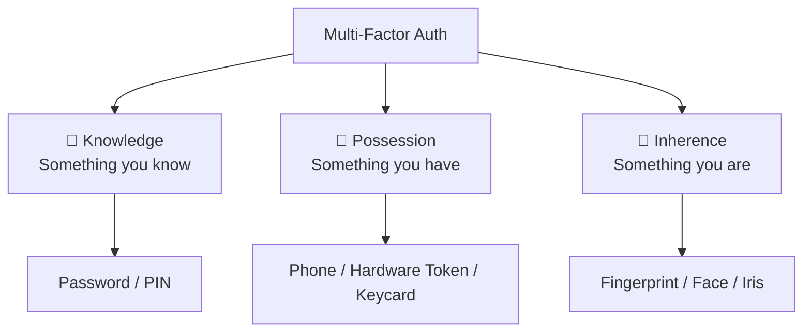

### MFA / TFA
- Combines **at least two** factor categories
- Example: Password (knowledge) + OTP to phone (possession)

> [!warning] OTP Risk — SIM Swap Attack
> Attacker convinces carrier to transfer your phone number to their SIM → receives your OTP → bypasses MFA

---

## Common Account Threats

| Threat | How It Works |
|---|---|
| **Keylogging** | Records keystrokes, sends credentials to attacker |
| **Credential Stuffing** | Uses leaked credentials from one site to attack others |
| **Social Engineering** | Builds trust, manipulates user into revealing credentials |
| **Phishing** | Fake email/link mimicking a legitimate service |
| **MITM (Man-in-the-Middle)** | Attacker intercepts traffic, impersonates both client and server |
| **Machine-in-the-Middle** | Network-level interception via compromised routers |

---

## SSO, Password Managers & Passkeys

### Single Sign-On (SSO)
- Login to one site using identity from another (e.g. "Login with Google")
- Commonly implemented via **OAuth 2.0**
- Reduces password reuse but creates **dependency on identity provider**

### Password Managers
- Store passwords encrypted (e.g. AES-256)
- Protected by a single master password
- Encourage long, unique passwords per site

### Passkeys
- Device generates a **public/private key pair**
- Public key sent to website; private key stays on device
- Login: site sends challenge → device signs with private key → site verifies with public key
- Eliminates: password reuse, phishing-based credential theft
- Often combined with biometric unlock

---

# Protecting Data

## Data Leak

> [!danger] What a Leak Exposes
> A database breach may expose: usernames, emails, passwords, personal info.
> - Passwords stored in **plain text** → instant access for attacker
> - Passwords stored as **hashes** → attacker must crack them

---

## Hashing

> One-way function: `input → hash function → fixed-length output`

**Properties:**
- Fixed-length output regardless of input size
- Deterministic — same input always gives same hash
- Irreversible — cannot recover original input from hash
- No visible pattern in output representing input

### Registration & Login Flow

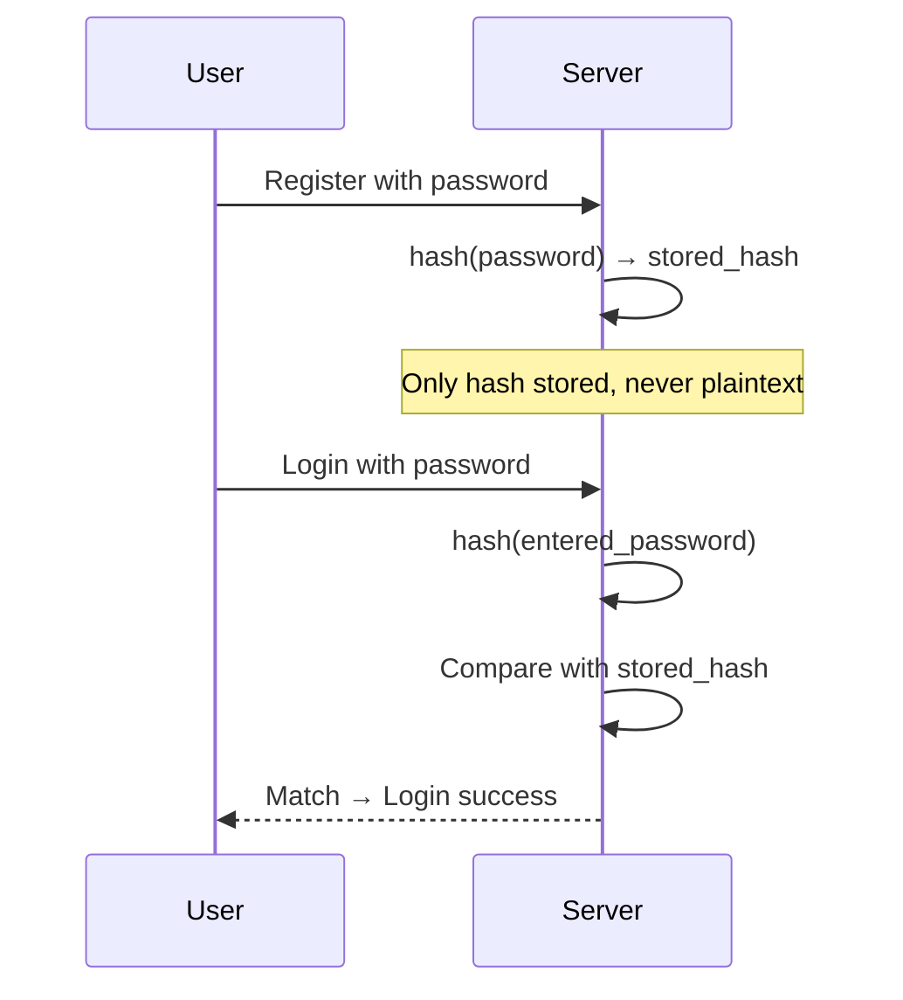

---

## Attacks on Hashed Passwords

- **Dictionary attack on hashes** — hash every dictionary word, compare with stolen hashes
- **Brute force on hashes** — hash all combinations, compare (expensive but possible for weak passwords)
- **Rainbow Tables** — precomputed table of `password → hash` pairs; look up stolen hash instantly

---

## Salting

> Add a unique random value to the password before hashing

```
hash(password + salt) → unique hash per user
```

- Salt is **unique per user**, stored alongside hash (not secret, just random)
- Two users with same password get **different hashes**
- **Defeats rainbow table attacks** entirely — precomputed tables become useless

---

## Hash Algorithms to Use

> [!tip] Don't reinvent hashing — use well-tested libraries

| Use Case | Recommended |
|---|---|
| Password hashing | `bcrypt`, `Argon2`, `PBKDF2` |
| General cryptographic hash | `SHA-2`, `SHA-3` |

**Hash metadata stored in modern systems:**
- Algorithm used
- Cost/work factor
- Salt
- Hash value (all encoded in one string)

---

## Red Flags & Collisions

> [!danger] Red Flag
> If a site **emails you your original password** during reset → they store it in plain text. Do not trust that site.

**Hash Collisions:**
- Infinite possible inputs, fixed-length output → collisions are mathematically possible (pigeonhole principle)
- Strong cryptographic hashes make collisions **computationally infeasible**
- Still considered one-way hashing in practice

**Integrity Hashes (different use case):**
- HMAC, CMAC — used for message integrity and authenticity, not password storage

---

# Cryptography

> [!abstract] Definition
> Cryptography = reversible secret coding. Unlike hashing, it is **two-way**: encrypt and decrypt.
> Requires: the algorithm + the **key**.

## Terminology

| Term | Meaning |
|---|---|
| Plaintext | Original readable data |
| Ciphertext | Encrypted unreadable data |
| Cipher | Mathematical procedure to transform data |
| Encipher | Plaintext → Ciphertext |
| Decipher | Ciphertext → Plaintext |
| Key | Secret value used by the algorithm |

---

## Symmetric Key Cryptography

- Both sender and receiver share the **same key**
- Used for actual data encryption (fast)

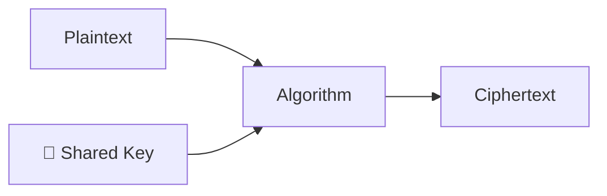

**Common algorithms:** AES, Triple DES

> [!warning] Key Distribution Problem
> How do you securely share the secret key in the first place?
> If you encrypt the key, you need another key — infinite regress.
> Solved using **asymmetric cryptography**.

---

## Asymmetric Key Cryptography (Public Key)

- Uses two mathematically linked keys: **public** and **private**
- Public key: freely shareable
- Private key: never leaves the owner

**Encryption flow:**
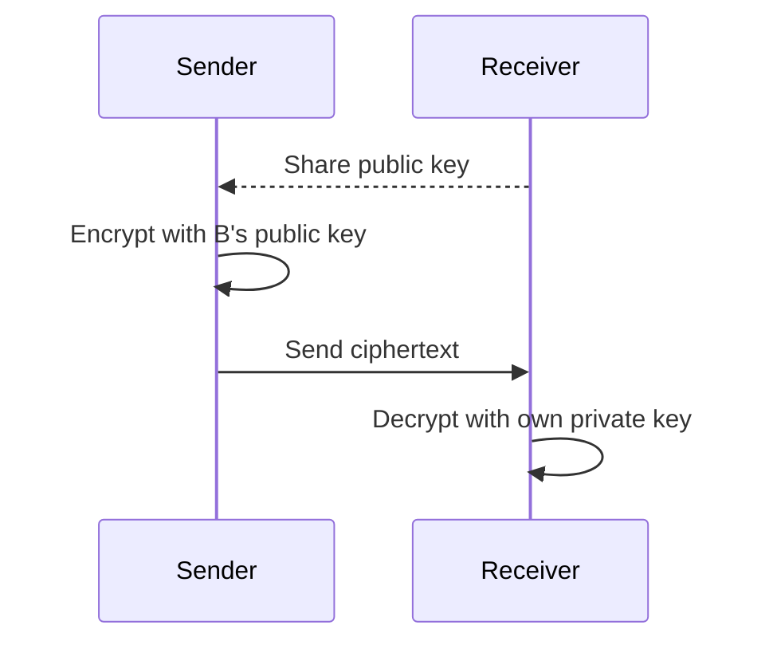

---

## RSA

Based on difficulty of factoring large numbers.

Choose two large primes $p$, $q$:

$$n = p \times q$$

$$\phi(n) = (p-1)(q-1)$$

Choose public exponent $e$ such that $\gcd(e, \phi(n)) = 1$

Compute private exponent: $d \equiv e^{-1} \pmod{\phi(n)}$

| Key | Value |
|---|---|
| Public Key | $(e, n)$ |
| Private Key | $(d, n)$ |
| Encrypt | $C = M^e \bmod n$ |
| Decrypt | $M = C^d \bmod n$ |

Security relies on the computational difficulty of factoring large $n$.

---

## Diffie–Hellman Key Exchange

> Establishes a **shared secret** over an insecure channel — neither party transmits the secret directly.

Public values: $p$ (prime), $g$ (generator)

Each party picks private values $a$ and $b$, then exchanges:

$$A = g^a \bmod p \qquad B = g^b \bmod p$$

Both compute shared secret independently:

$$S = B^a \bmod p = A^b \bmod p$$

---

## Digital Signatures

**Purpose:** Prove authenticity, ensure integrity, provide non-repudiation.

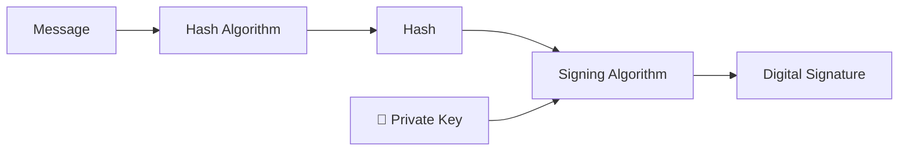

**Signing:** Hash the message → sign hash with private key → output is signature

**Verification:**
1. Receiver hashes the received message
2. Uses sender's **public key** to recover hash from signature
3. Compares both hashes → match = valid signature

**Algorithms:** DSA, ECDSA, RSA (for signing)

---

## Caesar Cipher (Historical)

- Each letter shifted by a fixed number of positions
- Example (shift 3): `A→D`, `B→E`, `C→F`
- Simple and **completely insecure** — only 25 possible keys

---

## Passkeys (Web Authentication)

Passwordless login using asymmetric cryptography:

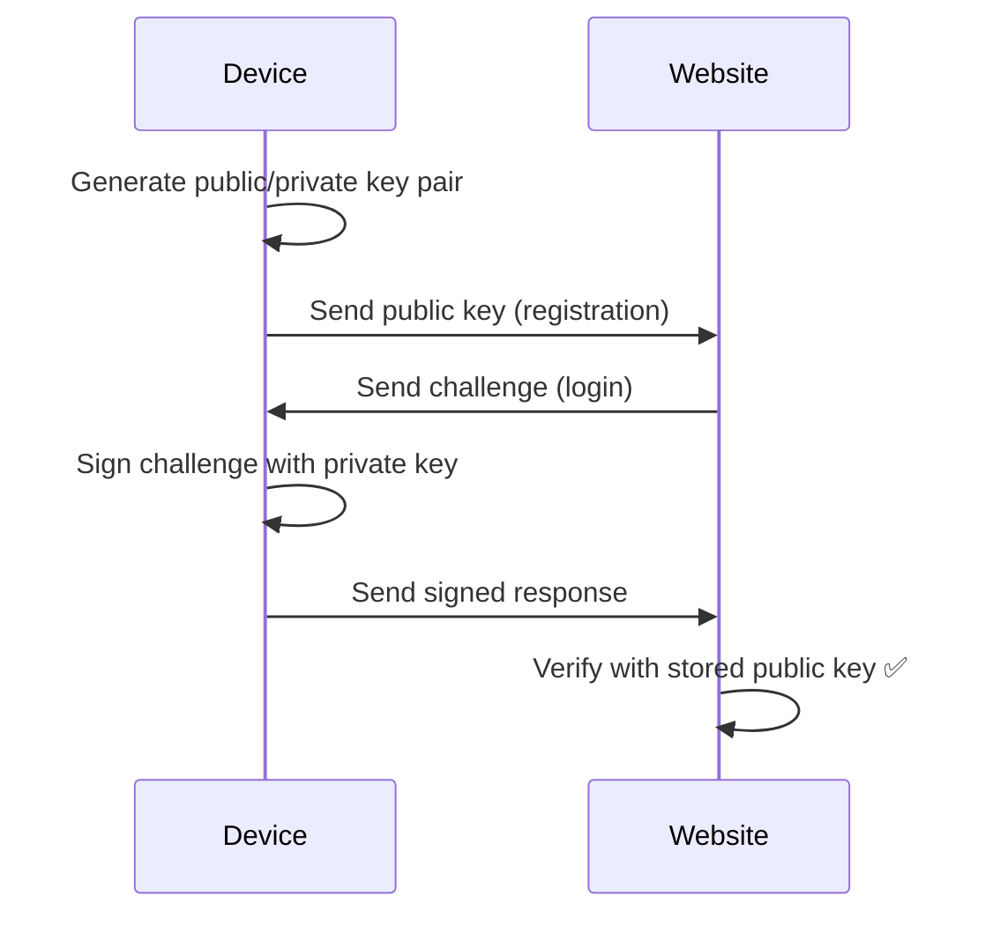

- No password stored anywhere
- Phishing-resistant — key pair is unique per website
- Private key never leaves the device

---

# Protecting Data in Practice

## Encryption in Transit vs At Rest

| Type | What it protects | What it doesn't |
|---|---|---|
| **In Transit** | Data moving A→B | Data sitting at B (server can read it) |
| **End-to-End (E2EE)** | Entire path sender→recipient | Nothing — only endpoints can decrypt |
| **At Rest** | Stored data on disk | Data while in use/memory |

> [!example]
> - Gmail uses HTTPS → encrypts your connection → but Google's servers can read your email (not E2EE)
> - WhatsApp uses E2EE → servers only see ciphertext

---

## Deletion & Secure Deletion

> [!warning] "Deleting" a file doesn't wipe it
> OS only marks that storage space as **available** — original bits remain until overwritten.
> Deleted files are often fully recoverable with forensic tools.

**Secure deletion** — actively overwrites storage with zeros or random data (multiple passes for stronger guarantee).

---

## Full Disk Encryption

- Entire disk appears as random bytes without the key
- Examples: **BitLocker** (Windows), **LUKS** (Linux)
- If device is stolen, sold, or disposed → data unreadable

---

## Ransomware

Attacker encrypts your files with their own key → demands payment for decryption key.

> [!danger]
> No guarantee the provided key works. Paying does not ensure recovery.

---

## Quantum Computing Threat

| Bits | Classical | Quantum (Qubits) |
|---|---|---|
| Representation | Strictly 0 or 1 | Superposition — both simultaneously |
| States for $n$ bits | $n$ states | $2^n$ states |

- **Shor's algorithm** can factor large numbers efficiently → breaks RSA
- Post-quantum cryptography is an active research area

---

# Securing Systems

> [!abstract] Everything builds on encryption.

## WiFi — WPA

**WPA (WiFi Protected Access)** encrypts traffic between your device and the router.
- Without WPA, anyone on the network can read your traffic in plaintext

---

## HTTP vs HTTPS

| Protocol | Encrypted? | Risk |
|---|---|---|
| HTTP | ❌ No | Attacker can read and modify all packets |
| HTTPS | ✅ Yes (TLS) | Packet metadata (IP, port) visible; payload is safe |

**Packet Sniffing / Machine-in-the-Middle:**
- Attacker reads unencrypted packets
- Can also **inject** content — e.g. `<script src="ad.js">` into HTML responses

---

## Session Cookies & Hijacking

Server issues a session cookie after login so you don't re-authenticate every request:

```http
HTTP/3 200
Set-Cookie: session=1234abcd
```

Subsequent request:

```http
GET / HTTP/3
Cookie: session=1234abcd
```

> [!danger] Session Hijacking
> Attacker steals your session ID (via sniffing, XSS, etc.) → impersonates you without needing your password.
> HTTPS prevents cookie sniffing in transit.

---

## TLS & Certificate Authorities

**TLS (Transport Layer Security)** — protocol that secures HTTPS. SSL is its deprecated predecessor.

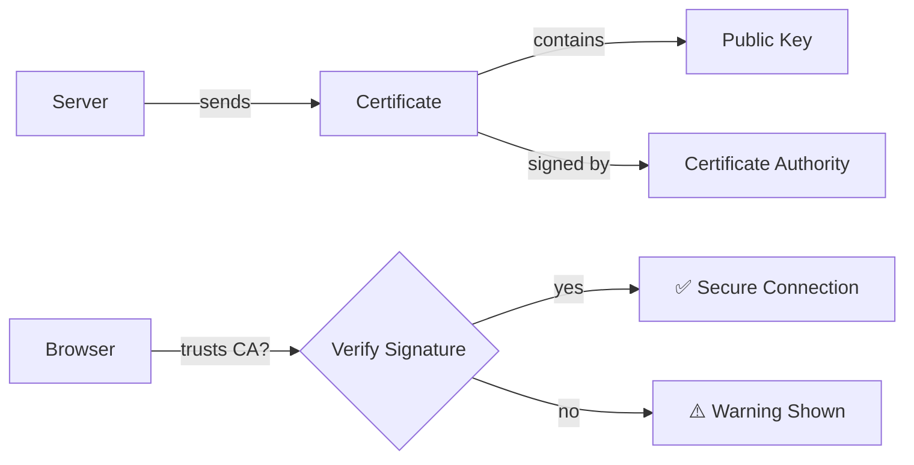

**Certificate contains:** domain name, public key, expiry, issuer (CA)

**Certificate Authorities (CAs):** DigiCert, Let's Encrypt — browsers inherently trust their signatures.

---

## DNS Spoofing & TLS Protection

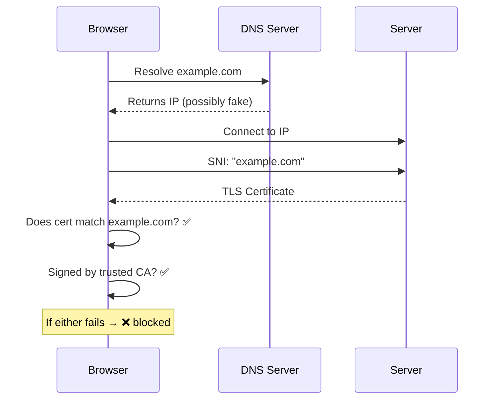

- **SNI (Server Name Indication)** — browser tells server which domain it wants *before* receiving certificate
- Certificate is tied to domain name (CN / SANs), **not** to IP address
- DNS spoofing alone usually fails because the fake server can't present a valid cert for the real domain
- Attacker would need a valid CA-signed cert for your domain — very hard unless CA is compromised or user installed a malicious CA

> [!summary] One-line
> **DNS tells you where to go. TLS proves who you're talking to.**

---

## SSL Stripping & HSTS

When you type `example.com`, browser first tries HTTP then gets redirected:

```http
HTTP/3 307 Redirect
Location: https://example.com
```

> [!warning] This redirect is unencrypted — attacker can intercept and swap to a fake domain.

**HSTS (HTTP Strict Transport Security)** — server instructs browser to *only ever* use HTTPS for this domain:

```
Strict-Transport-Security: max-age=31536000; includeSubDomains; preload
```

| Directive | Effect |
|---|---|
| `max-age` | Enforce HTTPS for ~1 year |
| `includeSubDomains` | Applies to all subdomains |
| `preload` | Browser ships with HTTPS-only list — eliminates even the first HTTP request |

---

## VPN

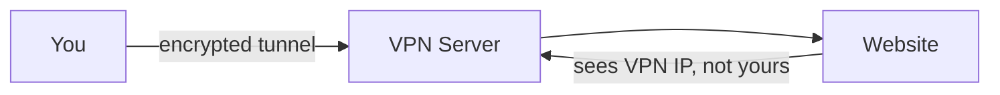

**What it solves:** Encrypts all traffic between you and VPN server; hides your IP from the destination.

**What it doesn't solve:** Only IP is changed — browser fingerprinting (OS, resolution, fonts, timezone) still works. VPN provider can log and disclose traffic if legally required.

---

## TOR

- Traffic routed through **at least 3 nodes** before reaching server
- Different path for every request — harder to log
- If an adversary controls enough nodes and can correlate entry + exit traffic, they can identify you
- The fewer nodes exist, the easier de-anonymization becomes

---

## SSH

Encrypted protocol for remotely executing commands:

```bash
ssh user@stanford.edu
```

- All commands and responses encrypted
- Can also tunnel other traffic (acts as an ad-hoc VPN)

---

## Ports

| Port | Service |
|---|---|
| 80 | HTTP |
| 443 | HTTPS |
| 22 | SSH |
| 53 | DNS |

- A service must be **listening** on a port to accept connections
- **Port scanning** — probing all ports to discover what services are running
- **Penetration testing** — authorized exploitation of open ports to find vulnerabilities before attackers do
  - Red team = attackers | Blue team = defenders | Ethical hacking = within legal scope

---

## Firewall

Software or hardware that filters traffic by **IP, port, or protocol** based on rules.

- Example: block all traffic on port 23 (Telnet)
- **Deep Packet Inspection (DPI)** — inspects payload content, can block by domain or detect malware
- Only controls traffic on the network it manages — mobile data bypasses a home firewall

---

## Proxy

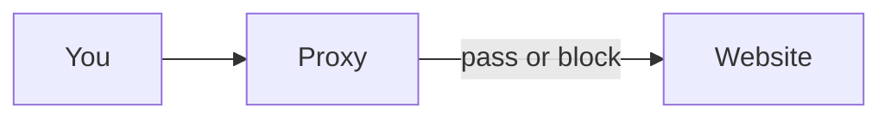

- Sits between client and destination — can inspect, filter, or modify traffic
- Companies use proxies to monitor all employee web traffic
- Can install a **custom CA** on your device → proxy intercepts HTTPS, decrypts, inspects, re-encrypts
- This is a **sanctioned machine-in-the-middle** — your organization owns your device

> [!note]
> VPNs don't help if a CA has been installed on your device — traffic flows through the proxy first regardless.

---

## Malware

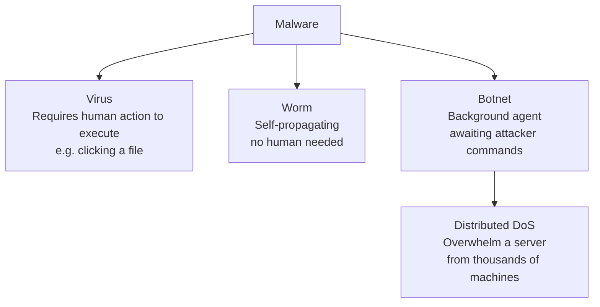

- **Antivirus** — periodically or continuously scans for known malicious code signatures
- **Auto-updates** — latest versions patch known vulnerabilities and recognize newer malware (trade-off: may introduce breaking changes)
- **Zero-day attack** — attacker exploits a vulnerability before vendors can patch it; spreads faster than the world can respond

> [!tip] Security is layered — no single tool is sufficient.

---

# Securing Software

## Phishing via HTML

- An `<a>` tag shows one name but links to a different URL
- Attackers can also **clone a legitimate site** (download HTML/CSS) and host it themselves — looks identical

---

## Cross-Site Scripting (XSS)

Attacker injects JavaScript into a page via unsanitized user input.

### Reflected XSS

```
https://example.com/search?q=<script>alert(document.cookie)</script>
```

- URL-encoded version sent as a link → victim clicks thinking it's a normal search
- Script executes in victim's browser — can steal cookies, redirect, etc.

### Stored XSS

- Malicious script is stored on the server (e.g. in a message or post)
- Every user who views that content triggers the script

### Defenses

- **Character escaping** — `<` → `&lt;`, `>` → `&gt;`, `"` → `&quot;`, `'` → `&apos;`, `&` → `&amp;`
- **Content Security Policy (CSP) headers:**

```http
Content-Security-Policy: script-src https://example.com
Content-Security-Policy: style-src https://example.com
```

Tells browser to only execute scripts/styles from external files on the specified domain — inline scripts are blocked.

---

## SQL Injection

Dynamic query built with unescaped user input:

```sql
SELECT * FROM users WHERE username = '{username}'
```

Attacker input: `malan'; DELETE FROM users; --`

Result:

```sql
SELECT * FROM users WHERE username = 'malan';
DELETE FROM users;
-- '
```

**Login bypass:**

```json
{ "username": "alex", "password": "' OR '1'='1" }
```

Becomes:

```sql
SELECT * FROM users WHERE username = 'alex' AND password = '' OR '1'='1'
```

→ Always true → login bypassed

**Defense:** Use **prepared statements / parameterized queries** — the DB handles escaping. Don't reinvent it.

---

## Command Injection

- Languages expose `system()`, `eval()`, etc. for OS-level operations
- If user input reaches these calls unsanitized → attacker executes arbitrary commands
- **Defense:** Use the language/framework's built-in escaping — it already exists

---

## Client-Side vs Server-Side Validation

> [!warning] Never trust the client
> HTML attributes like `disabled`, `required`, `hidden` can be edited in browser DevTools.
> A user can remove `disabled` from a button, delete `required` from a field, and submit anything.

- **Client-side validation** — improves UX, gives fast feedback, but is purely cosmetic from a security standpoint
- **Server-side validation** — the only real enforcement; always required regardless of client-side checks

---

## Cross-Site Request Forgery (CSRF)

### GET-based CSRF

Anything that **changes server state** should never use GET.

```html
<!-- GET request triggers buy -->

```

Just visiting a malicious page that embeds this image → triggers the purchase.

### POST-based CSRF

Even POST requests are vulnerable — attacker can auto-submit a form on page load:

```html
<form action="https://www.amazon.com/" method="post">
  <input name="dp" type="hidden" value="B07XLQ2FSK">
</form>
<script>document.forms[0].submit();</script>
```

### Defense — CSRF Token

Server generates a unique random token per user session and embeds it in every form:

```html
<form action="https://www.amazon.com/" method="post">
  <input name="csrf_token" type="hidden" value="1234abcd">
  <input name="dp" type="hidden" value="B07XLQ2FSK">
</form>
```

Or as an HTTP header:

```http
POST / HTTP/3
Host: amazon.com
X-CSRFToken: 1234abcd
```

- Server validates token on every state-changing request
- Attacker on another domain can't read your CSRF token → request rejected

---

## Arbitrary Code Execution & Buffer Overflow

**Arbitrary Code Execution (ACE):** Attacker runs code on your machine that the software was never meant to run.

**Remote Code Execution (RCE):** Same, but triggered remotely over a network.

**Buffer Overflow:**
- Input larger than the allocated buffer → data overflows into adjacent memory
- Memory stack grows bottom-up; method calls store a **return address** (where to jump back after the call)
- Attacker crafts input that overwrites the return address with a pointer to **their own injected code**
- With enough trial and error, attacker redirects execution to their payload

---

## Cracking & Reverse Engineering

- **Cracking** — manipulating input to bypass security checks (e.g. crafting input that skips password verification)
- **Reverse engineering** — recovering human-readable logic from compiled machine code; used in malware analysis to understand and counter threats

---

## Open Source vs Closed Source

| | Open Source | Closed Source |
|---|---|---|
| Transparency | Full — anyone can audit | None |
| Security risk | Attackers can find bugs easily | Harder to reverse engineer |
| Security benefit | More good engineers can find and fix bugs | Fewer eyes = fewer fixes |

- **App stores** add a layer of signing verification before software reaches your device
- Signing: developer hashes and signs the package with their private key → store checks signature on install
- **Limitation:** Signing only verifies the source, not intent — a developer could publish malicious updates

---

## Vulnerability Tracking

| System | Purpose |
|---|---|
| **CVE** (Common Vulnerabilities and Exposures) | Unique ID for every known vulnerability |
| **CVSS** (Common Vulnerability Scoring System) | Ranks severity of vulnerabilities |
| **EPSS** (Exploit Prediction Scoring System) | Predicts likelihood of exploitation in the wild |
| **KEV** (Known Exploited Vulnerabilities Catalog) | Documents vulnerabilities actively exploited — baseline for defense |

**Bug Bounty:** Companies pay skilled researchers to find and responsibly disclose vulnerabilities — channeling skills toward good outcomes.

---

# Preserving Privacy

## What Tracks You

### Browser History
- Convenient but a privacy risk if someone else accesses the device
- Mitigations: clear history, use private windows, avoid logging in

### Server Logs
- Servers log: IP address, timestamp, request type, URL, browser info
- More data than necessary is routinely retained

### HTTP Referer Header
- When you click a link from Google, request includes:
  ```
  Referer: https://www.google.com/search?q=cats
  ```
- Sites can embed `<meta name="referrer" content="origin">` to control what gets shared
- Third-party tools can strip outgoing headers

### Browser Fingerprinting
- IP address + User-Agent (browser, version, OS) + timezone + resolution + installed fonts + settings = unique fingerprint
- VPN only masks IP — all other fingerprint data remains
- Phone adds GPS if location permission granted

---

## Cookies

### Session Cookies
```http
HTTP/3 200
Set-Cookie: session=1234abcd
```
- Generated at login, sent by server, stored in browser
- Attached to every subsequent request — server matches it to identify user
- Short lifespan by design

### Tracking Cookies
- Designed to track behavior across sites (ads, analytics, bug fixing)
- **Third-party cookies** — cookie from a different domain than the one you're visiting (e.g. Google AdSense)

### Third-Party Tracking via Referer

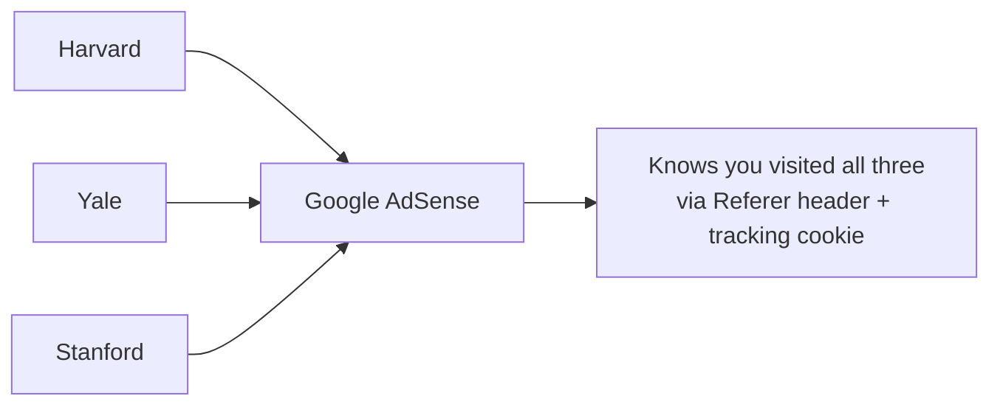

If a site you visit fetches a third-party resource (ad, pixel, script), that third-party request also carries your **Referer** header — the third party knows you visited the originating site.

### Tracking Parameters
- URL params like `click_id`, `utm_source` etc. are logged to track which ads/pages you came from

---

## Private Browsing

- Fresh session — no existing cookies or history
- **Still tracked in the same ways** — new cookies created, Referer still sent, fingerprint still present
- ISP and server still see your IP, browser, OS, resolution
- Protects **client-side** (local device) only; server-side tracking unchanged

---

## Supercookies

- Injected by ISP, network, or proxy — added to your HTTP headers without your knowledge
- Can share your data with third parties
- HTTPS protects against network-level injection; proxy-level does not

---

## DNS Privacy

| Protocol | Encrypted? | Who Can See Queries |
|---|---|---|
| Plain DNS (port 53) | ❌ No | Anyone, including ISP |
| DNS over HTTPS (DoH) | ✅ Yes | Only DNS resolver |
| DNS over TLS (DoT) | ✅ Yes | Only DNS resolver |

**Without encryption:** ISP (and any middleman) can see every domain you request — not the page content, but the domain itself.

**With DoH/DoT:** DNS resolver knows but middlemen don't.

> [!note] DNS Spoofing + TLS
> Even if DNS returns a fake IP, the attacker can't present a valid TLS cert for your domain → browser blocks the connection. See [[#DNS Spoofing & TLS Protection]].

---

## VPN

Encrypts all traffic — device to VPN server — acting as an anonymous proxy for the destination.

**Solves:** IP masking, encrypting traffic from ISP/network
**Doesn't solve:** Browser fingerprinting, tracking cookies, VPN provider trust

---

## TOR

- Traffic hops through at least 3 volunteer-run nodes before reaching destination
- Different route per request — hard to log consistently
- If an adversary controls enough nodes to see both entry and exit traffic → can de-anonymize

---

## Permissions

- Browser and apps request access: location, camera, microphone, contacts, etc.
- Any app with location permission that's currently running can track you
- Minimize granted permissions; revoke unused ones