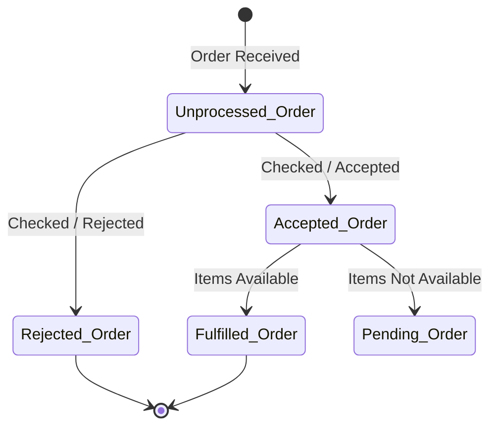
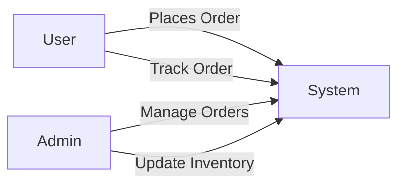

# 22. List various UML diagrams and explain the purpose of each diagram.

---

## Introduction

UML (Unified Modeling Language) provides different types of diagrams to model, visualize, design, and document software systems. Each diagram serves a specific purpose in representing either the **structure** or the **behavior** of a system.

UML diagrams are broadly classified into:

### 1. Structural Diagrams (Static View)
These diagrams represent the static structure of a system.
- Class Diagram  
- Object Diagram  
- Component Diagram  
- Deployment Diagram  
- Package Diagram  

### 2. Behavioral Diagrams (Dynamic View)
These diagrams represent the dynamic behavior of a system.
- Use Case Diagram  
- State Machine Diagram  
- Activity Diagram  
- Sequence Diagram  
- Communication Diagram  

---

# 1. State Machine Diagram

## Definition

A State Machine Diagram (also known as a State-Chart Diagram) is used to model the dynamic behavior of a class or system in response to time and changing external stimuli.

It shows how an object changes its state during its lifetime in response to events.

---

## Content and Purpose

### • Purpose:
It illustrates the different conditions or "states" an object can occupy during its life cycle and the events that cause it to move from one state to another.

### • Usage:
- Used for modeling reactive systems.
- Suitable for systems having multiple states.
- Helps in understanding object life cycle.
- Useful in embedded systems, real-time systems, and transaction-based systems.

### • Importance:
- Clearly shows event-driven behavior.
- Helps detect missing transitions.
- Improves system reliability by visualizing possible states.

---

## Components / Notations

- **Initial State:**  
  Represented by a black filled circle, showing where the system starts.

- **Transition:**  
  A solid arrow showing the flow from one state to another, labeled with the event that triggers it.

- **State:**  
  A rounded rectangle representing the condition of an object at a specific time.

- **Fork and Join:**  
  Solid rectangular bars used to show a state splitting into concurrent states (Fork) or multiple states converging into one (Join).

- **Self Transition:**  
  A state transitioning back to itself on an event.

- **Final State:**  
  A filled circle within a circle, representing the end of the system's journey.

---

## Diagram (Example: Online Order System)

A State Machine Diagram for an online order typically follows this sequence:

1. Initial State → Order Received.  
2. Unprocessed Order (State) → Checked (Event).  
3. Rejected Order (State) OR Accepted Order (State).  
4. If Accepted → Fulfilled Order (if items available) OR Pending Order (if items unavailable).  
5. Final State (Fulfilled and Rejected orders merge here).

---

### Sample Representation (Text Form)

---

# 2. Use Case Diagram

## Definition

A Use Case Diagram is a high-level UML diagram used during the requirements gathering and design phases to represent the interactions between users (actors) and the system.

It provides a functional view of the system from the user's perspective.

---

## Content and Purpose

### • Purpose:
- To capture stakeholder requirements.
- To define system functionality.
- To define project scope.
- To identify system boundaries.

### • Usage:
- Helps project teams demonstrate new features to stakeholders.
- Shows how features apply to the existing system.
- Used as a Black Box testing technique to verify that the software meets functional requirements.
- Used during requirement analysis phase.

### • Elements of Use Case Diagram:

- **Actor:**  
  Represents a user or external system interacting with the system.

- **Use Case:**  
  Represents a specific functionality provided by the system.

- **System Boundary:**  
  Defines the scope of the system.

- **Relationships:**  
  Include association, include, extend, and generalization.

---

## Advantages of Use Case Diagram

- Easy to understand for non-technical stakeholders.
- Clearly defines functional requirements.
- Helps in identifying missing requirements.
- Serves as base for test case development.

---

## Diagram

The Use Case Diagram is a technique for requirements gathering where project teams describe "use case scenarios" to show stakeholders what the potential deliverable could look like.

---

### Sample Representation

---

# Conclusion

UML diagrams play a vital role in software engineering by providing standardized visual representations of a system.

- **State Machine Diagram** models dynamic behavior and state transitions.
- **Use Case Diagram** models functional requirements and user interactions.

Together, they help in improving communication, documentation, design clarity, and system understanding.

---

