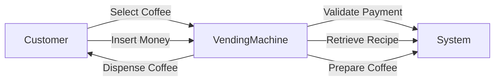
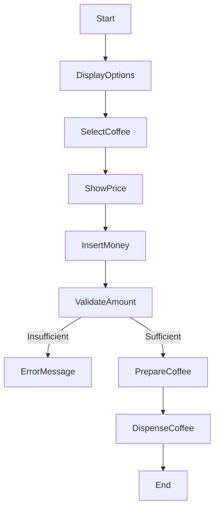
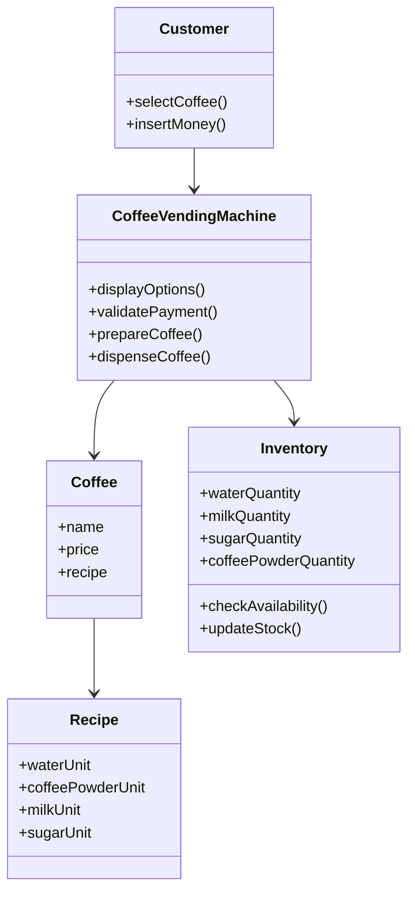

# Develop the Software Requirement Document for a Coffee Vending Machine

---

# 1. Introduction

## 1.1 Purpose

This Software Requirement Specification (SRS) document describes the functional and non-functional requirements of a **Coffee Vending Machine System** that allows customers to select and purchase coffee from multiple available options.

## 1.2 Scope

The system enables a customer to:
- Select a type of coffee from a list of ten options.
- Insert or supply the required amount.
- Receive the prepared coffee.

Each coffee is prepared using predefined recipes consisting of:
- Hot water
- Coffee powder
- Milk
- Sugar

The system stores and uses recipes to prepare the selected coffee.

---

# 2. Overall Description

## 2.1 Product Perspective

The Coffee Vending Machine is an automated standalone system that:
- Accepts user input.
- Validates payment.
- Prepares coffee based on stored recipes.
- Dispenses coffee.

## 2.2 Users

- **Customer** – Selects coffee and makes payment.
- **Maintenance Staff (Optional)** – Refills ingredients and updates recipes.

---

# 3. Functional Requirements

1. The system shall display a list of available coffee types (10 options).
2. The system shall allow the customer to select a coffee type.
3. The system shall display the price of selected coffee.
4. The system shall accept payment from the customer.
5. The system shall validate whether the inserted amount is sufficient.
6. The system shall prepare coffee based on stored recipe.
7. The system shall dispense coffee after successful preparation.
8. The system shall store recipes for each coffee type.
9. The system shall deduct ingredients from inventory after preparation.
10. The system shall display an error message if:
   - Insufficient amount is inserted.
   - Ingredients are insufficient.

---

# 4. Non-Functional Requirements

- The system shall respond within 5 seconds after selection.
- The system shall ensure accurate measurement of ingredients.
- The system shall be user-friendly.
- The system shall be reliable and safe.

---

# 5. Use Case Diagram

## Explanation

The main actor is the **Customer**.  
The customer interacts with the vending machine to:
- Select coffee
- Insert money
- Receive coffee

The system internally:
- Validates payment
- Retrieves recipe
- Prepares coffee
- Dispenses coffee

---

## Use Case Diagram

---

# 6. Activity Diagram

## Explanation

The activity diagram shows the workflow from coffee selection to dispensing.

Steps:
1. Display coffee options.
2. Customer selects coffee.
3. Display price.
4. Insert money.
5. Validate amount.
6. If insufficient → Show error.
7. If sufficient → Prepare coffee.
8. Dispense coffee.
9. End.

---

## Activity Diagram

---

# 7. Class Diagram

## Explanation

The class diagram represents the structure of the system.

### Main Classes:

1. **CoffeeVendingMachine**
   - displayOptions()
   - validatePayment()
   - prepareCoffee()
   - dispenseCoffee()

2. **Coffee**
   - name
   - price
   - recipe

3. **Recipe**
   - waterUnit
   - coffeePowderUnit
   - milkUnit
   - sugarUnit

4. **Customer**
   - selectCoffee()
   - insertMoney()

5. **Inventory**
   - waterQuantity
   - milkQuantity
   - sugarQuantity
   - coffeePowderQuantity
   - checkAvailability()
   - updateStock()

---

## Class Diagram

---

# Conclusion

The Software Requirement Document clearly defines:

- System requirements
- Functional behavior
- Workflow of operation
- Structural design

The Use Case Diagram shows system interaction.  
The Activity Diagram shows process flow.  
The Class Diagram shows system structure.

This answer covers all required components for **10 marks (2 + 8)**.
