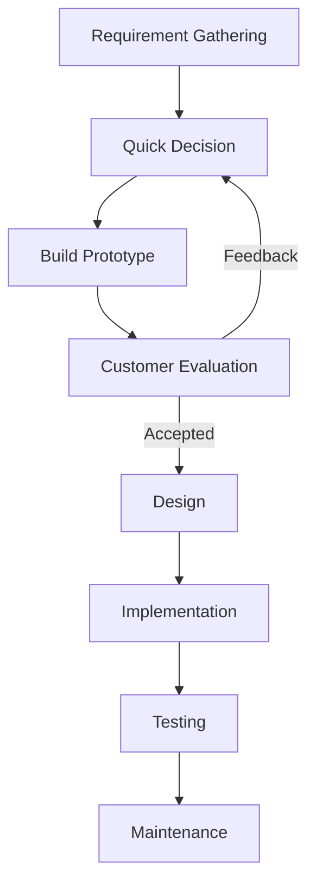

# Prototyping Model

---

# 1. Definition of the Prototyping Model

The Prototype Model is a software development paradigm that requires a working "toy" implementation of the system to be built before the actual software development begins.

A prototype is often a crude version of the final product, characterized by:

- Limited functional capabilities  
- Lower reliability  
- Less efficient performance compared to the actual software  

This model is particularly useful in scenarios where:

- The client has only a general idea of their requirements  
- There is a lack of detailed information regarding inputs, processing needs, and output requirements  
- Requirements are unclear, incomplete, or changing  

The main objective of this model is to understand user requirements clearly before developing the final system.

---

# 2. Need for Prototyping Model

The Prototyping Model is preferred when:

- Requirements are not clearly understood.
- Customer is unsure about system functionality.
- The project involves high user interaction.
- Innovation or experimentation is required.

It reduces misunderstanding between developer and client by allowing early visualization of the system.

---

# 3. Effect of Designing a Prototype on Overall Cost

The effect of prototyping on the overall cost of a software project is two-fold:

---

## 1. Increased Initial Investment

- Prototyping requires additional time and effort in the early stages.
- It involves continuous interaction with customers.
- It costs customer money due to repeated evaluation and refinement.
- If the customer withdraws mid-process, the initial investment in the prototype may be lost.
- Requires extensive customer collaboration and skilled development effort.

Thus, initial cost and development time may increase.

---

## 2. Reduced Long-Term / Total Cost

Despite the initial expense, prototyping reduces the overall cost in the long run because:

- It reduces maintenance cost.
- Errors are detected much earlier.
- Incorrect user requirements are identified early.
- Rework cost after final implementation is minimized.
- Customer satisfaction increases.
- Risk of project failure is reduced.

Since the system is developed "side by side" with the customer, major defects are avoided in later stages, preventing expensive corrections.

👉 Therefore, although the initial cost increases, the total project cost usually decreases.

---

# 4. Content (Steps of the Prototype Model)

The Prototyping Model consists of six primary steps:

---

## 1. Requirement Gathering and Analysis

- Developers interact with the client.
- General goals of the software are identified.
- Basic system requirements are gathered.

---

## 2. Quick Decision (Quick Design)

- A rough design is prepared.
- Focus is mainly on user interface and key functionalities.
- It is not a complete system design.

---

## 3. Build Prototype

- A crude working model of the system is developed.
- It demonstrates limited functionality.
- It is not optimized or fully secure.

---

## 4. Assessment or User Evaluation

- The prototype is presented to the customer.
- Customer provides feedback.
- Incorrect or missing requirements are identified.

This is the most important step in this model.

---

## 5. Prototype Refinement

- Based on feedback, the prototype is modified.
- Requirements are refined.
- The cycle continues until customer satisfaction is achieved.

This step may repeat multiple times.

---

## 6. Engineer Final Product

- Once the customer approves the prototype,
- The final system is developed using proper design, coding, and testing.
- The professional software product is delivered.

---

# 5. Advantages of Prototyping Model

- Reduces risk of incorrect requirements.
- Improves customer involvement.
- Early detection of errors.
- Reduces maintenance cost.
- Helps in better system understanding.
- Supports innovation and experimentation.

---

# 6. Disadvantages of Prototyping Model

- Initial cost is high.
- Requires continuous customer involvement.
- May lead to poorly designed final product if prototype is directly converted.
- Not suitable for very large systems without proper control.
- Excessive iterations may increase development time.

---

# 7. Diagram of the Prototyping Model

The model consists of two major parts:

1. Prototype Development Phase  
2. Iterative Development Phase  

---

## Prototype Development Phase

- Requirement Gathering  
→ Quick Decision  
→ Build Prototype  
→ Customer Evaluation  
→ Refine Requirements  
→ (Loop back to Quick Decision until accepted)

---

## Iterative Development Phase

After customer acceptance:

- Design  
→ Implementation  
→ Testing  
→ Maintenance  

---

## Diagram Representation

---

# Conclusion

The Prototyping Model is a requirement-driven development model that focuses on building a working model before developing the final system.

Although it increases the initial cost, it significantly reduces the overall project cost by:

- Minimizing rework
- Reducing maintenance cost
- Detecting errors early
- Ensuring customer satisfaction

Hence, it is highly suitable for projects where requirements are unclear or continuously evolving.

---
