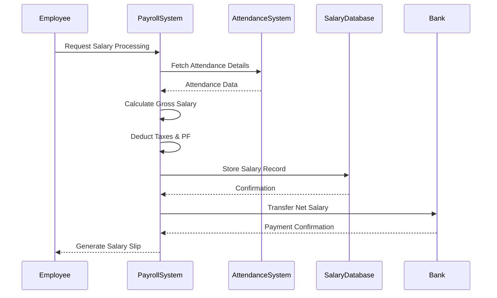
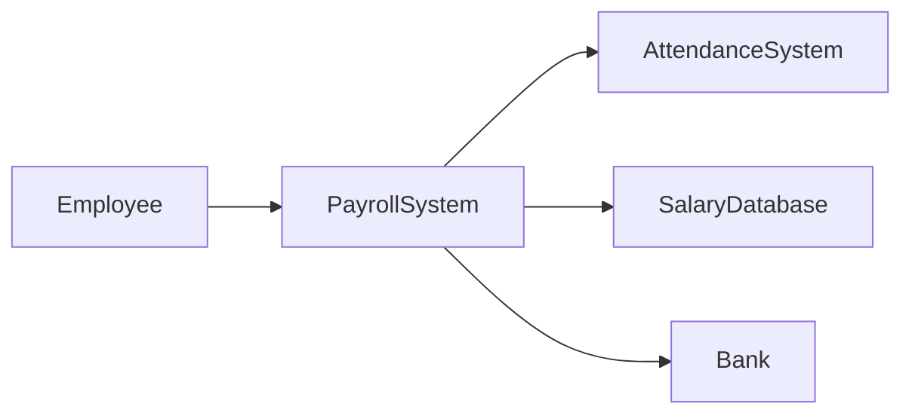

---

# 25. Apply Interactive Modelling for a Payroll System in UML

---

# 1. Definition of Interactive Modelling (2 Marks)

Interactive modelling in UML refers to representing the dynamic interaction between objects within a system. It shows how objects communicate by sending and receiving messages to accomplish a specific functionality.

It mainly focuses on the **behavioral aspect** of the system and is commonly represented using:

- Sequence Diagrams  
- Communication (Collaboration) Diagrams  

Interactive modelling helps in understanding:
- Runtime behavior of the system  
- Order of execution of operations  
- Message passing between objects  

---

# 2. Content – Interactive Modelling for Payroll System (3 Marks)

A Payroll System is used to calculate and process employee salaries based on attendance, salary structure, and deductions.

### Key Entities in Payroll Interaction:

- **Employee**
- **Payroll System**
- **Attendance System**
- **Salary Calculator**
- **Salary Database**
- **Bank System**
- **HR/Admin (optional actor)**

---

## Functional Activities in Payroll System

1. Employee attendance is recorded daily.
2. Payroll system retrieves attendance data.
3. System calculates:
   - Basic Salary
   - Allowances (HRA, DA, Bonus)
   - Deductions (Tax, PF, Loan, etc.)
4. Net salary is computed.
5. Salary details are stored in database.
6. Payment request is sent to bank.
7. Bank transfers salary to employee account.
8. Salary slip is generated and sent to employee.

---

## Why Interactive Modelling is Important Here?

- Ensures correct flow of payroll processing.
- Helps identify missing interactions.
- Useful for validating sequence of salary calculation.
- Helps in debugging transaction failures.
- Improves system reliability and clarity.

---

# 3. UML Sequence Diagram (5 Marks)

The Sequence Diagram represents the interaction of objects in time order.

---

## Sequence Diagram for Payroll Processing

---

# Explanation of Sequence Diagram

1. Employee initiates salary processing.
2. Payroll System collects attendance data.
3. Salary calculation is performed internally.
4. Net salary is stored in salary database.
5. Payment instruction is sent to bank.
6. Bank confirms transaction.
7. Salary slip is generated and delivered.

---

# Communication Diagram (Alternative Interactive Model)

A Communication Diagram shows interaction focusing on relationships rather than time sequence.

---

# Additional Considerations in Payroll Interaction

### Exception Handling:
- If attendance data is missing → Error message.
- If bank transfer fails → Retry or notify HR.
- If database storage fails → Rollback transaction.

### Security Aspects:
- Only authorized HR can initiate payroll.
- Employee data must be confidential.
- Bank communication must be encrypted.

---

# Conclusion

Interactive modelling for Payroll System clearly shows:

- Object interactions
- Message flow
- Sequence of salary processing
- Integration with external systems like bank

Using UML Sequence and Communication Diagrams helps in:

- Designing efficient payroll workflow
- Avoiding logical errors
- Ensuring secure and reliable salary processing

---
