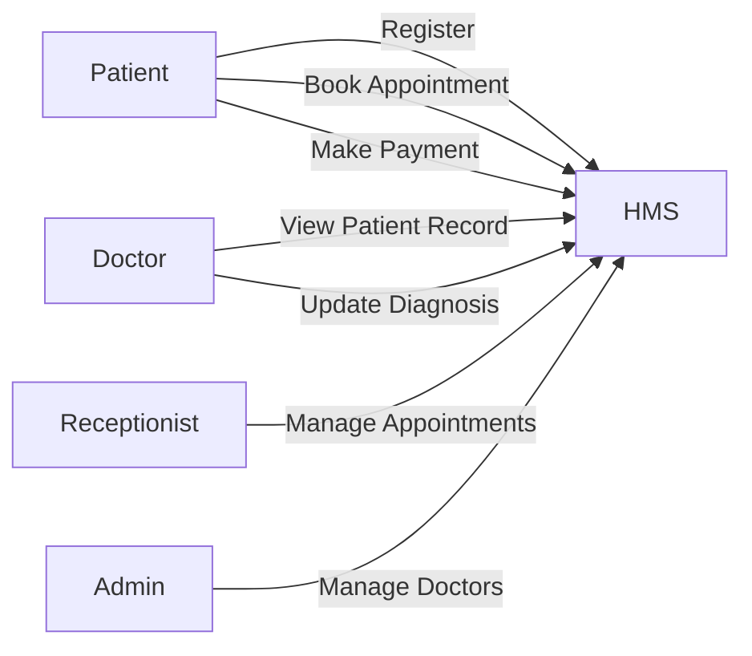
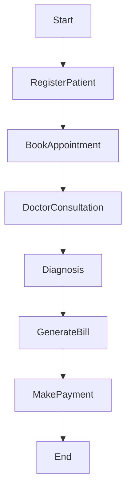
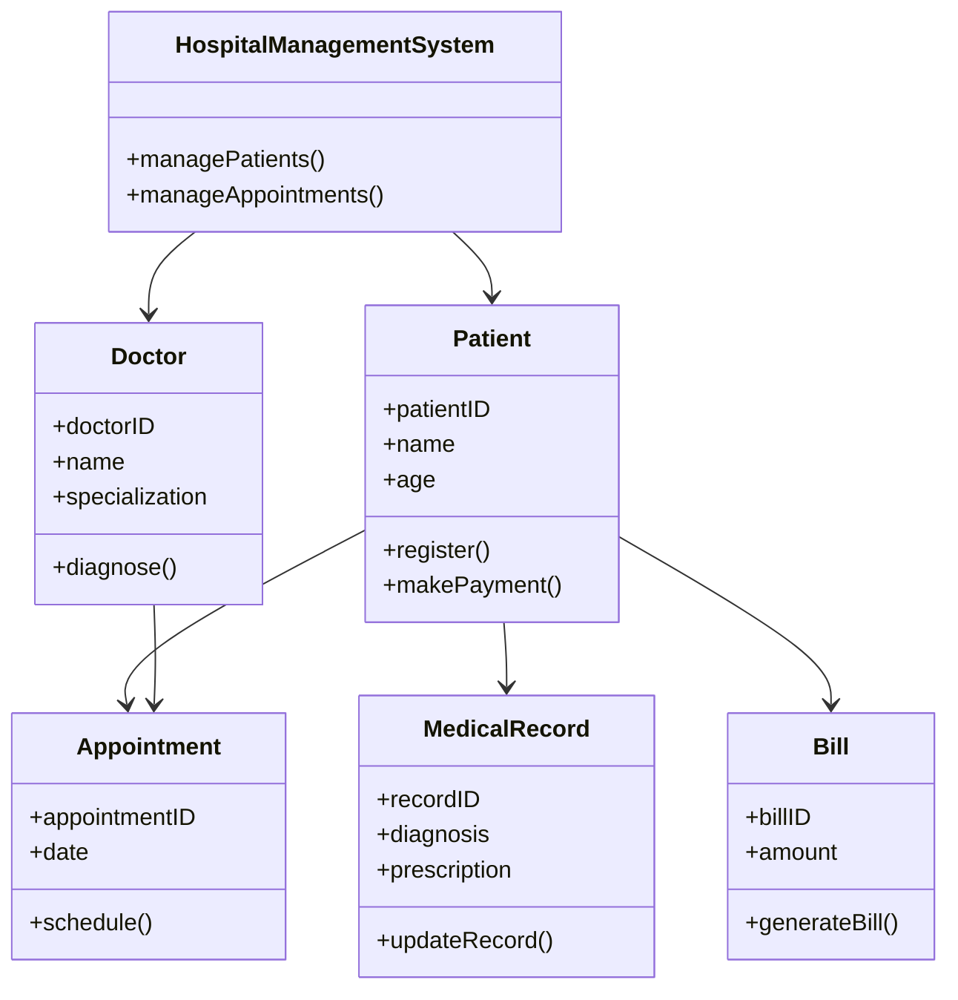

# 26. Hospital Management System – Use Case, Class and Activity Diagram

---

# 1. Definition (2 Marks)

A Hospital Management System (HMS) is a software system designed to manage hospital operations such as patient registration, appointment scheduling, doctor management, billing, and medical records.

UML diagrams are used to model the structure and behavior of the system to ensure proper design and understanding.

---

# 2. Explanation of Hospital Management System (5 Marks)

## Main Functional Modules

1. Patient Registration  
2. Appointment Scheduling  
3. Doctor Management  
4. Medical Record Management  
5. Billing and Payment  
6. Pharmacy and Lab Management  

---

## Key Actors

- Patient  
- Doctor  
- Receptionist  
- Admin  
- Pharmacist (optional)  

---

## System Workflow (Overall)

1. Patient registers in hospital.
2. Appointment is scheduled with doctor.
3. Doctor examines patient.
4. Diagnosis and prescription are recorded.
5. Bill is generated.
6. Payment is processed.
7. Patient receives treatment and medicines.

---

# 3. Use Case Diagram (3 Marks)

## Explanation

The Use Case Diagram represents interactions between users (actors) and the hospital system.

---

## Use Case Diagram

---

# 4. Activity Diagram (3 Marks)

## Explanation

The Activity Diagram shows the workflow of patient treatment process.

---

## Activity Diagram

---

# 5. Class Diagram (3 Marks)

## Explanation

The Class Diagram represents the structure of the hospital system.

### Main Classes:

1. Patient  
2. Doctor  
3. Appointment  
4. MedicalRecord  
5. Bill  
6. HospitalManagementSystem  

---

## Class Diagram

---

# Conclusion

The Hospital Management System UML diagrams help in:

- Visualizing system interactions (Use Case Diagram)
- Understanding process flow (Activity Diagram)
- Designing system structure (Class Diagram)

These diagrams ensure proper planning, clear communication, and efficient system implementation.

---
