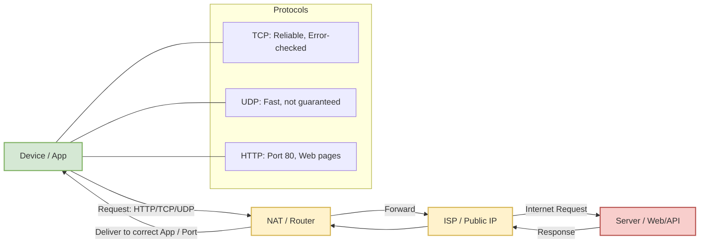

# Computer Networks

---

## 1. Network

- **Definition:** Computers connected together to share resources and data
- **Examples:**
    - Home: computers, laptops, TVs, phones
    - Office: computers, servers, printers, etc.

---

## 2. Internet 

- **Definition:** Global system of interconnected networks
- **Example:** Home network connecting to websites worldwide

---

## 3. Protocols

### 3.1 TCP (Transmission Control Protocol)

- Reliable data transfer (100%)
- Errors checked and retransmitted if corrupted

### 3.2 UDP (User Datagram Protocol)

- Not guaranteed that all data will reach
- Faster, used in video calls, streaming, online games

### 3.3 HTTP (Hyper Text Transfer Protocol)

- Used for web pages
- Default port: 80

---
## 4. IP (Internet Protocol)

- Format: x.x.x.x (each x = 0–255)
- **Public IP:** Provided by ISP to modem/router
- **Local IP:** Unique for each LAN device via DHCP (Dynamic Host Configuration Protocol)

---
## 5. Data Flow in Network ^flow

1. Device sends request → Modem → ISP → Server
2. Server sends response → ISP → Modem → Device

**Key Components:**

- **NAT (Network Address Translation):** Directs response to correct device
- **PORTS:** Identify which app requested data
    - 16-bit numbers → 0–65535
    - Reserved: 0–1023
    - Apps: MongoDB → 27017, SQL → 1433
    - Free: 49152–65535

---

**Tip:** Think of it like sending a letter:

- **IP → Street Address** (device) ^IP
- **Port → Room Number** (app)
- **NAT → Receptionist** (directs letter to correct room)

---

---
### Internet Basics

- **ISP (Internet Service Provider):** Connects us to the internet.
- **Data rate:**
    - 1 Mbps = 1 Megabit per second = **1,000,000 bits per second**
    - 1 byte = **8 bits**
- **Communication:**
    - **Upload:** Sending data (your device → internet)
    - **Download:** Receiving data (internet → your device)

---
### Communication Methods

- **Guided (Wired):** Direct physical medium like cables between computers.
- **Unguided (Wireless):** No physical cable between sender and receiver. Needs addressing (like IP addresses) to find the destination.

---
### Internet Infrastructure

- **Undersea cables:** Huge optical fiber cables under oceans connect continents.
- **Physical transmission media:**
    - **Wired:** Optical fiber (fastest, light signals), coaxial cable, twisted pair (Ethernet).
    - **Wireless:** Bluetooth, Wi-Fi, 3G, 4G, LTE, 5G, satellite.

---

### Speed Considerations

- **Wired > Wireless** (generally faster, more reliable, less interference).
- **Wireless** is more convenient but speed depends on distance, obstacles, and technology.

---
### **OSI Model Context & Networks**

**LAN (Local Area Network)**

- Covers a small area like a house, office, or campus.
- Typical connections: Ethernet cables, Wi-Fi.

**MAN (Metropolitan Area Network)**

- Covers a city or a large campus.
- Connects multiple LANs within a metropolitan area.

**WAN (Wide Area Network)**

- Covers a large geographic area, like countries or continents.
- Often uses **optic fiber** or satellite links.

**SONET (Synchronous Optical Networking)**

- High-speed network standard for long-distance fiber-optic networks.
- Often used to interconnect WANs over large distances.

**Frame Relay**

- A method to connect LANs to WANs.
- Provides cost-effective, packet-switched connections over long distances.

---

### **Networking Devices**

**MODEM (Modulator-Demodulator)**

- Converts **digital signals** (from computer) to **analog signals** (for telephone line) and vice versa.
- Needed when transmitting over analog lines like traditional phone lines.

**Router**

- Connects **different networks** (e.g., LAN → WAN).
- Directs traffic between networks based on IP addresses.
- Can provide additional features like NAT, firewall, and DHCP.

**Switch** _(optional clarification)_

- Connects devices **within the same LAN**.
- Operates at Layer 2 (Data Link) of the OSI model using MAC addresses.

**Hub** _(less common now)_

- Connects devices in a LAN but **does not filter traffic**. Broadcasts to all ports.

---
## Structure of network

Order and delivery are in application layer. Other internals are abstracted 

---
# OSI (Open Systems Interconnection Model)

**Definition**: A standard way two devices communicate with each other by splitting the process into **7 layers**.

---
## 📝 7 Layers of OSI Model

1. **Application Layer**
    - Interface between **user software** and the network.
    - Users interact and send/receive data.
    - Provides **order and delivery** abstraction → the lower layers handle details.
    - Functions:
        - Data input/output (via software).
        - Abstracts lower-level operations from the user.
 
---

2. **Presentation Layer**
    
    - Converts **high-level data** (characters, decimals, text, images) into **binary**. 
    - Handles:
        - **Translation/Encoding** → e.g., ASCII, EBCDIC.
        - **Encryption/Decryption** → SSL/TLS.
        - **Compression** → reduces size for efficient transfer.
    - Ensures data is in a proper format before transmission.

---

3. **Session Layer**    
    - Responsible for **establishing, managing, and terminating sessions**.
    - Steps:
        1. **Authentication** (verify identity).
        2. **Authorization** (grant permissions).
        3. **Connection setup** 
        4. **Data transfer**.
        5. **Connection termination**.
    - Relies on the **transport layer** for actual data movement after setup.

---

4. **Transport Layer**
    
    - Provides **end-to-end communication** between applications.
    - **Protocols**: TCP (reliable, connection-oriented), UDP (fast, connectionless).
    - Main tasks:
        - **Segmentation**: Splits data into chunks (segments) with:
            - Source & Destination port numbers (to identify applications).
            - Sequence numbers (for correct order).
        - **Error Control**: Uses **checksums** to detect errors.
        - **Flow Control**: Maintains data speed.
    - TCP ensures reliability via **acknowledgements & retransmission**.
    - UDP sends without feedback (useful for streaming, gaming).

---

5. **Network Layer**
    
    - Handles communication **between different networks**.
    - Uses **routers** for forwarding data.
    - Provides **logical addressing** → IP addresses.
    - Creates **IP packets** to encapsulate transport layer segments.
    - Performs **routing** (best path selection).
    - Example: A packet traveling from **192.168.1.1 → 192.168.7.1 → 192.168.2.1** via routers.

---

6. **Data Link Layer**
    
    - Works on the link between **two directly connected nodes**.
    - Functions:
        
        - **Error detection/correction** within a single hop.         
        - **Physical addressing** using **MAC addresses** (12-digit alphanumeric ID of NIC).
        - Adds **source & destination MAC addresses** to frames.
    - **Frame** = data unit at this layer (contains payload + MAC address + error check).
    - Example: Your phone has different MAC addresses for **WiFi**, **Bluetooth**, etc.

---

7. **Physical Layer**
    
    - Deals with **actual transmission of raw bits (0s & 1s)** over physical medium.
    - Hardware: **Cables, switches, NICs, radio signals, connectors**.
    - Converts frames into **electrical/optical/radio signals**.

---
## 📌 Flow of Data

**Sender → Receiver**  
Application → Presentation → Session → Transport → Network → Data Link → Physical  
(reverse order on receiver side).