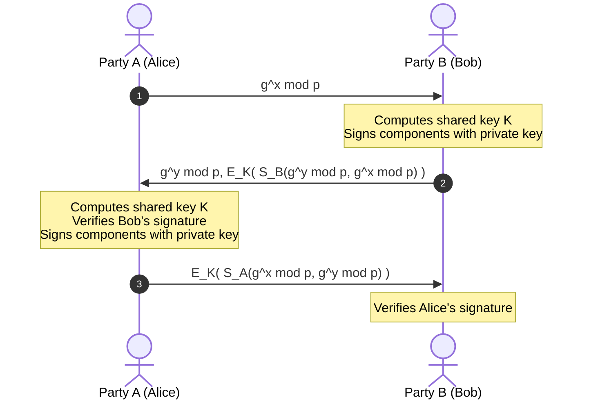
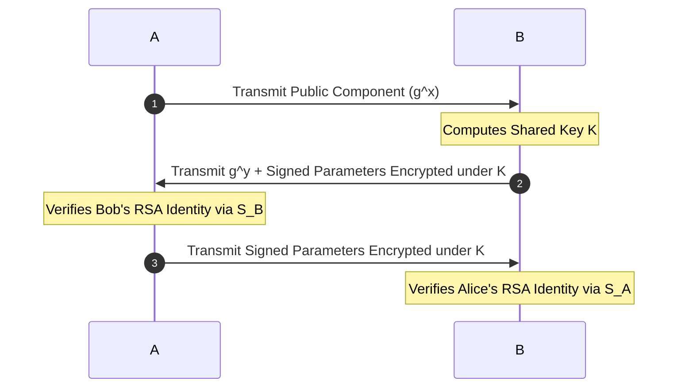

Up next in our consolidated question bank is **Question 6**, the second item under the *Moderately Repeated Part B & C* list: **Authenticated Key Agreement Protocols (Diffie-Hellman + RSA)**.

---

# Question 6: Authenticated Key Agreement Protocol (15-Mark Master Blueprint)

## 1. Core Concept (The "Why")

The classic Diffie-Hellman key exchange allows two parties to create a shared secret password over an open network without sending the password itself. However, it has a fatal flaw: it does not verify identities. A hacker can sit in the middle, pretend to be Alice to Bob, and pretend to be Bob to Alice (a Man-in-the-Middle attack).

To fix this, we combine **Diffie-Hellman with RSA digital signatures**. This protocol forces both sides to sign their mathematical components using their private keys, proving exactly who they are while establishing the shared key.

---

## 2. Protocol Execution Flow

The protocol runs via a 3-step message exchange between Party A (Alice) and Party B (Bob):

### Abbreviations & Cryptographic Notation:

* 
$g, p$: Public Diffie-Hellman parameters (generator and prime number).

* $x, y$: Private secret integers chosen randomly by $A$ and $B$ respectively.
* 
$g^x \pmod p, g^y \pmod p$: Public keys generated for this session.

* $K$: The final shared secret session key, where $K = (g^y)^x = (g^x)^y \pmod p$.
* 
$S_A, S_B$: Digital signatures created using Alice's or Bob's secret RSA Private Key.

* 
$E_K$: Symmetric encryption using the newly created session key $K$.

---

3. Detailed Step-by-Step Actions & Belief States 

Message 1: $A \rightarrow B: g^x \pmod p$ 

* 
**Action:** Alice generates a random secret number $x$, calculates $g^x \pmod p$, and sends it to Bob.

Message 2: $B \rightarrow A: g^y \pmod p, E_K(S_B(g^y \pmod p, g^x \pmod p))$ 

**Actions taken by $A$ upon receipt:** 

1. Alice receives Bob’s public component ($g^y \pmod p$).

2. She calculates the shared secret session key: $K = (g^y)^x \pmod p$.
3. She uses key $K$ to symmetrically decrypt the second half of the message.

4. She extracts Bob's signature ($S_B$) and uses **Bob's public RSA key** to verify it.

5. She checks that the values inside the signature exactly match the $g^y$ he sent and the $g^x$ she originally sent.

**Belief State of $A$ at this stage:** 

* Alice believes she is talking to the **real Bob**, because only Bob holds the secret private RSA key required to make that unique signature.

* She believes the session key $K$ is secure and that no eavesdropper knows it, because an attacker would need her secret value $x$ or Bob's secret value $y$ to compute it.

---

Message 3: $A \rightarrow B: E_K(S_A(g^x \pmod p, g^y \pmod p))$ 

**Actions taken by $B$ upon receipt:** 

1. Bob receives the encrypted packet and uses his copy of the shared secret key $K$ ($K = (g^x)^y \pmod p$) to decrypt it.

2. He extracts Alice's signature ($S_A$).

3. He uses **Alice's public RSA key** to mathematically verify the signature.

4. He checks that the values inside the signature correspond perfectly to the $g^x$ and $g^y$ components exchanged during the session.

**Belief State of $B$ at this stage:** 

* Bob now firmly believes he is interacting with the **real Alice**, as only her private RSA key could produce that matching signature payload.

* He believes that Alice has successfully decrypted his Message 2, calculated the correct key $K$, and is active in the live session right now.

---

4. Final Authentication Status 

**Yes, A and B are successfully and mutually authenticated to each other after this protocol run**.

### Justification:

* **Bob is authenticated to Alice** because his signature in Message 2 binds his identity to this specific, fresh session exchange ($g^y, g^x$).

* **Alice is authenticated to Bob** because her signature in Message 3 proves she controls her private key and can actively read the encrypted data streams under key $K$.

* Because both signatures reference each other's random parameters, a Man-in-the-Middle attacker cannot alter the values or replay an old recorded packet without causing the verification checks to fail instantly.

---

Here is the clean, consolidated markdown block configured for your Obsidian environment.

# Exam Note: Authenticated Diffie-Hellman + RSA Exchange

## 1. Operational Protocol Vectors
* **Message 1:** $A \to B: g^x \bmod p$
* **Message 2:** $B \to A: g^y \bmod p, E_K(S_B(g^y \bmod p, g^x \bmod p))$
* **Message 3:** $A \to B: E_K(S_A(g^x \bmod p, g^y \bmod p))$

## 2. Cryptographic Security Properties
* **Mutual Authentication Status:** **ACHIEVED**. Both nodes validate signatures tied to the active session parameters, defeating intercept/replay attempts.
* **Key Encryption Mechanism:** Symmetric cipher wrapping ($E_K$) ensures that only an entity capable of calculating the true Diffie-Hellman secret key $K$ can extract the internal authentication payloads.

---

Say **"Next"** whenever you are ready to proceed to the next long-answer topic in the sequence: **Intrusion Detection Systems (IDS) Framework**.