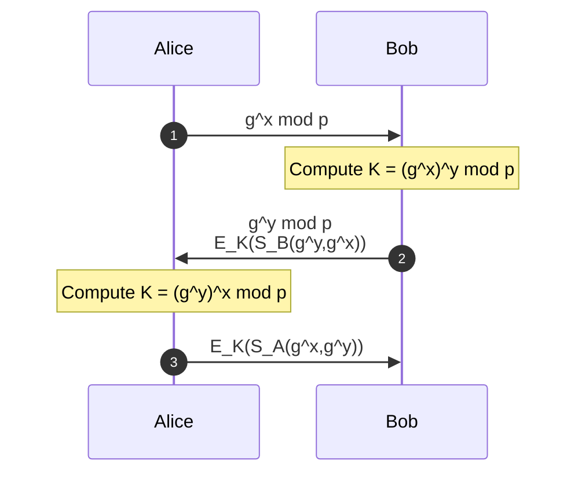

# Authenticated Diffie-Hellman with RSA Signatures

## Why Does This Protocol Exist?

Suppose Alice and Bob want to communicate securely.

They need a shared secret key.

Diffie-Hellman solves this problem.

However, Diffie-Hellman has a major weakness:

```text id="6kzbfe"
It does not authenticate the participants.
```

An attacker can intercept messages and establish separate keys with Alice and Bob.

This is called a:

```text id="n86ql7"
Man-in-the-Middle Attack (MITM)
```

To prevent this, Diffie-Hellman is combined with RSA digital signatures.

The result provides:

* Shared secret generation
* Mutual authentication

---

## Real-World Analogy

Imagine Alice and Bob want to agree on a secret code word.

Diffie-Hellman allows them to create the code word.

But how do they know they are speaking to the real person?

They each sign their messages with their personal signature.

Anyone can verify the signature.

Only the owner can create it.

---

## Cryptographic Components

### Public Parameters

| Symbol | Meaning            |
| ------ | ------------------ |
| `p`    | Large prime number |
| `g`    | Generator value    |

These values are publicly known.

---

### Private Values

| Symbol | Owner |
| ------ | ----- |
| `x`    | Alice |
| `y`    | Bob   |

These values remain secret.

---

### Public Diffie-Hellman Values

Alice computes:

```text id="m4wcqb"
g^x mod p
```

Bob computes:

```text id="0wujq0"
g^y mod p
```

These values are exchanged openly.

---

### Shared Secret Key

Alice computes:

```text id="q27r44"
K = (g^y)^x mod p
```

Bob computes:

```text id="n8ty4s"
K = (g^x)^y mod p
```

Both obtain the same key:

```text id="t4vnjd"
K = g^(xy) mod p
```

---

### RSA Signatures

| Symbol  | Meaning                                  |
| ------- | ---------------------------------------- |
| `S_A()` | Alice's RSA signature                    |
| `S_B()` | Bob's RSA signature                      |
| `E_K()` | Symmetric encryption using session key K |

---

## Protocol Messages

### Message 1

```text id="0r9ybo"
A → B : g^x mod p
```

Alice sends her Diffie-Hellman value.

---

### Message 2

```text id="pgu1ma"
B → A : g^y mod p,
        E_K(S_B(g^y mod p, g^x mod p))
```

Bob sends:

* His Diffie-Hellman value
* His signed parameters encrypted using K

---

### Message 3

```text id="3lzlln"
A → B : E_K(S_A(g^x mod p, g^y mod p))
```

Alice sends:

* Her signed parameters encrypted using K

---

## Complete Protocol Flow



---

# Task 1: Actions and Beliefs

## Actions Performed by Alice After Receiving Message 2

Alice receives:

```text id="frb2cx"
g^y mod p

E_K(S_B(g^y, g^x))
```

### Step 1

Compute the shared key:

```text id="od76qh"
K = (g^y)^x mod p
```

---

### Step 2

Use K to decrypt:

```text id="uydkd7"
E_K(S_B(g^y, g^x))
```

---

### Step 3

Extract Bob's signature:

```text id="0a0glw"
S_B(g^y, g^x)
```

---

### Step 4

Verify the signature using Bob's public RSA key.

---

### Step 5

Check whether the signature contains:

* Alice's value `g^x`
* Bob's value `g^y`

---

## Alice's Beliefs After Message 2

Alice believes:

1. She is communicating with the real Bob.
2. Bob possesses the corresponding RSA private key.
3. Bob knows the shared secret K.
4. The values `g^x` and `g^y` belong to the current session.
5. No attacker modified the exchange.

---

## Actions Performed by Bob After Receiving Message 3

Bob receives:

```text id="7b3o0v"
E_K(S_A(g^x, g^y))
```

---

### Step 1

Use K to decrypt the message.

---

### Step 2

Extract Alice's signature:

```text id="79ns6z"
S_A(g^x, g^y)
```

---

### Step 3

Verify the signature using Alice's public RSA key.

---

### Step 4

Verify that the signature contains:

* Alice's value `g^x`
* Bob's value `g^y`

---

## Bob's Beliefs After Message 3

Bob believes:

1. He is communicating with the real Alice.
2. Alice possesses the corresponding RSA private key.
3. Alice successfully computed K.
4. Alice participated in the current session.
5. No attacker altered the exchange.

---

# Task 2: Are Alice and Bob Authenticated?

```text id="n6gxx0"
Yes.
```

Mutual authentication is achieved.

---

## Why Is Bob Authenticated to Alice?

Bob's signature proves:

```text id="vqvr5n"
Only Bob could have generated S_B().
```

The signature includes:

```text id="2vnmwt"
(g^y, g^x)
```

Therefore, the signature is bound to the current session.

---

## Why Is Alice Authenticated to Bob?

Alice's signature proves:

```text id="zk2w2j"
Only Alice could have generated S_A().
```

The signature includes:

```text id="f0zb7h"
(g^x, g^y)
```

This confirms active participation.

---

## Why Is MITM Prevented?

An attacker can intercept:

```text id="j2wflw"
g^x

g^y
```

However, the attacker cannot generate:

```text id="9l64nm"
S_A()

S_B()
```

because they do not possess:

* Alice's RSA private key
* Bob's RSA private key

Signature verification fails immediately.

---

## Security Properties Achieved

| Property              | Achieved? |
| --------------------- | --------- |
| Confidentiality       | ✅ Yes     |
| Shared Key Agreement  | ✅ Yes     |
| Mutual Authentication | ✅ Yes     |
| Integrity             | ✅ Yes     |
| Replay Protection     | ✅ Yes     |
| MITM Resistance       | ✅ Yes     |

---

## Memory Shortcuts

Remember:

```text id="b0yyc8"
Diffie-Hellman → Creates K

RSA → Proves Identity
```

```text id="zx59za"
K = Secret

RSA Signature = Trust
```

Protocol flow:

```text id="e6f1q5"
Exchange → Compute K → Sign → Verify
```

---

## Exam Points

* Diffie-Hellman alone does not provide authentication.
* RSA signatures bind identities to session parameters.
* Both parties compute the same secret key K.
* Signatures include both DH values.
* Encryption using K proves possession of the session key.
* Mutual authentication is achieved.
* MITM attacks are prevented.

---

## One-Line Summary

> Authenticated Diffie-Hellman combines the key agreement capability of Diffie-Hellman with RSA digital signatures to provide secure session key establishment with mutual authentication and protection against man-in-the-middle attacks.
