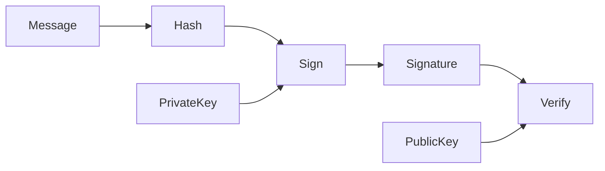

# Digital Signature Algorithm (DSA)

## Why Does DSA Exist?

DSA provides:

* Authentication
* Integrity
* Non-repudiation

Unlike RSA, DSA is designed specifically for digital signatures.

> [!important]
> DSA cannot be used for encryption or key exchange.

---

## DSA Overview

DSA uses:

* Modular arithmetic
* Hash functions
* Discrete logarithm problem

Security relies on the difficulty of computing discrete logarithms.

---

## Domain Parameters

Choose public parameters:

* Large prime `p`
* Prime divisor `q`
* Generator `g`

Conditions:

q\mid(p-1)

and:

g=h^{(p-1)/q}\bmod p

where:

```text
1 < h < p−1
```

---

## Key Generation

Choose private key:

```text
x
```

such that:

```text
0 < x < q
```

Compute public key:

y=g^x\bmod p

Keys:

* Private key: `x`
* Public key: `(p,q,g,y)`

---

## Signature Generation

For message `M`:

### Step 1: Compute Hash

```text
H = Hash(M)
```

---

### Step 2: Select Random Number

Choose:

```text
k
```

such that:

```text
0 < k < q
```

`k` must be unique and secret.

---

### Step 3: Compute r

r=(g^k\bmod p)\bmod q

If `r = 0`, choose another `k`.

---

### Step 4: Compute s

s=k^{-1}(H+xr)\bmod q

If `s = 0`, choose another `k`.

The signature is:

```text
(r,s)
```

---

## Signature Verification

Receiver computes:

### Step 1

Verify:

```text
0 < r,s < q
```

---

### Step 2

Compute:

w=s^{-1}\bmod q

---

### Step 3

Compute:

u_1=Hw\bmod q

u_2=rw\bmod q

---

### Step 4

Compute:

v=((g^{u_1}y^{u_2}\bmod p)\bmod q)

Accept the signature if:

v=r

---

## Example

Given:

```text
p = 23
q = 11
h = 2
```

Compute:

```text
g = 2^((23−1)/11) mod 23
g = 4
```

Choose:

```text
x = 3
```

Public key:

```text
y = 4^3 mod 23 = 18
```

Suppose:

```text
H(M) = 5
k = 6
```

Compute:

```text
r = (4^6 mod 23) mod 11 = 2
```

```text
k⁻¹ mod 11 = 2
```

Compute:

```text
s = 2(5 + 3×2) mod 11
s = 0
```

Since `s = 0`, choose another `k`.

> [!warning]
> Reusing or exposing `k` compromises the private key.

---

## DSA Workflow



---

## DSA vs RSA

| Feature            | DSA                | RSA                   |
| ------------------ | ------------------ | --------------------- |
| Encryption         | ❌                  | ✅                     |
| Digital Signatures | ✅                  | ✅                     |
| Security Basis     | Discrete Logarithm | Integer Factorization |
| Signature Speed    | Fast               | Medium                |
| Verification Speed | Medium             | Fast                  |

---

## Memory Shortcuts

Remember:

```text
DSA = Sign Only
```

Signature generation:

```text
Hash → r → s
```

Verification:

```text
w → u₁,u₂ → v
```

---

## Exam Points

* DSA provides digital signatures only.
* Security depends on the discrete logarithm problem.
* The random value `k` must never be reused.
* Signature consists of `(r,s)`.
* Verification succeeds when `v=r`.

---

## One-Line Summary

> DSA is a public-key digital signature scheme that uses modular arithmetic and the discrete logarithm problem to provide authentication, integrity, and non-repudiation.
