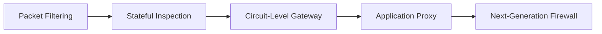
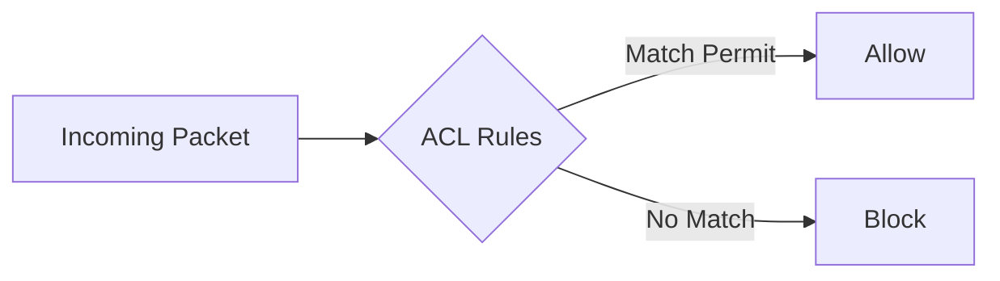
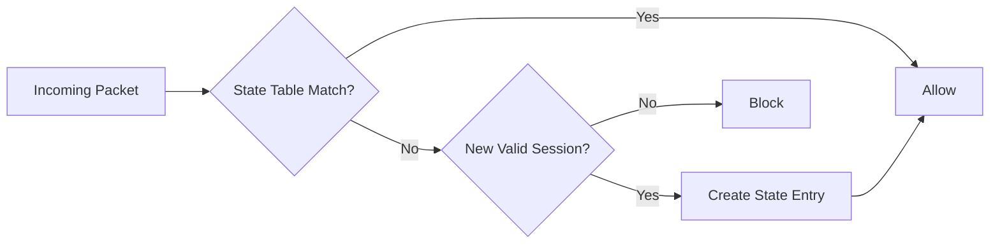
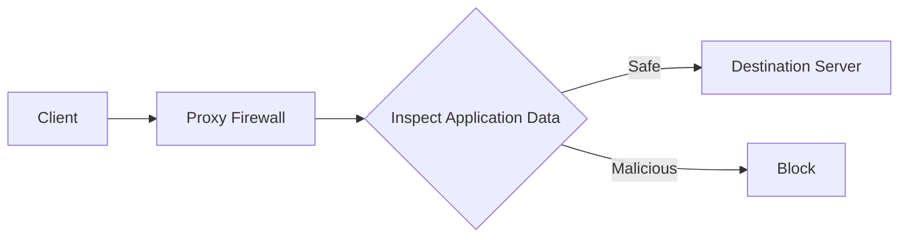
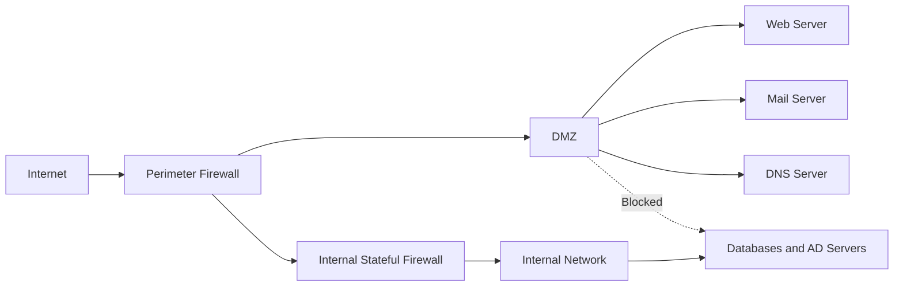

# Firewall Architectures and Deployment Strategies

## Why Do Firewalls Exist?

Connecting an internal network directly to the internet exposes it to:

* Port scanning
* Malware
* Unauthorized access
* Denial-of-Service attacks
* Data theft

A firewall acts as a security checkpoint between trusted and untrusted networks.

It examines network traffic and decides whether to:

* Allow
* Deny
* Log
* Inspect further

based on predefined security policies.

> [!important]
> A firewall enforces the organization's security policy at the network boundary.

---

## Real-World Analogy

Think of a firewall as airport security.

* Passengers → Network packets
* Passport → IP address
* Boarding pass → Session information
* Luggage inspection → Payload inspection
* Security officer → Firewall rules

Only authorized traffic is allowed to enter.

---

## Evolution of Firewalls

Each new firewall type was developed to solve limitations of earlier types.



---

## Firewall Types

### 1. Packet-Filtering Firewall

Operates at:

* Network Layer (Layer 3)
* Transport Layer (Layer 4)

It examines:

* Source IP address
* Destination IP address
* Source port
* Destination port
* Protocol type

Each packet is evaluated independently.

### Example Rules

```text id="x1e8vz"
Allow TCP port 443

Block Telnet port 23
```

### Working



### Advantages

* Fast
* Simple
* Low cost

### Limitations

* No session awareness
* Cannot inspect payload
* Vulnerable to spoofing

---

## 2. Stateful Inspection Firewall

Maintains a dynamic state table containing active sessions.

Instead of inspecting packets individually, it tracks connections.

Example:

```text id="2kg0yj"
Internal User → HTTPS Request
```

The firewall records:

* Source IP
* Destination IP
* Port numbers
* Session state

Return traffic is automatically permitted.

### Working



### Advantages

* Better security
* Session awareness
* Efficient traffic handling

### Limitations

* Cannot inspect application content
* State table exhaustion attacks possible

---

## 3. Circuit-Level Gateway

Operates at:

* Session Layer (Layer 5)

It validates TCP sessions rather than packet contents.

Example:

* SOCKS proxy

The gateway establishes connections on behalf of clients.

```text id="49yn3s"
Client → Gateway → Server
```

### Advantages

* Hides internal addresses
* Low overhead

### Limitations

* No payload inspection
* Cannot detect application attacks

---

## 4. Application Proxy Firewall

Operates at:

* Application Layer (Layer 7)

Acts as an intermediary between clients and servers.

Clients never directly communicate with external servers.

```text id="w3n7lq"
Client → Proxy → Server
```

The proxy examines:

* URLs
* Commands
* Content
* Application payload

### Working



### Advantages

* Deep packet inspection
* Content filtering
* User authentication
* Hides internal network

### Limitations

* High resource usage
* Increased latency
* Protocol-specific configuration required

---

## 5. Next-Generation Firewall (NGFW)

Modern enterprises combine multiple security features into a single platform.

NGFW capabilities:

* Stateful inspection
* Deep packet inspection
* Application awareness
* Intrusion Prevention System (IPS)
* Malware detection
* User identity integration
* SSL/TLS inspection

### Advantages

* Comprehensive protection
* Application-level control
* Centralized management

### Limitations

* Expensive
* Complex configuration
* High processing requirements

> [!note]
> Most modern enterprise deployments use NGFWs.

---

## Firewall Comparison

| Type                  | OSI Layer | Inspects           | Connection Tracking | Performance |
| --------------------- | --------- | ------------------ | ------------------- | ----------- |
| Packet Filtering      | L3/L4     | Headers            | ❌                   | Very High   |
| Stateful Inspection   | L3/L4     | Headers + Sessions | ✅                   | High        |
| Circuit-Level Gateway | L5        | Sessions           | ✅                   | Medium      |
| Application Proxy     | L7        | Full Payload       | ✅                   | Low         |
| NGFW                  | L3-L7     | Deep Inspection    | ✅                   | Medium      |

---

## Enterprise Firewall Deployment Strategy

A single firewall is insufficient for enterprise networks.

Organizations divide networks into security zones.

### Security Zones

1. Internet
2. DMZ
3. Internal Network
4. Restricted Network

---

## DMZ Architecture

Public-facing servers are placed in the DMZ.

Examples:

* Web servers
* Mail servers
* DNS servers



---

## Firewall Placement Strategy

### Perimeter Firewall

Type:

* Packet filtering or NGFW

Purpose:

* Block obvious malicious traffic
* Enforce ingress and egress filtering

---

### Internal Segmentation Firewall

Type:

* Stateful inspection

Purpose:

* Separate departments
* Restrict lateral movement

Example:

```text id="lc1lb9"
HR Network ≠ Finance Network
```

---

### Application Firewall

Type:

* Application proxy

Purpose:

* Protect critical applications

Examples:

* Web applications
* APIs
* Email gateways

---

## Recommended Rule Configuration

Apply the principle of least privilege.

```text id="s77f31"
Default Action = Deny
```

Allow only required services.

Example:

| Source   | Destination      | Service      | Action |
| -------- | ---------------- | ------------ | ------ |
| Internet | Web Server       | HTTPS (443)  | Allow  |
| Internet | Internal Network | Any          | Deny   |
| DMZ      | Database         | MySQL (3306) | Allow  |
| DMZ      | Internal Users   | Any          | Deny   |

---

## Ongoing Firewall Management

Effective firewall security requires continuous monitoring.

Tasks include:

* Log analysis
* Rule review
* Firmware updates
* Backup configuration
* Vulnerability assessment
* Performance monitoring

> [!warning]
> Misconfigured firewall rules can create security gaps.

---

## Best Practices

* Use default deny policies
* Remove unused rules
* Enable logging
* Segment networks
* Apply regular updates
* Review access policies periodically
* Synchronize firewall rules with business requirements

---

## Advantages of Firewalls

* Prevent unauthorized access
* Enforce security policies
* Monitor traffic
* Segment networks
* Reduce attack surface

---

## Limitations of Firewalls

* Cannot stop insider attacks
* Cannot protect against social engineering
* Misconfiguration reduces effectiveness
* Encrypted traffic inspection is difficult

---

## Memory Shortcuts

```text id="q6rzkj"
Packet Filter → Individual Packets

Stateful Firewall → Connections

Circuit Gateway → Sessions

Proxy Firewall → Applications

NGFW → Everything
```

Remember:

```text id="2c4gdb"
Internet → Firewall → DMZ → Internal Network
```

---

## Exam Points

* Firewalls separate trusted and untrusted networks.
* Packet-filtering firewalls inspect headers only.
* Stateful firewalls maintain connection tables.
* Circuit-level gateways validate sessions.
* Application proxies inspect application data.
* NGFWs combine multiple security technologies.
* DMZs isolate public-facing servers.
* Enterprises deploy multiple firewall layers.
* Default-deny policies improve security.

---

## One-Line Summary

> A firewall is a network security device that monitors and controls traffic between trusted and untrusted networks using predefined security policies, with modern enterprises deploying layered firewall architectures and DMZs for defense-in-depth.
