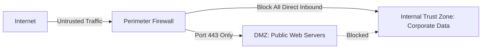

Up next in our Highest Repeated sequence is **Firewall Architectures & Deployment Strategies**.

---

# Question 4: Firewall Architectures & Deployment Strategies

## 1. Core Concept (The "Why")

A corporate network connected directly to the open internet is completely exposed to port scans, exploit attempts, and malicious traffic. A firewall acts as a digital checkpoint at the network perimeter. Its job is to isolate the trusted internal network from the untrusted external internet, monitoring all traffic and blocking unauthorized packets based on a defined security policy.

---

## 2. The Three Primary Firewall Architectures

### A. Packet-Filtering Firewall

* **How it works:** Operates at the Network and Transport layers (Layers 3 & 4). It examines individual packets in isolation by reading their structural headers: Source/Destination IP addresses, Source/Destination ports, and Protocol type (TCP/UDP/ICMP).
* **The Rule:** If a packet matches a permit rule in its Access Control List (ACL), it passes. Otherwise, it is dropped. It has no awareness of the context of an open session.

### B. Stateful Inspection Firewall

* **How it works:** Operates up through the Transport layer but maintains a dynamic **State Table** that tracks active connections (like TCP handshakes and established sessions).
* **The Rule:** When an internal user requests a webpage, the firewall records the outbound connection in its state table. When the web server replies, the firewall checks the table. If a matching outbound request exists, the incoming traffic is let through automatically. Unsolicited incoming traffic is blocked immediately.

### C. Application Proxy / Gateway Firewall

* **How it works:** Operates at the Application layer (Layer 7). It completely terminates the direct network connection between the internal client and the external server. It acts as a middleman.
* **The Rule:** The client connects directly to the proxy. The proxy un-wraps the entire packet, reads and verifies the actual application-layer command payload (e.g., checking an HTTP request for dangerous SQL injection strings), and then copies safe requests onto a brand-new packet sequence to send to the destination server.

---

## 3. Comparative Evaluation (Summary Table)

| Firewall Type | Operational Layer | Main Advantage | Main Weakness |
| --- | --- | --- | --- |
| **Packet-Filtering** | Network/Transport (Layers 3/4) | Extremely fast; minimal computational overhead. | Easily fooled by IP spoofing; cannot inspect data content. |
| **Stateful Inspection** | Transport (Layer 4 with tracking) | Highly secure for tracking connections; strong traffic control. | Can be vulnerable to memory exhaustion attacks (DoS on state table). |
| **Application Proxy** | Application (Layer 7) | Deepest inspection capability; completely hides internal network. | Very slow; requires high processing power per connection. |

---

## 4. Organizational Deployment Strategy Scenario

To defend an enterprise environment hosting public services (like a web server) and private internal data (like user workstations and active directories), organizations deploy a **Demilitarized Zone (DMZ)** architecture.

### Step-by-Step Security Zone Implementation

1. **The External Zone:** The untrusted public Internet.
2. **The Perimeter Firewall:** Traffic entering from the internet hits a stateful inspection firewall configured with three interfaces.
3. **The DMZ (Demilitarized Zone):** An isolated, middle-ground network segment. Public-facing servers (Web, Mail, DNS) are placed here. The firewall rules allow outside internet traffic to access only specific application ports (e.g., port 80/443 for HTTP/HTTPS) inside the DMZ.
4. **The Internal Zone:** The strictly trusted network containing corporate database records, financial applications, and employee workstations.
5. **The Shielding Rules:** The firewall policy explicitly blocks **all** direct inbound traffic from the open internet to the Internal Zone. It also blocks any traffic originating *from* the DMZ into the Internal Zone. If the web server in the DMZ is compromised, the attacker remains trapped in the DMZ sandbox and cannot reach internal corporate systems.

---

Here is the clean, consolidated code block ready for your Obsidian notes.

# Exam Note: Firewall Architectures & DMZ Topologies

## 1. Architectural Classification Matrix
* **Packet Filter:** Inspects Layer 3/4 static headers independently. Fast but blind to application context.
* **Stateful Filter:** Compares inbound packets against a dynamic connection state table. Protects client traffic.
* **Application Proxy:** Complete connection break. Decouples client/server networks at Layer 7. Slow but highly secure.

## 2. Production DMZ Security Policy Principles
* **Principle of Least Privilege:** Public traffic can touch the DMZ but never cross into the internal repository networks directly.
* **Session Isolation:** Compromise of an application component within the DMZ boundary does not grant automatic identity access to internal directory services.

---

Say **"Next"** whenever you are ready to transition into the **Moderately Repeated Part B/C Questions**, starting with the complete evaluation of the **X.509 Authentication Service**.