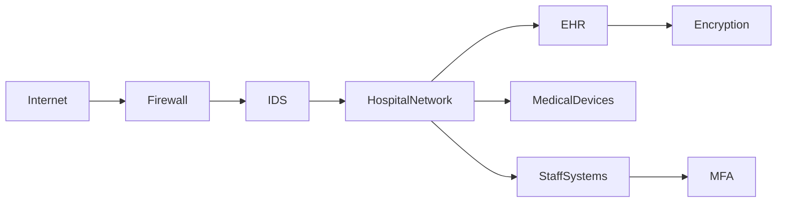

---

## topic: Healthcare Security

# Healthcare Security and Threat Modeling

## Why Is Healthcare Security Important?

Healthcare organizations store highly sensitive information:

* Patient records
* Insurance information
* Medical history
* Prescription data

Compromise of this information can result in:

* Identity theft
* Financial fraud
* Patient safety risks
* Legal penalties

---

## Common Healthcare Assets

* Electronic Health Records (EHR)
* Medical IoT devices
* Hospital networks
* Diagnostic systems
* Cloud storage

---

## Common Threats

| Threat          | Example                      |
| --------------- | ---------------------------- |
| Ransomware      | Encrypting patient records   |
| Phishing        | Stealing staff credentials   |
| Insider Threats | Unauthorized access          |
| Malware         | Compromised workstations     |
| DDoS            | Disrupting hospital services |

---

## Threat Modeling Process

Threat modeling identifies:

```text
Assets → Threats → Vulnerabilities → Controls
```

### Steps

1. Identify critical assets.
2. Identify potential attackers.
3. Analyze vulnerabilities.
4. Evaluate risks.
5. Implement controls.

---

## STRIDE Threat Model

| Threat                 | Description         |
| ---------------------- | ------------------- |
| Spoofing               | Impersonating users |
| Tampering              | Modifying records   |
| Repudiation            | Denying actions     |
| Information Disclosure | Data leakage        |
| Denial of Service      | Service disruption  |
| Elevation of Privilege | Unauthorized access |

---

## Security Controls

### Administrative Controls

* Security policies
* Staff training
* Incident response plans

### Technical Controls

* Encryption
* MFA
* IDS/IPS
* Firewalls

### Physical Controls

* CCTV
* Access cards
* Secure server rooms

---

## Preventing Common Breaches

### Against Phishing

* User awareness training
* Email filtering
* MFA

### Against Ransomware

* Regular backups
* Patch management
* Network segmentation

### Against Insider Threats

* Least privilege access
* Audit logging
* User behavior monitoring

### Against Data Theft

* Encryption at rest
* Encryption in transit
* Data loss prevention

---

## Security Mechanisms vs Attacks

| Attack           | Security Mechanism      |
| ---------------- | ----------------------- |
| Phishing         | MFA, Awareness Training |
| Malware          | Endpoint Protection     |
| DDoS             | Traffic Filtering       |
| Credential Theft | Password Policies, MFA  |
| Data Leakage     | Encryption, DLP         |
| Insider Abuse    | Access Control, Logging |

---

## Healthcare Security Architecture



---

## Best Practices

* Apply least privilege.
* Use strong authentication.
* Maintain regular backups.
* Segment networks.
* Monitor logs continuously.
* Encrypt sensitive data.

---

## Exam Points

* Healthcare data is highly sensitive.
* Threat modeling identifies risks proactively.
* STRIDE is a common threat model.
* Encryption protects patient records.
* MFA reduces credential theft.
* Security requires administrative, technical, and physical controls.

---

## One-Line Summary

> Healthcare security protects sensitive patient information by combining threat modeling, layered security controls, and proactive defenses against modern cyberattacks.
