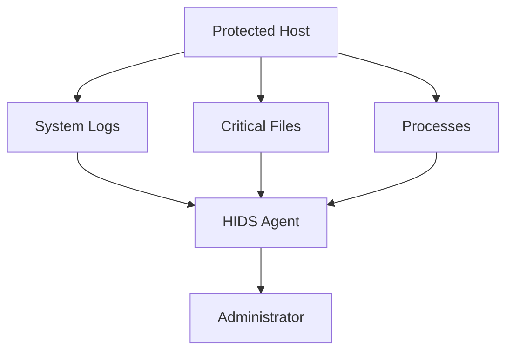
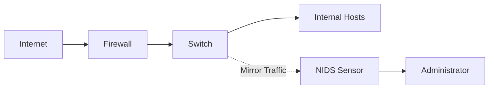
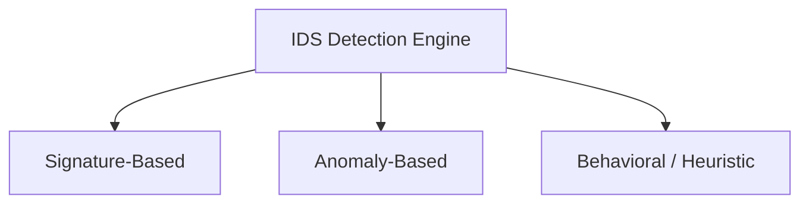
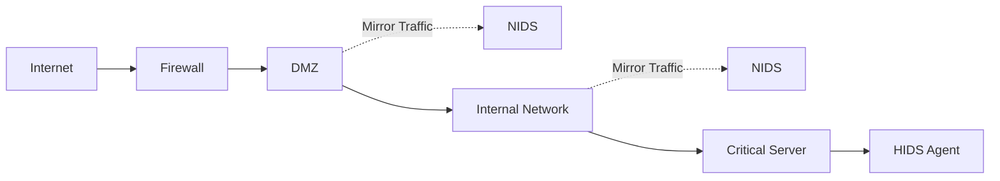

# Intrusion Detection System (IDS)

## Why Does IDS Exist?

Even strong firewalls cannot stop every attack.

Examples:

* Insider threats
* Misconfigured firewalls
* Zero-day exploits
* Malware brought through USB devices
* Compromised user accounts

An organization needs a system that continuously monitors activity and alerts administrators when suspicious behavior occurs.

This is the role of an Intrusion Detection System (IDS).

> [!important]
> IDS detects attacks and generates alerts.
>
> It does not automatically block traffic.

---

## Real-World Analogy

Think of a building.

| Security Component | Real-World Equivalent         |
| ------------------ | ----------------------------- |
| Firewall           | Security guard at the gate    |
| IDS                | CCTV cameras and alarm system |
| IPS                | Automatic locking system      |

The firewall controls entry.

The IDS watches for suspicious activity after entry.

---

## What Does an IDS Monitor?

An IDS analyzes:

* Network traffic
* System logs
* File modifications
* Login attempts
* Running processes
* User behavior

If suspicious activity is detected:

```text id="awybhs"
Generate Alert → Notify Administrator
```

---

## Basic IDS Architecture


---

## IDS Components

### Sensors

Collect security data.

Examples:

* Network packets
* System logs
* File changes

---

### Analysis Engine

Processes collected data.

Detection methods include:

* Signature-based detection
* Anomaly-based detection
* Behavioral detection

---

### Alert System

Generates:

* Emails
* SMS notifications
* Dashboard alerts
* Log entries

---

### Management Console

Allows administrators to:

* View alerts
* Configure rules
* Investigate incidents

---

## IDS Deployment Types

There are two major IDS architectures:

1. Host-Based IDS (HIDS)
2. Network-Based IDS (NIDS)

---

## Host-Based IDS (HIDS)

Installed directly on individual systems.

Examples:

* Database servers
* Domain controllers
* Critical workstations

### Monitors

* System logs
* Registry changes
* File integrity
* Running processes
* User activities

### Architecture



### Advantages

* Detects insider attacks
* Monitors file changes
* Sees decrypted traffic
* Provides detailed host visibility

### Limitations

* Consumes host resources
* Requires installation on each host
* Can be disabled after full system compromise

---

## Network-Based IDS (NIDS)

Installed at strategic network locations.

Common placements:

* Behind firewalls
* DMZ
* Core switches
* Network gateways

NIDS usually receives traffic through:

* SPAN ports
* Network TAPs

### Monitors

* Packet headers
* Packet payloads
* Network sessions

### Architecture



### Advantages

* One sensor monitors many devices
* No endpoint installation required
* Minimal impact on hosts

### Limitations

* Cannot inspect encrypted traffic
* Cannot determine whether an attack succeeded
* High-speed networks may overwhelm sensors

---

## HIDS vs NIDS

| Feature           | HIDS                | NIDS                |
| ----------------- | ------------------- | ------------------- |
| Deployment        | Individual hosts    | Network segments    |
| Data Source       | Logs and files      | Packets and traffic |
| Encrypted Traffic | ✅ Visible           | ❌ Hidden            |
| Resource Usage    | Host CPU and memory | Dedicated sensor    |
| Attack Visibility | Host-level          | Network-level       |
| Scalability       | Lower               | Higher              |

---

## Detection Methodologies



---

## 1. Signature-Based Detection

Compares activity against a database of known attack patterns.

Similar to antivirus software.

### Example

```text id="e4rkta"
Known SQL Injection Pattern

Known Malware Hash

Known Buffer Overflow Payload
```

### Advantages

* High accuracy
* Low false positives
* Fast detection

### Limitations

* Cannot detect unknown attacks
* Requires frequent updates

> [!note]
> Signature-based IDS is effective against known threats.

---

## 2. Anomaly-Based Detection

Creates a baseline of normal behavior.

Any significant deviation triggers an alert.

### Example

Normal behavior:

```text id="s0fdkr"
Employee logs in at 9 AM
Downloads 500 MB daily
```

Suspicious behavior:

```text id="0j3j2j"
Employee logs in at 3 AM
Downloads 50 GB
```

### Advantages

* Detects zero-day attacks
* Identifies unknown threats

### Limitations

* High false positive rate
* Requires training period

---

## 3. Heuristic / Behavioral Detection

Analyzes actions instead of exact signatures.

Focuses on intent and activity patterns.

### Example

Ransomware behavior:

```text id="8lv1tg"
Read file

Encrypt file

Delete original file

Repeat thousands of times
```

Even if the malware is new, the behavior is suspicious.

### Advantages

* Detects modified malware
* Effective against advanced threats

### Limitations

* Computationally expensive
* Complex to configure

---

## IDS vs IPS

Students often confuse these terms.

| Feature          | IDS         | IPS    |
| ---------------- | ----------- | ------ |
| Detects Threats  | ✅           | ✅      |
| Generates Alerts | ✅           | ✅      |
| Blocks Traffic   | ❌           | ✅      |
| Deployment       | Out-of-band | Inline |

Remember:

```text id="s0hhjt"
IDS = Detect

IPS = Detect + Prevent
```

---

## Enterprise IDS Deployment

Modern organizations deploy multiple IDS layers.



### Deployment Strategy

* NIDS at network boundaries
* NIDS in the DMZ
* HIDS on critical servers

This provides:

```text id="8ikcrx"
Defense in Depth
```

---

## Advantages of IDS

* Detects internal threats
* Provides security visibility
* Supports incident response
* Identifies policy violations
* Monitors suspicious behavior

---

## Limitations of IDS

* Cannot stop attacks automatically
* Generates false positives
* Requires skilled administrators
* High alert volume

---

## Memory Shortcuts

```text id="95vp8d"
HIDS → Hosts

NIDS → Network
```

```text id="mwm7eh"
Signature → Known attacks

Anomaly → Unusual behavior

Behavioral → Suspicious actions
```

Remember:

```text id="kt2nlt"
Firewall Prevents

IDS Detects

IPS Prevents + Detects
```

---

## Exam Points

* IDS monitors systems and networks for malicious activity.
* HIDS monitors individual hosts.
* NIDS monitors network traffic.
* Signature-based detection identifies known attacks.
* Anomaly-based detection identifies deviations from normal behavior.
* Behavioral detection tracks suspicious activities.
* IDS generates alerts but does not block traffic.
* Organizations often deploy both HIDS and NIDS.

---

## One-Line Summary

> An Intrusion Detection System is a security solution that monitors hosts or network traffic to detect malicious activities using signature-based, anomaly-based, and behavioral analysis techniques.
