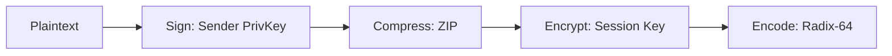

# Question 8: Pretty Good Privacy (PGP) Architecture (15-Mark Master Blueprint)

## 1. Core Concept (The "Why")
Standard internet email systems transmit messages in plain text, meaning anyone intercepting them along the network route can read sensitive details or alter payloads undetected. Pretty Good Privacy (PGP) provides an application-layer cryptographic framework designed specifically to protect email. It delivers a comprehensive security bundle—confidentiality, integrity, non-repudiation, and efficient resource utilization—without relying on a centralized global infrastructure.

---

## 2. Core Cryptographic Functions & Workflows

[cite_start]PGP integrates four distinct operational processes to achieve its security goals[cite: 52]:

### A. Digital Signature & Authentication (Non-Repudiation)

* **The Process:** The sender hashes the message to create a message digest, encrypts that digest using their own **Private RSA/DSS Key** to generate a digital signature, and attaches it to the front of the raw message.
* **The Verification:** The recipient decrypts the signature using the sender's public key, hashes the incoming text locally, and compares the two values. A perfect match guarantees data integrity and absolute non-repudiation (the sender cannot deny writing the email).

### B. Confidentiality (Encryption)
* **The Process:** PGP uses a hybrid cryptosystem. Because asymmetric key encryption is computationally heavy, PGP generates a unique, one-time temporary **Symmetric Session Key** (using AES or Triple-DES) for every single message.
* **The Execution:** The bulk message is encrypted using this fast symmetric session key. Then, the session key itself is encrypted using the recipient's **Public Asymmetric Key** and appended to the front of the encrypted message envelope. Only the recipient's corresponding private key can unlock the session key, which then unlocks the message.

### C. Compression (Efficiency)
* **The Process:** PGP applies a compression algorithm (ZIP or Deflate) immediately *after* signature generation but *before* encryption.
* **Why it matters:** 1. It saves significant bandwidth and network transit time.
  2. It improves cryptographic security by drastically reducing redundant patterns in the text, making it significantly harder for attackers to launch cryptanalytic pattern attacks against the subsequent encryption layer.

### D. Email Compatibility Transmission
* **The Process:** Cryptographic ciphertext and compressed binaries contain raw 8-bit arbitrary character codes. Standard legacy email transfer protocols (like SMTP) handle only basic 7-bit ASCII text and will choke or corrupt raw binary. PGP routes the entire finalized binary envelope through a **Radix-64 (Base64) conversion engine**, transforming the ciphertext into safe, standardized 7-bit ASCII print text.

---

## 3. PGP Algorithmic Operation Pipeline

```mermaid
graph TD
    subgraph Transmission Processing Engine (Sender)
        M[Plaintext Message] --> HASH[1. Hash Engine]
        HASH -->|Digest| Sign[2. Encrypt with Sender's Private Asymmetric Key]
        Sign -->|Digital Signature| Combine[Combine Signature + Message]
        M --> Combine
        Combine --> COMP[3. ZIP Compression Engine]
        COMP -->|Compressed Payload| BulkEnc[4. Encrypt Payload with Symmetric Session Key]
        SymKey[Random Session Key] --> BulkEnc
        SymKey --> KeyEnc[5. Encrypt Key with Receiver's Public Asymmetric Key]
        BulkEnc --> Package[Merge Encrypted Key + Encrypted Payload]
        KeyEnc --> Package
        Package --> R64[6. Radix-64 Encoding]
        R64 --> Out[Final ASCII Email Text]
    end
```

---

## 4. Radical Key Management Structure: The Web of Trust

[cite_start]Unlike traditional corporate infrastructures that depend on central, hierarchical Certificate Authorities (like X.509) to vouch for public keys[cite: 40], PGP implements a decentralized framework known as the **Web of Trust**.


* **No Central Hierarchy:** There is no single, absolute root authority that can be hacked or compromised to take down the network.
* **Direct Peer Endorsement:** Users sign each other’s public keys directly. For instance, if Bob trusts Alice implicitly, and Alice signs Charlie's public key certificate, Bob can use Alice's signature to automatically trust that Charlie's key is genuine.
* **The Trust Levels:** PGP keyrings track and quantify trust dynamically. Each certificate contains metadata tags detailing how far a user trusts an individual to validate other members. This creates a distributed web of horizontal identity verification across global networks.

---

## 5. Consolidated Functional Matrix

| PGP Security Service | Underlying Algorithm Options | Key Component Utilized |
| :--- | :--- | :--- |
| **Digital Signature** | SHA-256 / SHA-512 with RSA or DSS | [cite_start]Sender's Private Key [cite: 52, 89] |
| **Confidentiality** | AES / CAST-128 / 3DES / IDEA | [cite_start]Temporary Session Key + Recipient's Public Key [cite: 52, 89] |
| **Compression** | ZIP / Deflate | [cite_start]N/A (Standard algorithmic reduction) [cite: 52] |
| **Radix-64 Format** | Base64 Encoding Map | N/A (Converts binary payload to ASCII) |

```obsidian
# Exam Note: Pretty Good Privacy (PGP) Architecture Blueprint

## 1. Sequence Priority Logic
* **Rule:** Encryption happens *after* signing. 
* **Justification:** This allows the signature layer to be verified directly without forcing third-party mail systems to fully decrypt the underlying text payload for basic message tracking.



## 2. Structural Core Traits
* `Session Key`: Ephemeral single-use metric; discarded immediately after payload assembly.
* [cite_start]`Web of Trust`: Eliminates fixed administrative point vulnerabilities through peer-to-peer certificate signing[cite: 52, 80].
* [cite_start]`Radix-64 Engine`: Modifies binary streams to safe character domains to protect payloads from SMTP translation errors[cite: 72].
```

```

---

Say **"Next"** whenever you are ready to proceed to the next long-answer topic in the sequence: **Public Key Distribution Schemes**.