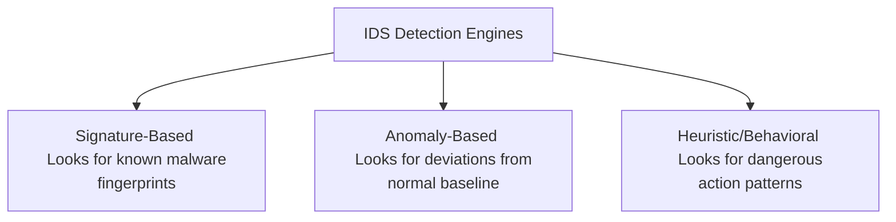
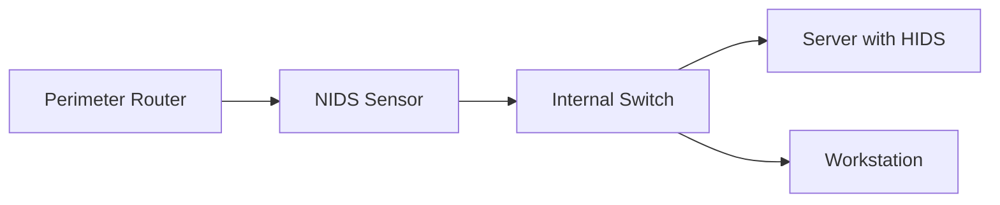

````
# Question 7: Intrusion Detection Systems (IDS) Framework (15-Mark Master Blueprint)

## 1. Core Concept (The "Why")
While firewalls act as static border guards blocking unauthorized entrance to a network, sophisticated attacks or rogue internal users can still bypass them. An Intrusion Detection System (IDS) acts as an internal security camera network[cite: 76]. It continuously monitors system logs, configurations, and live network packets to identify, log, and alert administrators about malicious activity occurring inside the perimeter[cite: 48, 51, 75].

---

## 2. Architectural Comparison: Host-Based vs. Network-Based
An IDS is deployed using two primary architectural strategies depending on the operational environment[cite: 49, 50]:


### A. Host-Based IDS (HIDS)
* **Deployment:** Installed directly onto a specific high-value machine, such as a core database or an Active Directory server[cite: 49].
* **Data Monitored:** Internal operating system logs, local application trails, registry changes, and file integrity modifications[cite: 50].
* **Main Advantage:** Can inspect decrypted traffic seamlessly because it analyzes data at the endpoint level after the host has processed and terminated the encryption layer.
* **Main Weakness:** Consumes local CPU and memory resources directly from the host system it guards, and its local logs can be altered or disabled if an attacker achieves root system compromise.

### B. Network-Based IDS (NIDS)
* **Deployment:** Placed at strategic network bottleneck points, such as right behind a perimeter firewall or attached to a network switch SPAN port[cite: 49, 50].
* **Data Monitored:** Raw inbound and outbound network packet headers and payloads moving across network segments in real time[cite: 50].
* **Main Advantage:** A single NIDS sensor can transparently monitor traffic for hundreds of connected devices without requiring individual machine agent installations or degrading endpoint host performance.
* **Main Weakness:** Completely blind to encrypted packet payloads (such as HTTPS or SSH traffic streams) moving across the wire, and cannot verify if an observed exploit packet successfully executed on the target host.

---

## 3. Detection Methodologies & Measures
To determine if an active event constitutes an attack, an IDS utilizes three core tracking methodologies[cite: 51]:



### 1. Signature-Based Detection (Misuse Detection)
* **Mechanism:** Compares network traffic or log entries directly against a static database of known attack fingerprints, similar to traditional antivirus software[cite: 51].
* **Example:** Matching a specific sequence of bytes in a packet header known to belong to a legacy remote code execution exploit.
* **Evaluation:** Highly accurate with near-zero false alarms for known threats, but completely blind to brand-new, modified, or zero-day attacks.

### 2. Anomaly-Based Detection
* **Mechanism:** First monitors normal network operation over an initial baseline phase to establish a statistical model of standard behavior (e.g., normal bandwidth volumes, typical login hours)[cite: 51]. It flags any deviation from this baseline[cite: 51].
* **Example:** A regular user account suddenly downloading 50GB of raw database files via an unusual protocol at 3:00 AM.
* **Evaluation:** Highly capable of identifying unknown zero-day attacks, but prone to high false-positive rates because legitimate user behavior changes dynamically.

### 3. Heuristic / Behavioral Tracking
* **Mechanism:** Instead of looking for exact signature matches or pure statistical metrics, it evaluates the *intent* and behavioral characteristics of an application’s actions over a timeline[cite: 51].
* **Example:** Detecting an unknown program that is rapidly opening documents, reading them, writing encrypted output copies, and deleting the originals (the definitive behavior of active ransomware).
* **Evaluation:** Highly effective at neutralizing mutating malware variants, but demands significant computational processing power to track and parse application execution states.

---

## 4. Consolidated Operational Summary Matrix

| Evaluation Metric | Host-Based (HIDS) [cite: 49] | Network-Based (NIDS) [cite: 49] |
| :--- | :--- | :--- |
| **Data Visibility** | Local OS files, memory spaces, and application logs[cite: 50]. | Network wire packets and communication protocol headers[cite: 50]. |
| **Encryption Handling** | Decrypts and views data at the OS layer. | Blind to encrypted payload data packets. |
| **Primary Methodology** | Integrates file integrity and signature checks[cite: 51]. | Integrates network signatures and baseline anomaly tracing[cite: 51]. |

# Exam Note: IDS Architecture and Detection Engines

## 1. Topographic Deployments
* **NIDS Layer:** Positioned out-of-band at the network core to parse packet traffic structures[cite: 49, 50].
* **HIDS Layer:** Provisioned directly onto high-value target assets to watch system-level runtime events[cite: 49, 50].



## 2. Detection Rule Sets
* `Signature Engine`: Static pattern matching[cite: 51]. Zero configuration overhead but blind to new exploits[cite: 51].
* `Anomaly Engine`: Baseline variance tracing[cite: 51]. Identifies custom threats but produces high false-alarm noise profiles[cite: 51].


Say **"Next"** whenever you are ready to proceed to the next long-answer topic in the sequence: **Public Key Distribution Schemes**.