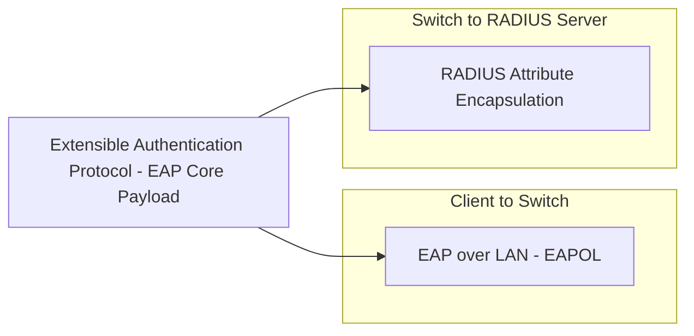
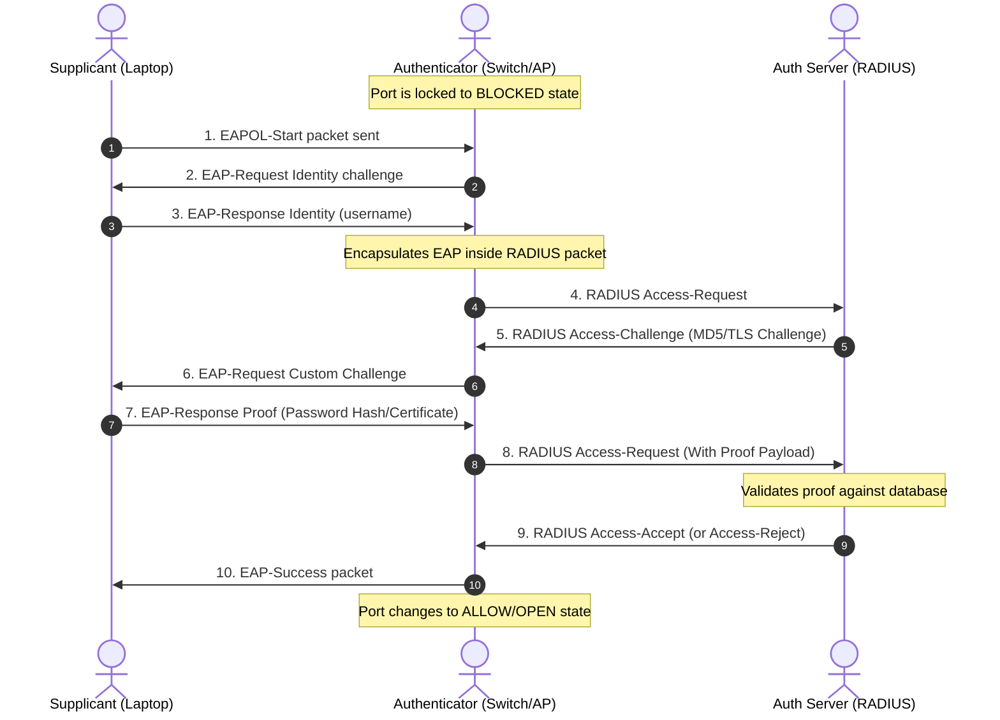
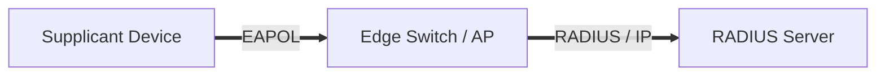

Up next in our consolidated question bank is **Question 9**, the fourth item under the *Moderately Repeated Part B & C* list: **IEEE 802.1X and EAP Enterprise Network Integration**.

---

# Question 9: IEEE 802.1X and EAP Enterprise Network Integration (15-Mark Master Blueprint)

## 1. Core Concept (The "Why")

In traditional networks, a device could simply plug an Ethernet cable into a wall jack or connect to an open Wi-Fi network and immediately access the entire corporate network. This is a massive security vulnerability.

**IEEE 802.1X** is an international standard that implements **Port-Based Network Access Control (PNAC)**. It acts as an electronic gatekeeper. When a device connects to a physical switch port or a wireless access point, that port is initially placed into an **unauthenticated state**, blocking all network traffic except for basic identity verification packets. The device must pass an authentication challenge before the port changes to an **authenticated state**, granting access to the corporate intranet.

---

## 2. Architectural Components

The 802.1X framework relies on a distinct three-tier architectural relationship:

1. **Supplicant (Client):** The user endpoint device (e.g., a laptop, smartphone, or printer) running software that wants to join the network and provides credentials.
2. **Authenticator (Edge Switch / Access Point):** The network hardware device that physically controls access to the network wire or wireless spectrum. It acts as a middleman, passing the client's credentials down the line without verifying them itself.
3. **Authentication Server (RADIUS Server):** The backend central database (typically running Cisco ISE, FreeRADIUS, or Microsoft NPS) that contains the network profiles, verifies credentials, and explicitly tells the Authenticator whether to open or block the port.

---

## 3. The Protocol Stack Matrix

Because data must move securely across different mediums (from a wireless card over an air interface, through an Ethernet switch, and down to a data-center server), the framework layers distinct protocols inside one another:

* **EAP (Extensible Authentication Protocol):** The core authentication envelope that carries the user's raw identity, passwords, or certificates. EAP doesn't care about network cables or routing; it just handles the security handshake.
* **EAPOL (EAP over LAN):** The transport protocol used to carry the EAP data payload over physical Ethernet cables or Wi-Fi connections between the **Supplicant** and the **Authenticator**.
* **RADIUS (Remote Authentication Dial-In User Service):** The network protocol used to strip the EAP payload out of the EAPOL packet at the switch layer, wrap it into standard IP packets, and safely route it across data centers to the backend **Authentication Server**.

---

## 4. Step-by-Step Protocol Exchange Pathway

### Protocol Steps Breakdown:

1. **Connection Initiation:** The client connects to the port and sends an `EAPOL-Start` frame to request access.
2. **Identity Challenge:** The Switch responds with an `EAP-Request/Identity` frame asking who the client is.
3. **Identity Submission:** The client returns an `EAP-Response/Identity` packet containing their username.
4. **Server Routing:** The Switch receives this identity packet, packages it inside an IP-routable `RADIUS Access-Request` packet, and sends it to the central database server.
5. **Credential Challenge:** The Authentication Server returns a cryptographic challenge (`RADIUS Access-Challenge`) to check for a valid password or certificate. The Switch strips this out and forwards it to the client as an `EAP-Request`.
6. **Credential Response:** The client computes the mathematical response to the challenge (using an algorithm like EAP-PEAP or EAP-TLS) and passes the `EAP-Response` back to the switch, which forwards it to the RADIUS server.
7. **Port Authorization:** If the credentials match, the RADIUS server issues a `RADIUS Access-Accept` payload. Upon receiving this message, the Edge Switch unblocks the physical port, passing standard user data packets onto the network.

---

# Exam Note: IEEE 802.1X Integration Blueprint

## 1. Topographic Layout

* **Supplicant Domain:** Lives on user endpoint execution frames.
* **Authenticator Domain:** Controls edge hardware infrastructure states (Port Open/Port Closed).
* **Server Domain:** Holds the ultimate security logic, checking incoming payloads against centralized employee records.

## 2. Definitive Operational States

* **Unauthenticated State:** Default stance. Port drops all data packets except 802.1X management packets.
* **Authenticated State:** Triggered exclusively by a RADIUS Access-Accept code. Port passes all standard IP networking data streams.

---

Say **"Next"** whenever you are ready to proceed to the next long-answer topic in the sequence: **IPsec Architecture (AH vs ESP Modes)**.