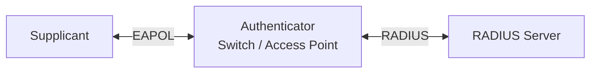
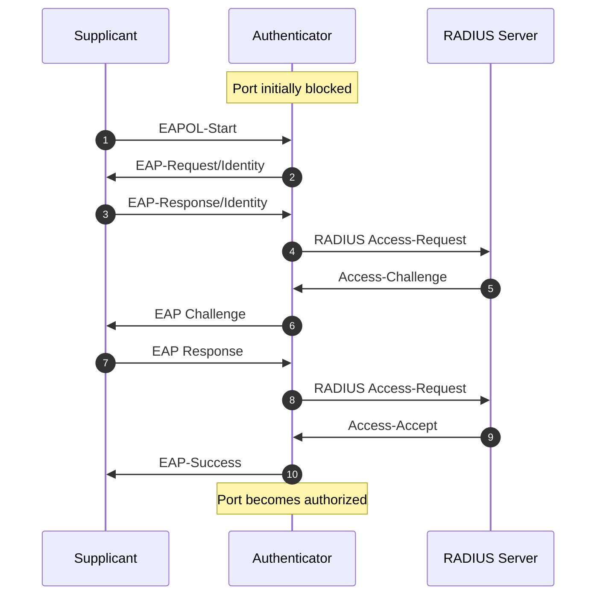
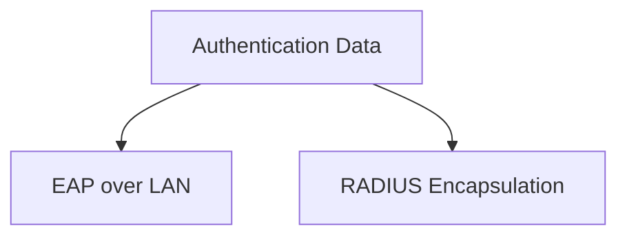

---

## topic: IEEE 802.1X

# IEEE 802.1X and EAP Enterprise Network Integration

## Why Does IEEE 802.1X Exist?

In traditional networks, anyone could:

* Plug a laptop into an Ethernet port
* Connect to corporate Wi-Fi

and immediately gain network access.

This creates security risks:

* Unauthorized devices
* Rogue users
* Insider threats
* Device impersonation

IEEE 802.1X solves this problem using:

```text id="a3mxwv"
Port-Based Network Access Control (PNAC)
```

The network port remains locked until the user or device is authenticated.

> [!important]
> IEEE 802.1X controls access before network communication begins.

---

## Real-World Analogy

Think of a secure office building.

| Network Component | Real-World Equivalent |
| ----------------- | --------------------- |
| Supplicant        | Visitor               |
| Switch/AP         | Security Guard        |
| RADIUS Server     | Reception Database    |
| Network Port      | Locked Door           |

The security guard checks with reception before opening the door.

---

## Core Components

IEEE 802.1X uses three entities.

### 1. Supplicant

The device requesting network access.

Examples:

* Laptop
* Smartphone
* Printer

The supplicant provides credentials.

---

### 2. Authenticator

The network device controlling access.

Examples:

* Ethernet switch
* Wireless access point

Responsibilities:

* Blocks or allows traffic
* Relays authentication messages
* Does not verify credentials

---

### 3. Authentication Server

The backend server that validates credentials.

Usually implemented using:

* RADIUS
* FreeRADIUS
* Microsoft NPS
* Cisco ISE

The authentication server decides whether access is granted.

---

## IEEE 802.1X Architecture



---

## Port States

An authenticator maintains two port states.

### Unauthorized State

Default state.

Allowed traffic:

* EAPOL messages only

Blocked traffic:

* All normal network traffic

---

### Authorized State

Triggered after successful authentication.

Allowed traffic:

* Normal network communication

---

## Authentication Flow



---

## Step-by-Step Authentication Process

### Step 1: Connection Request

The client connects to the network.

The port remains blocked.

The client sends:

```text id="7ylfj7"
EAPOL-Start
```

---

### Step 2: Identity Request

The authenticator asks:

```text id="2j7d1o"
Who are you?
```

using:

```text id="ol08x0"
EAP-Request/Identity
```

---

### Step 3: Identity Response

The client sends:

```text id="qiw6b4"
Username or Device Identity
```

using:

```text id="v0h0d7"
EAP-Response/Identity
```

---

### Step 4: Forward to Authentication Server

The switch encapsulates EAP messages inside:

```text id="o3h82d"
RADIUS Access-Request
```

and forwards them to the authentication server.

---

### Step 5: Credential Verification

The authentication server validates:

* Username/password
* Digital certificate
* Smart card

depending on the EAP method.

---

### Step 6: Access Decision

The server sends:

```text id="3g1j8v"
Access-Accept
```

or

```text id="m8k7ms"
Access-Reject
```

---

### Step 7: Port Authorization

If accepted:

```text id="c2s0gq"
Port = Authorized
```

Normal traffic is now allowed.

---

## Where Does EAP Fit?

EAP stands for:

```text id="t98q73"
Extensible Authentication Protocol
```

EAP is not an authentication method itself.

It is a framework that carries authentication information.

Think of EAP as an envelope.

Different authentication methods can be placed inside it.

Examples:

* EAP-TLS
* PEAP
* EAP-TTLS
* EAP-MD5

---

## Protocol Stack



### Client ↔ Authenticator

Uses:

```text id="f2kltj"
EAPOL (EAP over LAN)
```

### Authenticator ↔ Authentication Server

Uses:

```text id="u8p61s"
RADIUS
```

---

## Common EAP Methods

### EAP-TLS

Uses:

* Client certificates
* Server certificates

Provides:

* Mutual authentication

Most secure option.

---

### PEAP

Uses:

* Server certificate
* Username/password

Common in enterprises.

---

### EAP-TTLS

Creates a secure tunnel first.

Then transmits credentials.

---

### EAP-MD5

Uses password hashing.

Provides:

* No mutual authentication

Rarely used today.

---

## Enterprise Deployment Example


Workflow:

1. User connects.
2. Switch forwards credentials.
3. RADIUS validates against Active Directory.
4. Network access is granted.

---

## Security Benefits

### Strong Access Control

Unauthorized devices cannot access the network.

---

### Centralized Authentication

Policies are managed centrally.

---

### Device Authentication

Both users and devices can be verified.

---

### Dynamic Access Control

Different users receive different permissions.

Examples:

* Guest VLAN
* Employee VLAN
* Administrator VLAN

---

### Audit and Logging

Authentication events are logged centrally.

---

## Challenges

### Deployment Complexity

Requires:

* Switch configuration
* Certificate management
* RADIUS infrastructure

---

### Certificate Management

EAP-TLS requires:

* Certificate issuance
* Renewal
* Revocation

---

### Legacy Device Support

Some devices do not support 802.1X.

Examples:

* Printers
* IoT devices

---

### Authentication Delays

Users may experience connection delays during authentication.

---

### Single Point of Failure

If the RADIUS server fails:

```text id="c4sy9j"
Network access may fail
```

---

## Memory Shortcuts

Remember the three entities:

```text id="rn0xbi"
Supplicant → Authenticator → Authentication Server
```

Remember:

```text id="y8nhnn"
EAP = Authentication Framework

EAPOL = Client to Switch

RADIUS = Switch to Server
```

Port states:

```text id="wocbr5"
Unauthorized → Authorized
```

---

## Exam Points

* IEEE 802.1X provides port-based network access control.
* The three entities are supplicant, authenticator, and authentication server.
* EAP carries authentication information.
* EAPOL transports EAP between client and switch.
* RADIUS transports EAP between switch and server.
* Ports remain blocked until authentication succeeds.
* EAP-TLS is the most secure EAP method.
* Dynamic VLAN assignment is supported.

---

## One-Line Summary

> IEEE 802.1X is a port-based network access control standard that uses EAP and RADIUS to authenticate users and devices before granting access to enterprise networks.
